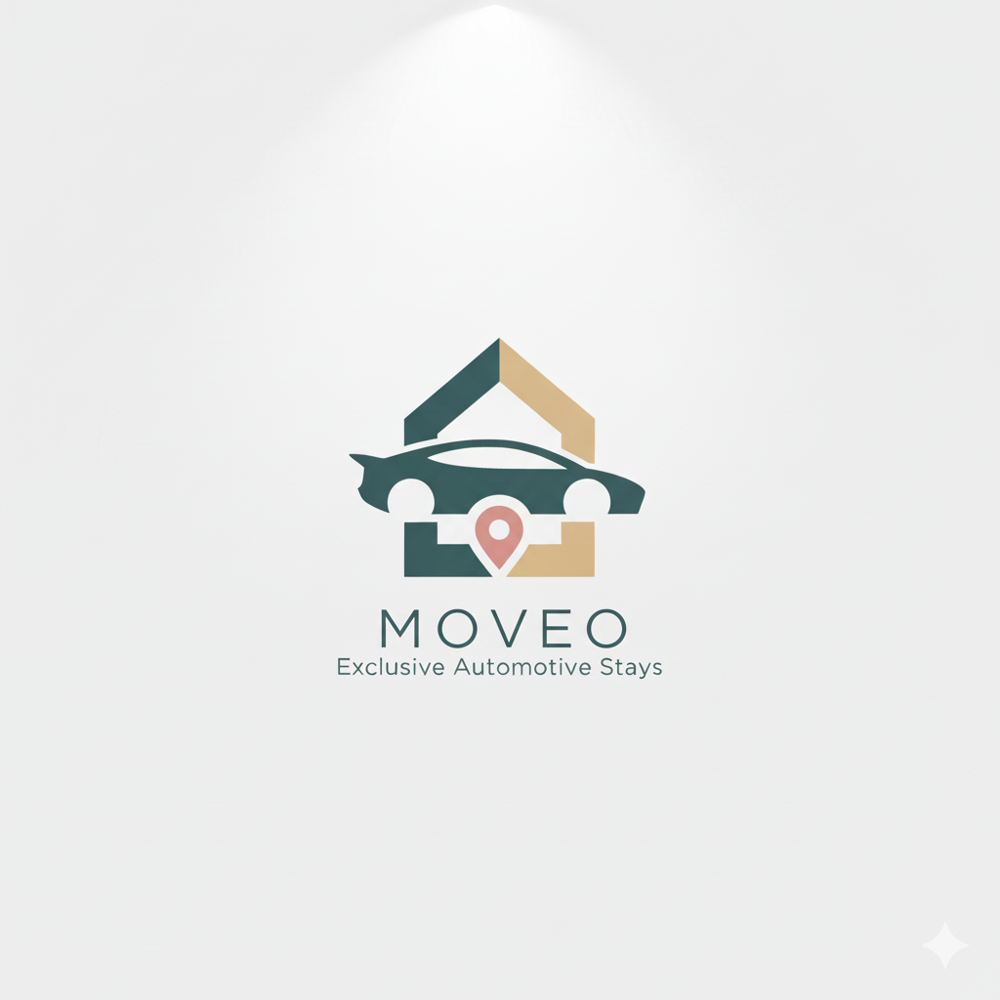
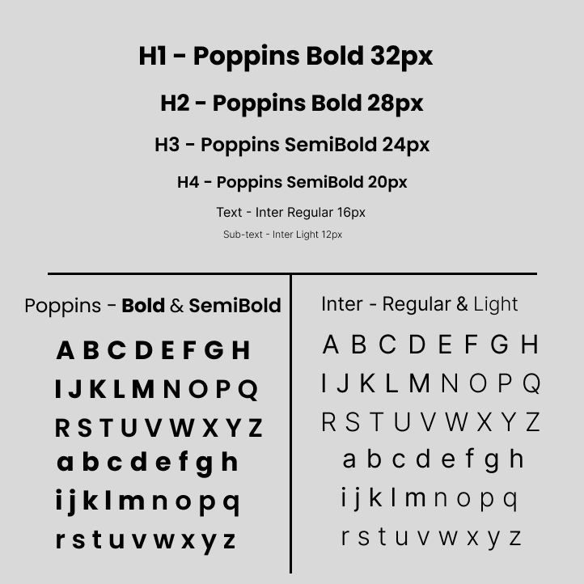
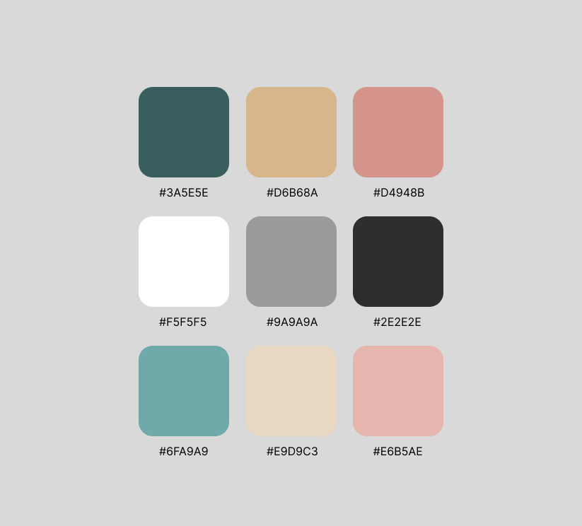
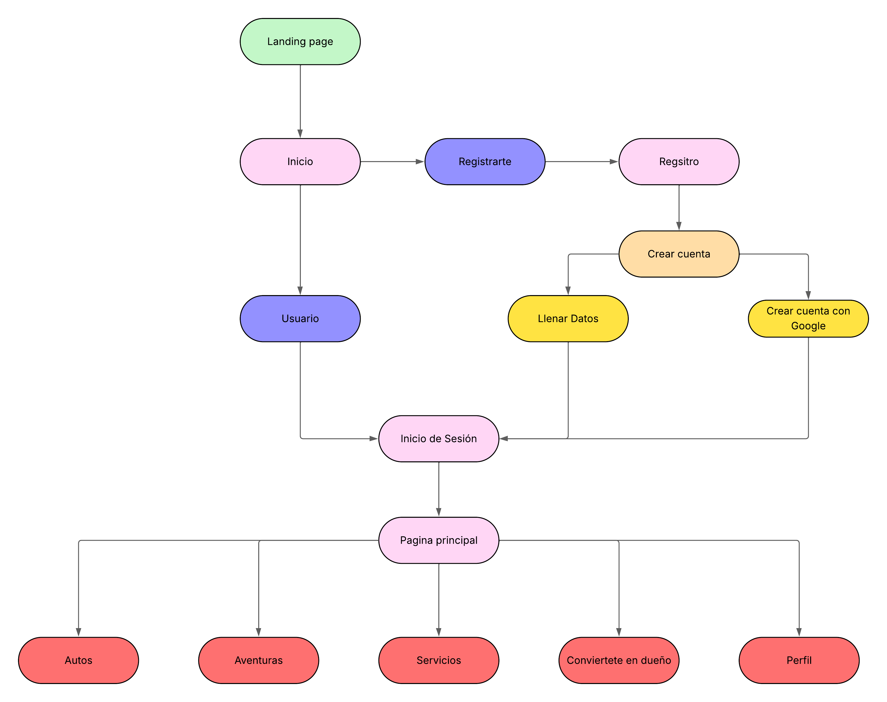

# <center>MOVEO PROJECT</center>

<p align="center">
    <strong>Universidad Peruana de Ciencias Aplicadas</strong><br>
    </img><br>
    <strong>Ingeniería de Software</strong><br>
    <strong>Aplicaciones Web - </strong><br>
    <strong>Profesor:  </strong><br>
    <strong>INFORME TB1  </strong><br>
</p>

<center>

#### Startup: **-----**
#### Product: **Moveo**
### Team  Members:

</center>

<div align="center">

| Member                               | Code        |
|:--------------------------------------:|:-------------:|
|Carlos Alejandro De la cruz Villareal | U20211c036  |
|Franco Gabriel Huang Liu              | U202310345  |
|Gianfranco Luna Morales               | U201824343  |
|Andreow Jomark Santiago Peña          | U202317362  |
|Sebastian Gabriel Zuñiga Calle        | u20221b479  |

</div>

<center>
<br> SEPTIEMBRE 2025
</center> 

# Registro de Versiones del Informe

|version|Fecha|Autor|Descripcion de Modificacion|
|---|---|---|---|
|0.1| 29/08/2025 | Andreow Santiago | Creacion y primera version del informe |
|0.2| 08/09/2025 | Franco Huang | Avance de Syle Guidelines  |
|0.3| 10/09/2025 | Franco Huang | Avance de Information Architecture  |


# Project Report Collaboration Insights

En esta sección, el equipo presenta un análisis detallado de la colaboración realizada durante el desarrollo del informe del proyecto. A continuación, se describe el progreso alcanzado a lo largo de las distintas entregas, destacando tanto el trabajo individual como el esfuerzo colectivo, los commits realizados y las evidencias gráficas del flujo colaborativo en GitHub.

A continuacion, se detalla el trabajo realizado durante cada entrega, acompañado de evidencias visuales de participación en el repositorio del report en GitHub y un resumen de los principales commits realizados por los miembros del equipo.

Link del reporte del equipo: 

https://github.com/UPC-PRE-202502-1ASI0730-7432-MOVEO/MOVEO-Report

#### TB1

aun no acabamos


# Contenido

[Registro de Versiones del Informe](#registro-de-versiones-del-informe)

[Project Report Collaboration Insights](#project-report-collaboration-insights)

[Student Outcome](#student-outcome)

[Capítulo I: Introducción](#capítulo-i-introducción)

[1.1 Startup Profile](#11-startup-profile)  
[1.1.1. Descripción de la Startup](#111-descripción-de-la-startup)  
[1.1.2. Perfiles de integrantes del equipo](#112-perfiles-de-integrantes-del-equipo)  

[1.2. Solution Profile](#12-solution-profile)  
[1.2.1 Antecedentes y problemática](#121-antecedentes-y-problemática)  
[1.2.2 Lean UX Process.](#122-lean-ux-process)  
[1.2.2.1. Lean UX Problem Statements.](#1221-lean-ux-problem-statements)  
[1.2.2.2. Lean UX Assumptions.](#1222-lean-ux-assumptions)  
[1.2.2.3. Lean UX Hypothesis Statements.](#1223-lean-ux-hypothesis-statements)  
[1.2.2.4. Lean UX Canvas.](#1224-lean-ux-canvas)  

[1.3. Segmentos objetivo.](#13-segmentos-objetivo)  

[Capítulo II: Requirements Elicitation & Analysi](#capítulo-ii-requirements-elicitation--analysis)  

[2.1. Competidores](#21-competidores)  
[2.1.1. Análisis competitivo](#211-análisis-competitivo)  
[2.1.2. Estrategias y tácticas frente a competidores](#211-análisis-competitivo)  

[2.2. Entrevistas](#22-entrevistas)  
[2.2.1. Diseño de entrevistas](#221-diseño-de-entrevistas)  
[2.2.2. Registro de entrevistas](#222-registro-de-entrevistas)  
[2.2.3. Análisis de entrevistas](#223-análisis-de-entrevistas)  

[2.3. Needfinding](#23-needfinding)  
[2.3.1. User Personas](#231-user-personas)  
[2.3.2. User Task Matrix](#232-user-task-matrix)  
[2.3.3. User Journey Mapping](#233-user-journey-mapping)  
[2.3.4. Empathy Mapping](#234-empathy-mapping)  
[2.3.5. As-is Scenario Mapping](#235-as-is-scenario-mapping) 

[2.4. Ubiquitous Language](#24-ubiquitous-language)  

[Capítulo III: Requirements Specificatio](#capítulo-iii-requirements-specification)  

[3.1. To-Be Scenario Mapping](#31-to-be-scenario-mapping)    
[3.2. User Stories](#32-user-stories)  
[3.3. Impact Mapping](#33-impact-mapping)  
[3.4. Product Backlog](#34-product-backlog)  

[Capítulo IV: Product Desig](#capítulo-iv-product-design)  

[4.1. Style Guidelines](#41-style-guidelines)  
[4.1.1. General Style Guidelines](#411-general-style-guidelines)  
[4.1.2. Web Style Guidelines](#412-web-style-guidelines)  

[4.2. Information Architecture](#42-information-architecture)  
[4.2.1. Organization Systems](#421-organization-systems)  
[4.2.2. Labeling Systems](#422-labeling-systems)  
[4.2.3. SEO Tags and Meta Tag](#423-seo-tags-and-meta-tags)  
[4.2.4. Searching Systems](#424-searching-systems)   
[4.2.5. Navigation Systems](#425-navigation-systems)  

[4.3. Landing Page UI Design](#43-landing-page-ui-design)   
[4.3.1. Landing Page Wireframe](#431-landing-page-wireframe)  
[4.3.2. Landing Page Mock-up](#432-landing-page-mock-up) 

[4.4. Web Applications UX/UI Design](#44-web-applications-uxui-design)  
[4.4.1. Web Applications Wireframes](#441-web-applications-wireframes)  
[4.4.2. Web Applications Wireflow Diagrams](#442-web-applications-wireflow-diagrams)  
[4.4.3. Web Applications Mock-ups](#443-web-applications-mock-ups)   
[4.4.4. Web Applications User Flow Diagrams](#444-web-applications-user-flow-diagrams)  

[4.5. Web Applications Prototyping](#45-web-applications-prototyping)  

[4.6. Domain-Driven Software Architecture](#46-domain-driven-software-architecture)  
[4.6.1. Software Architecture Context Diagram](#461-software-architecture-context-diagram)  
[4.6.2. Software Architecture Container Diagrams](#462-software-architecture-container-diagrams)  
[4.6.3. Software Architecture Components Diagrams](#463-software-architecture-components-diagrams)  

[4.7. Software Object-Oriented Design](#47-software-object-oriented-design)  
[4.7.1. Class Diagrams](#471-class-diagrams)  
[4.7.2. Class Dictionary](#472-class-dictionary)  

[4.8. Database Design](#48-database-design)  
[4.8.1. Database Diagram](#481-database-diagram)  

[Capítulo V: Product Implementation, Validation & Deploymen](#capítulo-v-product-implementation-validation--deployment)  

[5.1. Software Configuration Management](#51-software-configuration-management)  
[5.1.1. Software Development Environment Configuration](#511-software-development-environment-configuration)  
[5.1.2. Source Code Management](#512-source-code-management)  
[5.1.3. Source Code Style Guide & Conventions](#513-source-code-style-guide--conventions)  
[5.1.4. Software Deployment Configuration](#514-software-deployment-configuration)  

[5.2. Landing Page, Services & Applications Implementation](#52-landing-page-services--applications-implementation)  
[5.2.1. Sprint 1](#521-sprint-1)  
[5.2.2. Sprint 2 ](#522-sprint-2)  
[5.2.2. Sprint 3 ](#522-sprint-3)  
[5.2.2. Sprint 4 ](#522-sprint-4)  
  
[Bibliografía](#bibliografía)  
[Anexos](#anexos)  

# Student Outcome

| Criterio Específico | Acciones Realizadas |
|---|---|
     


# Capítulo I: Introducción
## 1.1. Startup Profile
### 1.1.1. Descripción de la Startup
#### 1.1.2. Perfiles de integrantes del equipo

# 1.2. Solución Profile

## 1.2.1. Antecedentes y Problemática


## 1.2.2. Lean UX Process

### 1.2.2.1. Lean UX Problem Statement

### 1.2.2.2. Lean UX Assumptions

### 1.2.2.3. Lean UX Hypothesis Statements

#### 1.2.2.4. Lean UX Canvas.

## 1.3. Segmentos objetivo

# Capítulo II: Requirements Elicitation & Analysis
## 2.1. Competidores


### 2.1.1. Análisis competitivo.

### 2.1.2. Estrategias y tácticas frente a competidores.


## 2.2. Entrevistas


### 2.2.1. Diseño de entrevistas.


### 2.2.2. Registro de entrevistas

#### **Segmento 1:**

##### **Roy Hsieh:** 

<p align="center">

</p>

Link: <https://youtu.be/kJXcfmofi8g>

#### **Segmento 2:**

##### **Gabriel Torres**

<p align="center">

</p>

Link: <https://youtu.be/pLZNIzb0hL0>

### 2.2.3. Análisis de Entrevistas

#### **Segmento 1:**

##### **Roy Hsieh:** 

#### **Segmento 2:**

##### **Gabriel Torres:** 

Gabriel Eduardo Torres Campos, un joven de 19 años, compartió su visión sobre el alquiler de autos a partir de la experiencia de su padre, aunque él nunca ha alquilado uno directamente. Mencionó que los documentos más comunes son el DNI, la licencia de conducir y, posiblemente, un contrato. También señaló que los requisitos suelen incluir ser mayor de edad, tener licencia con al menos 1 o 2 años de vigencia y contar con una tarjeta como garantía. Para él, los factores que más pesan al momento de alquilar son el precio y el estado del vehículo, ya que espera que el costo se justifique con la calidad y seguridad del auto.

Gabriel destacó que confía más en recomendaciones de familiares o conocidos que en plataformas abiertas, pues teme fraudes o autos en mal estado. Prefiere comunicarse por WhatsApp o llamadas si trata con dueños particulares, mientras que con empresas prefiere usar la computadora para navegar mejor por sus páginas. Además, valoró mucho la posibilidad de reservar con anticipación mediante una app para ahorrar tiempo y evitar trámites al llegar a un destino. Finalmente, comentó que casi nunca deja reseñas, salvo cuando la experiencia es muy buena.

## 2.3. Needfinding

### 2.3.1. User Persona

### 2.3.2. User Task Matrix

### 2.3.3. User Journey Mapping

### 2.3.4. Empathy Mapping

### 2.3.5. As-is Scenario Mapping

## 2.4. Ubiquitous Language

# Capítulo III: Requirements Specification
## 3.1. To-Be Scenario Mapping

## 3.2. User Stories

## 3.3. Impact Mapping

## 3.4. Product Backlog.

## 3.5. Entity Diagram.


# Capítulo IV: Product Design
## 4.1. Style Guidelines.
En esta sección se define un repositorio centralizado y debidamente organizado para el uso de todo el equipo, el cual incluye recursos como assets, tipografías y demás elementos necesarios. Su finalidad es asegurar una presentación coherente, estandarizada y alineada en todo el proyecto.

### 4.1.1. General Style Guidelines.
Buscamos transmitir confianza, accesibilidad y modernidad. Para reflejar la idea de compartir vehículos de manera segura y práctica, integramos un logo en el que un automóvil  se ubica frente a una casa , ambos unidos por un pin que simboliza ubicación y conexión. El branding se construye sobre la base de:
* **Misión:** Facilitar el acceso a la movilidad mediante una plataforma confiable donde las personas puedan compartir y alquilar autos con seguridad.
* **Visión:** Crear entornos dignos y seguros para adultos mayores usando tecnología.

#### Logo

Queremos transmitir una imagen de confianza, seguridad y tranquilidad al usuario a través de este diseño, utilizando un logotipo principalmente verde y crema para reforzar el concepto.

<p align="center">

</p>

#### Typography

La tipografía debe transmitir claridad, calidez y profesionalismo. Por esa razón decidimos usar **Poppins** e **Inter**, ya que tienen un diseño limpio y sencillo, lo que facilita la lectura en pantallas.
En este caso se usará **Poppins** para titulos y/o subtitulos e **Inter** para texto y/o subtexto.

<p align="center">

</p>

#### Colors

Elegimos los siguientes colores buscando plasmar una paleta que influya seguridad y profesionalismo:

<p align="center">

</p>

#### Spacing

En este proyecto el espaciado cumple un papel clave para mantener la legibilidad y la accesibilidad. Por ello:

* Párrafos: Se añade un espacio equivalente a una línea completa entre cada uno, lo que facilita distinguir las ideas.

* Elementos interactivos: Se deja entre 8 y 12 píxeles de separación en botones, enlaces u otros componentes, reduciendo posibles errores en dispositivos táctiles.

* Márgenes y padding: Se aplican márgenes de 16 a 24 píxeles alrededor del contenido, evitando que la interfaz se vea saturada.
  
#### Communication Tone

| Dimensión              | Nivel Adoptado    |
|------------------------|-------------------|
| Divertido/Serio        | Medio-Serio       |
| Formal/Casual          | Semi-Formal       |
| Respetuoso/Irreverente | Muy Respetuoso    |
| Entusiasta/Sereno      | Sereno y Empático |

Decidimos mantener una comunicación clara, cálida y profesional, porque este enfoque nos permite conectar de manera efectiva con el público, especialmente en un contexto tan sensible como la seguridad del usuario. 

### 4.1.2. Web Style Guidelines.

Para garantizar que la página se adapte a diferentes tamaños de pantalla y mantenga una presentación clara y atractiva, se empleará CSS con el apoyo de media queries. De esta manera, será posible definir estilos específicos según la resolución del dispositivo. Elementos clave como la barra de navegación y el pie de página se ajustarán automáticamente, ofreciendo una experiencia consistente en cualquier dispositivo. Los puntos de quiebre definidos son los siguientes:

| Dispositivo     | Ancho mínimo | Ejemplo de uso            |
|-----------------|--------------|----------------------------|
| Mobile          | ≥ 320px      | Teléfonos                  |
| Tablet          | ≥ 768px      | iPad / tablets genéricas   |
| Laptop  | ≥ 1024px     | Monitores y laptops        |
| Wide Screen     | ≥ 1440px     | Pantallas grandes o TV     |

## 4.2. Information Architecture.

### 4.2.1. Organization Systems.

Nuestro propósito es garantizar una experiencia de usuario coherente y sin fricciones en la plataforma web, tanto en la versión de sobremesa como la versión móvil. La estructura visual que presentamos ha sido diseñada estratégicamente para responder a las necesidades de nuestros dos segmentos principales.

Si bien ambos acceden a las mismas secciones, la diferencia radica en los niveles de permiso. Los dueños pueden prestar el transporte, ofrecer rutas de aventuras y prestar servicios adicionales, mientras que los inquilinos cuentan únicamente con acceso a la visualización de autos, aventuras y servicios disponibles, además de la posibilidad de filtrar por locación, fecha y/o cantidad de personas.

<p align="center">

</p>

Como se ve en el diagrama, se sigue un proceso estructurado para facilitar la gestión de la salud de los pacientes, permitiendo la interacción entre médicos y familiares. Aquí explicamos cada etapa del proceso y las funciones disponibles:

1. **Landing Page**: Es la página de inicio donde los usuarios pueden explorar la aplicación y conocer sus beneficios.

2. **Inicio**: Los usuarios pueden iniciar sesión si ya tienen una cuenta o registrarse como nuevos usuarios.

3. **Registro**:
   - **Crear Cuenta**: Los nuevos usuarios ingresan sus datos manualmente.
   - **Registrarse con Google**: Opción para facilitar el acceso mediante una cuenta de Google.
   - **Llenar Datos**: Se completa un formulario con información personal.

4. **Inicio de Sesión**: Los usuarios existentes ingresan sus credenciales para acceder a la plataforma.

5. **Página Principal**: Una vez dentro, los usuarios pueden acceder a diversas funcionalidades.

6. **Autos**: Los usuarios pueden ver autos disponibles.

7. **Aventuras**: Rutas por auto creadas por personas hacia diversos destinos con alguna temática.

8. **Servicios**: Servicios brinda.

9. **Conviertete en dueño**: Complementa la experiencia de alquiler, ofreciendo beneficios adicionales que mejoran la seguridad, comodidad y confianza del usuario.

10. **Perfil**: Configuración de la cuenta, donde los usuarios pueden actualizar su información personal.

Este flujo de trabajo permite que los médicos tomen decisiones informadas sobre la salud del paciente y que los familiares estén al tanto de su evolución.

### 4.2.2. Labeling Systems.

Los sistemas de etiquetado seguirán la misma estructura presentada en Organization Systems. El usuario podrá seleccionar el encabezado de su interés y, al hacer clic, será dirigido automáticamente a la sección correspondiente dentro de la plataforma.

| **Sección**  | **Contenido** |
|-------------|--------------|
| **Página Principal** | Es el primer punto de contacto con Moveo. Aquí se introduce la aplicación, explicando su propósito, misión y visión, además de resaltar esta manera de alquilar automóviles. |
| **About** | Proporciona una descripción detallada de las herramientas y funcionalidades que ofrece Moveo. Se explican los módulos principales, cómo interactúa el dueño de automóvil y el arrendador, y los beneficios del uso de la aplicación. |
| **Contacto** | Espacio donde los usuarios pueden encontrar los canales de comunicación con el equipo de soporte. Se incluyen redes sociales, un correo de asistencia técnica y un correo para consultas de negocios o colaboraciones. |

##### Secciones y contenido de Moveo

| **Sección**  | **Contenido** |
|-------------|--------------|
| **Autos** | Esta es la página principal en la que tambipen contiene la selección de autos disponibles para alquilar. |
| **Aventuras** | Sección donde los usuarios pueden publicar rutas personalizadas con actividades planeadas y destinos diferentes. |
| **Servicios** | Espacio dedicado a multiples servicios automovilisticos seleccionables . |
| **Conviertete en dueño** | Permite al usuario poner su auto en alquiler, publicar una aventura o publicar un servicio. |
| **Perfil** | Sección para la administración del perfil del usuario, permitiendo la actualización de datos personales, preferencias y configuración de accesibilidad. |

### 4.2.3. SEO Tags and Meta Tags

La **Landing Page** está diseñada para atraer nuevos usuarios, informar sobre la propuesta de valor y generar confianza en la marca.  Las etiquetas meta se centran en captar tráfico orgánico de personas interesadas en alquilar un auto, ir de viaje manejando o buscando un servicio automovilístico.


**Título de la página (Title)**

El título resume de forma directa el propósito del sitio, incluyendo las palabras clave **"autos"**, **"alquilar"** y **"seguro"**, que son términos con alta relevancia SEO para nuestro público objetivo.

```html
<title>Moveo – Alquilar autos de manera segura</title>
```

**Meta descripción (Meta Description)**

La meta descripción ofrece una vista clara del valor que ofrece la plataforma, motivando al clic desde los resultados de búsqueda.

```html
<meta name="description" content="Moveo es una plataforma digital que mejora la seguridad al alquilar autos, brindadndo viajes y servicios automovilísticos.">
```

**Palabras clave (Meta Keywords)**

Los términos elegidos cubren conceptos clave relacionados con el contexto de uso de Moveo, permitiendo un mayor alcance en búsquedas asociadas.

```html
<meta name="keywords" content="autos, alquiler, viajes, actividades, plataforma digital, aventuras, servicios automovilísticos">
```


**Autor del sitio (Meta Author)**

La etiqueta autor identifica al equipo creador, útil para fines de propiedad y referencia en motores de búsqueda.

```html
<meta name="author" content="Moveo Team">
```


### 4.2.4. Searching Systems.

La plataforma Moveo incorpora un sistema de búsqueda global que permite a los usuarios encontrar rápidamente lo que necesitan sin importar en qué sección se encuentren.

#### **Busqueda Global**

* Disponible en la barra superior de navegación en todas las páginas.
* El usuario puede escribir palabras clave como “SUV Lima”, “aventura playa” o “servicio mantenimiento”.
* El motor de búsqueda devuelve resultados clasificados por secciones:
  * Autos disponibles
  * Aventuras creadas por otros usuarios
  * Servicios automovilísticos
  * Usuarios/Dueños (en caso de búsqueda por nombre o alias)

#### **Filtrado de información**

* En cada sección principal (Autos, Aventuras, Servicios), los usuarios disponen de filtros específicos:
  * **Autos**: por ubicación, tipo de vehículo (sedán, SUV, deportivo), precio por día, transmisión (manual/automática), y valoraciones de otros usuarios.
  * **Aventuras**: por destino, temática (playa, montaña, ciudad), duración y popularidad.
  * **Servicios**: por tipo (lavado, mantenimiento, chofer privado, asistencia en carretera) y disponibilidad.
* Los filtros se combinan con la búsqueda global para entregar resultados personalizados y relevantes.

### 4.2.5. Navigation Systems.

Organizamos las secciones, permitiendo a los usuarios desplazarse sin dificultad entre distintas funcionalidades. La navegación está basada en una barra de menú principal, accesos rápidos y una estructura jerárquica clara que guía al usuario en su recorrido.

#### **Estructura de Navegación en la Landing Page**
 La landing page consta de las siguientes secciones principales:

 | **Sección**  | **Contenido** |
|-------------|--------------|
| **Página Principal** | Introduce Moveo, su propósito, misión y visión. Desde aquí, los usuarios pueden acceder rápidamente a las funciones clave. |
| **About** | Explica las herramientas principales de Moveo, cómo funcionan y cómo beneficia a los usuarios. |
| **Contacto** | Incluye enlaces a redes sociales, un correo de asistencia técnica y otro para consultas de negocio. |

#### **Estructura de Navegación en Moveo**
 La aplicación consta de las siguientes secciones principales:

 | **Sección**  | **Contenido** |
|-------------|--------------|
| **Autos** | Muestra de manera simple los carros disponibles y a la vez divididos por categorías. |
| **Aventuras** | Proporciona rutas personalizadas con actividades planeadas y destinos diferentes. |
| **Servicios** | Sección enfocada en brindar una variedad de opciones de servicios automotrices disponibles para selección. |
| **Conviertete en dueño** | Espacio donde el usuario puede publicar su automóvil para alquiler, proponer rutas personalizadas o agregar servicios complementarios. |
| **Perfil** | Área dedicada al control del perfil del usuario, con herramientas para mantener actualizados los datos, preferencias y accesos personalizados. |

## 4.3. Landing Page UI Design.

### 4.3.1. Landing Page Wireframe.

### 4.3.2. Landing Page Mock-up.


## 4.4. Web Applications UX/UI Design.
### 4.4.1. Web Applications Wireframes.

### 4.4.2. Web Applications Wireflow Diagrams.

### 4.4.3. Web Applications Mock-ups.

### 4.4.4. Web Applications User Flow Diagrams.

## 4.5. Web Applications Prototyping.

## 4.6. Domain-Driven Software Architecture.
### 4.6.1. Software Architecture Context Diagram.

### 4.6.2. Software Architecture Container Diagrams.

### 4.6.3. Software Architecture Components Diagrams.

## 4.7. Software Object-Oriented Design.
### 4.7.1. Class Diagrams.

### 4.7.2. Class Dictionary.

## 4.8. Database Design.
### 4.8.1. Database Diagram.

# Capítulo V: Product Implementation, Validation & Deployment
## 5.1. Software Configuration Management.

### 5.1.1. Software Development Environment Configuration.

### 5.1.2. Source Code Management.

### 5.1.3. Source Code Style Guide & Conventions.

### 5.1.4. Software Deployment Configuration.

## 5.2. Landing Page, Services & Applications Implementation.

## 5.2.1. Sprint 1
### 5.2.1.1. Sprint Planning 1.
### 5.2.1.2. Aspect Leaders and Collaborators.
### 5.2.1.3. Sprint Backlog 1.
### 5.2.1.4. Development Evidence for Sprint Review.
### 5.2.1.5. Execution Evidence for Sprint Review.
### 5.2.1.6. Services Documentation Evidence for Sprint Review.
### 5.2.1.7. Software Deployment Evidence for Sprint Review.
### 5.2.1.8. Team Collaboration Insights during Sprint.
