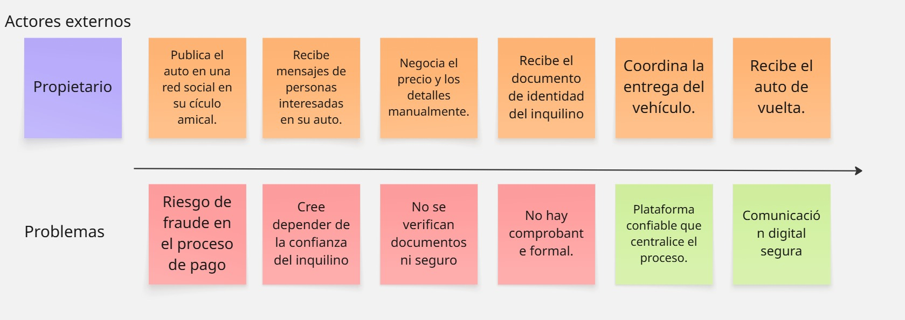
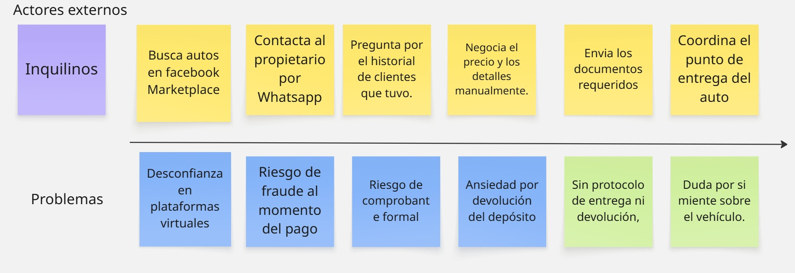

# <center>MOVEO PROJECT</center>

<p align="center">
    <strong>Universidad Peruana de Ciencias Aplicadas</strong><br>
    </img><br>
    <strong>Ingeniería de Software</strong><br>
    <strong>Aplicaciones Web - </strong><br>
    <strong>Profesor:  </strong><br>
    <strong>INFORME TB1  </strong><br>
</p>

<center>

#### Startup: **-----**
#### Product: **Moveo**
### Team  Members:

</center>

<div align="center">

| Member                               | Code        |
|:--------------------------------------:|:-------------:|
|Carlos Alejandro De la cruz Villareal | U20211c036  |
|Franco Gabriel Huang Liu              | U202310345  |
|Gianfranco Luna Morales               | U201824343  |
|Andreow Jomark Santiago Peña          | U202317362  |
|Sebastian Gabriel Zuñiga Calle        | u20221b479  |

</div>

<center>
<br> SEPTIEMBRE 2025
</center> 

# Registro de Versiones del Informe

|version|Fecha|Autor|Descripcion de Modificacion|
|---|---|---|---|
|0.1| 29/08/2025 | Andreow Santiago | Creacion y primera version del informe |
|0.2| 08/09/2025 | Franco Huang | Avance de Syle Guidelines  |
|0.3| 10/09/2025 | Franco Huang | Avance de Information Architecture y entrevistas  |


# Project Report Collaboration Insights

En esta sección, el equipo presenta un análisis detallado de la colaboración realizada durante el desarrollo del informe del proyecto. A continuación, se describe el progreso alcanzado a lo largo de las distintas entregas, destacando tanto el trabajo individual como el esfuerzo colectivo, los commits realizados y las evidencias gráficas del flujo colaborativo en GitHub.

A continuacion, se detalla el trabajo realizado durante cada entrega, acompañado de evidencias visuales de participación en el repositorio del report en GitHub y un resumen de los principales commits realizados por los miembros del equipo.

Link del reporte del equipo: 

https://github.com/UPC-PRE-202502-1ASI0730-7432-MOVEO/MOVEO-Report

#### TB1

aun no acabamos


# Contenido

[Registro de Versiones del Informe](#registro-de-versiones-del-informe)

[Project Report Collaboration Insights](#project-report-collaboration-insights)

[Student Outcome](#student-outcome)

[Capítulo I: Introducción](#capítulo-i-introducción)

[1.1 Startup Profile](#11-startup-profile)  
[1.1.1. Descripción de la Startup](#111-descripción-de-la-startup)  
[1.1.2. Perfiles de integrantes del equipo](#112-perfiles-de-integrantes-del-equipo)  

[1.2. Solution Profile](#12-solution-profile)  
[1.2.1 Antecedentes y problemática](#121-antecedentes-y-problemática)  
[1.2.2 Lean UX Process.](#122-lean-ux-process)  
[1.2.2.1. Lean UX Problem Statements.](#1221-lean-ux-problem-statements)  
[1.2.2.2. Lean UX Assumptions.](#1222-lean-ux-assumptions)  
[1.2.2.3. Lean UX Hypothesis Statements.](#1223-lean-ux-hypothesis-statements)  
[1.2.2.4. Lean UX Canvas.](#1224-lean-ux-canvas)  

[1.3. Segmentos objetivo.](#13-segmentos-objetivo)  

[Capítulo II: Requirements Elicitation & Analysi](#capítulo-ii-requirements-elicitation--analysis)  

[2.1. Competidores](#21-competidores)  
[2.1.1. Análisis competitivo](#211-análisis-competitivo)  
[2.1.2. Estrategias y tácticas frente a competidores](#211-análisis-competitivo)  

[2.2. Entrevistas](#22-entrevistas)  
[2.2.1. Diseño de entrevistas](#221-diseño-de-entrevistas)  
[2.2.2. Registro de entrevistas](#222-registro-de-entrevistas)  
[2.2.3. Análisis de entrevistas](#223-análisis-de-entrevistas)  

[2.3. Needfinding](#23-needfinding)  
[2.3.1. User Personas](#231-user-personas)  
[2.3.2. User Task Matrix](#232-user-task-matrix)  
[2.3.3. User Journey Mapping](#233-user-journey-mapping)  
[2.3.4. Empathy Mapping](#234-empathy-mapping)  
[2.3.5. As-is Scenario Mapping](#235-as-is-scenario-mapping) 

[2.4. Ubiquitous Language](#24-ubiquitous-language)  

[Capítulo III: Requirements Specificatio](#capítulo-iii-requirements-specification)  

[3.1. To-Be Scenario Mapping](#31-to-be-scenario-mapping)    
[3.2. User Stories](#32-user-stories)  
[3.3. Impact Mapping](#33-impact-mapping)  
[3.4. Product Backlog](#34-product-backlog)  

[Capítulo IV: Product Desig](#capítulo-iv-product-design)  

[4.1. Style Guidelines](#41-style-guidelines)  
[4.1.1. General Style Guidelines](#411-general-style-guidelines)  
[4.1.2. Web Style Guidelines](#412-web-style-guidelines)  

[4.2. Information Architecture](#42-information-architecture)  
[4.2.1. Organization Systems](#421-organization-systems)  
[4.2.2. Labeling Systems](#422-labeling-systems)  
[4.2.3. SEO Tags and Meta Tag](#423-seo-tags-and-meta-tags)  
[4.2.4. Searching Systems](#424-searching-systems)   
[4.2.5. Navigation Systems](#425-navigation-systems)  

[4.3. Landing Page UI Design](#43-landing-page-ui-design)   
[4.3.1. Landing Page Wireframe](#431-landing-page-wireframe)  
[4.3.2. Landing Page Mock-up](#432-landing-page-mock-up) 

[4.4. Web Applications UX/UI Design](#44-web-applications-uxui-design)  
[4.4.1. Web Applications Wireframes](#441-web-applications-wireframes)  
[4.4.2. Web Applications Wireflow Diagrams](#442-web-applications-wireflow-diagrams)  
[4.4.3. Web Applications Mock-ups](#443-web-applications-mock-ups)   
[4.4.4. Web Applications User Flow Diagrams](#444-web-applications-user-flow-diagrams)  

[4.5. Web Applications Prototyping](#45-web-applications-prototyping)  

[4.6. Domain-Driven Software Architecture](#46-domain-driven-software-architecture)  
[4.6.1. Software Architecture Context Diagram](#461-software-architecture-context-diagram)  
[4.6.2. Software Architecture Container Diagrams](#462-software-architecture-container-diagrams)  
[4.6.3. Software Architecture Components Diagrams](#463-software-architecture-components-diagrams)  

[4.7. Software Object-Oriented Design](#47-software-object-oriented-design)  
[4.7.1. Class Diagrams](#471-class-diagrams)  
[4.7.2. Class Dictionary](#472-class-dictionary)  

[4.8. Database Design](#48-database-design)  
[4.8.1. Database Diagram](#481-database-diagram)  

[Capítulo V: Product Implementation, Validation & Deploymen](#capítulo-v-product-implementation-validation--deployment)  

[5.1. Software Configuration Management](#51-software-configuration-management)  
[5.1.1. Software Development Environment Configuration](#511-software-development-environment-configuration)  
[5.1.2. Source Code Management](#512-source-code-management)  
[5.1.3. Source Code Style Guide & Conventions](#513-source-code-style-guide--conventions)  
[5.1.4. Software Deployment Configuration](#514-software-deployment-configuration)  

[5.2. Landing Page, Services & Applications Implementation](#52-landing-page-services--applications-implementation)  
[5.2.1. Sprint 1](#521-sprint-1)  
[5.2.2. Sprint 2 ](#522-sprint-2)  
[5.2.2. Sprint 3 ](#522-sprint-3)  
[5.2.2. Sprint 4 ](#522-sprint-4)  
  
[Bibliografía](#bibliografía)  
[Anexos](#anexos)  

# Student Outcome

| Criterio Específico | Acciones Realizadas |
|---|---|
     


# Capítulo I: Introducción
## 1.1. Startup Profile
### 1.1.1. Descripción de la Startup
#### 1.1.2. Perfiles de integrantes del equipo

# 1.2. Solución Profile

## 1.2.1. Antecedentes y Problemática


## 1.2.2. Lean UX Process

### 1.2.2.1. Lean UX Problem Statement

### 1.2.2.2. Lean UX Assumptions

### 1.2.2.3. Lean UX Hypothesis Statements

#### 1.2.2.4. Lean UX Canvas.

## 1.3. Segmentos objetivo

# Capítulo II: Requirements Elicitation & Analysis
## 2.1. Competidores
Previo al desarrollo de la aplicación, hicimos una búsqueda de las opciones que ya existen en el mercado, para ver que es lo que ofrecen y como podemos diferenciarnos de ellos.
- **Peru Rent A Car:**
  Esta plataforma se especializa en el alquiler de coches en Perú. Ofrece una amplia gama de vehículos y opciones de alquiler, así como información sobre destinos turísticos en Perú. 
  La plataforma también permite a los usuarios comparar precios y reservar coches en línea.
  <div style="text-align: center;">

  </div>
  
- **Kayak:**
  Kayak es una de las plataformas de búsqueda de viajes más grandes del mundo. Permite a los usuarios buscar y comparar precios de vuelos, hoteles y alquiler de coches en una sola plataforma. 
  Kayak también ofrece herramientas para planificar viajes, como alertas de precios y recomendaciones personalizadas.
  <div style="text-align: center;">

  </div>

- **Budget Car Rental Peru:**
  A diferencia de Peru Rent A Car, Budget Car Rental es una empresa internacional que ofrece servicios de alquiler de coches en Perú. 
  La plataforma permite a los usuarios buscar y comparar precios de coches de alquiler en diferentes ubicaciones y reservar en línea. Budget Car Rental también ofrece opciones de alquiler a largo plazo y programas de fidelización.
  <div style="text-align: center;">

  </div>

### 2.1.1. Análisis competitivo.

En esta sección tiene como objetivo que su startup conozca mejor a sus competidores, en contraste con la idea inicial que pudiera tener sobre ellos. Se debe desarrollar el siguiente Landscape:  
**Se realiza un mapeo estratégico comparativo entre nuestra propuesta (Moveo) y los principales actores del mercado, evaluando su perfil, marketing, producto y análisis SWOT, con el fin de identificar brechas de mercado, fortalezas propias y oportunidades de posicionamiento diferenciado.**

**¿Por qué llevar a cabo este análisis?**  
*Objetivo: Comprender a fondo el posicionamiento de nuestra startup frente a competidores clave en el mercado de alquiler de autos en Perú, identificando sus fortalezas, debilidades y estrategias, para definir con precisión nuestra ventaja competitiva y oportunidades de diferenciación.*


<table border="1" style="text-align: center;">
	<tbody>
		<tr><td colspan="6">Análisis de competidores</td></tr>
		<tr><td colspan="2"></td><td>Moveo</td><td>Kayak</td><td>Peru Rent A Car</td><td>Budget Car Rental Peru</td></tr>
		<tr><td rowspan="2">Perfil</td><td>Resumen</td>
			<td>Una aplicación que busca ofrecer una plataforma rápida y ágil para el alquiler de autos, con un fuerte enfoque en la seguridad de ambas partes.</td>
			<td>Kayak es una plataforma líder de búsqueda tanto de vuelos, como cuartos de hotel, alquiler de vehículos, etc.</td>
			<td>Esta plataforma web presenta parte de un catálogo establecido de vehículos para alquilar, con una atención mediante WhatsApp y dirigido solo a clientes.</td>
			<td>Plataforma de similar funcionamiento que Rent A Car Peru, orientado a clientes con un énfasis en cuidar el presupuesto de los mismos.</td></tr>
		<tr><td>Ventaja competitiva</td>
			<td>Ofrecer una plataforma tanto para dueños de vehículos como a clientes interesados en alquilar.</td>
			<td>Es la aplicación líder en la búsqueda de servicios por su variedad y robusta plataforma web.</td>
			<td>Líder local del servicio de alquiler de autos, con una amplia flota y rápida atención al usuario</td>
			<td>Ofrece una alternativa de alquiler económica velando por el bolsillo de sus clientes. </td></tr>
		<tr><td rowspan="2">Perfil de Marketing</td><td>Mercado objetivo</td>
			<td>Jóvenes y adultos desde los 20 a los 50 años.</td>
			<td>Turistas o viajeros que necesiten cualquier tipo de servicio de comodidad.</td>
			<td>Adultos peruanos que busquen alquilar un vehiculo.</td>
			<td>Adultos peruanos que busquen alquilar un vehiculo económico.</td></tr>
		<tr><td>Estrategias de marketing</td>
			<td>Marketing digital en redes sociales y colaboraciones con influencers.</td>
			<td>Alianza con Google Ads, tanto en Youtube como Chrome.</td>
			<td>Patrocinio mediante búsquedas de Chrome.</td>
			<td>Patrocinio mediante búsquedas de Chrome.</td></tr>
		<tr><td rowspan="3">Perfil de Producto</td>
			<td>Productos y Servicios</td>
			<td>Aplicación destinada a la oferta de vehículos en alquiler, como la demanda de los mismos.</td>
			<td>Aplicación móvil y web que cuenta con una enorme variedad de servicios esenciales para viajeros y turistas</td>
			<td>Aplicación web rápida e intuitiva que permite consultar parte del catálogo de vehículos disponibles para alquiler.</td>
			<td>Aplicación web ágil y amigable que permite consultar una limitada oferta de vehículos económicos en alquiler</td></tr>
		<tr><td>Precios y Costos</td>
			<td>Costos por publicación de vehículos mediante una suscripción.</td>
			<td>Modelo gratuito, con cobro de comisión a las empresas referidas.</td>
			<td>Ingreso directo mediante el alquiler.</td>
			<td>Ingreso directo mediante el alquiler.</td></tr>
		<tr><td>Canales de distribución</td>
			<td>Disponible en línea a través de la aplicación web.</td>
			<td>Descargable en Google Play y App Store y la plataforma web.</td>
			<td>Disponible en línea a través de la aplicación web.</td>
			<td>Disponible en línea a través de la aplicación web.</td></tr>
		<tr><td rowspan="4">Análisis SWOT</td><td>Fortalezas</td><td><ul>
                    <li>Orientado a jóvenes y adultos peruanos</li><li>Facilidades para alquilar, como ofrecer alquiler</li><li>Énfasis en la seguridad y garantía</li></ul></td>
			<td><ul>
                    <li>Gran cantidad de usuarios</li><li>Referente del sector</li><li>Plataformas ágiles e intuitivas</li></ul></td>
			<td><ul><li>Plataforma local</li><li>Excelente atención al cliente</li></ul></td>
			<td><ul><li>Plataforma web amigable</li><li>Todo el catálogo está disponible para cualquier usuario</li></ul></td></tr>
		<tr><td>Debilidades</td>
            <td><ul><li>Nuevo competidor</li><li>Sector con competidores fuertes ya establecidos</li></ul></td>
			<td><ul><li>Pobre atención al cliente</li></ul></td>
			<td><ul><li>Solo se puede consultar parte del catálogo de vehículos</li></ul></td>
			<td><ul><li>Opta por un nicho muy concreto</li><li>No cuenta con tanta relevancia como su competencia</li></ul></td></tr>
		<tr><td>Oportunidades</td>
            <td><ul><li>Sin competidores a nivel nacional</li><li>Ofrece servicio para ambas partes involucradas en el alquiler</li></ul></td>
			<td><ul><li>Fuerte presencia internacional</li><li>Referente del sector</li></ul></td>
			<td><ul><li>Flota amplia y en crecimiento</li><li>Atención personalizada</li></ul></td>
			<td><ul><li>Excelente interfaz</li></ul></td></tr>
		<tr><td>Amenazas</td>
            <td><ul><li>Competencia ya establecida</li><li>Sector muy competitivo</li></ul></td>
			<td><ul><li>Oferta demasiado ámplia</li><li>Sin control de calidad</li></ul></td>
			<td><ul><li>Oferta fija y poco variada</li><li>Sin opciones para dueños interesados en alquilar</li></ul></td>
<td><ul><li>Se ve opacado por la competencia</li><li>Oferta aún más limitada que la competencia</li></ul></td>
</tr></tbody></table>

### 2.1.2. Estrategias y tácticas frente a competidores.
Moveo se diferenciará mediante un enfoque local y seguro, integrando tanto a dueños de vehículos como a arrendatarios. 
Para contrarrestar la falta de reconocimiento como nuevo competidor, se aplicarán tácticas de marketing digital y alianzas con influencers, generando confianza y visibilidad rápida. 
Aprovechando la ausencia de un líder nacional en movilidad tipo Airbnb, la estrategia será posicionarse como la primera opción peruana especializada en alquiler de autos. 
Frente a amenazas de grandes plataformas, Moveo enfocará sus esfuerzos en segmentos desatendidos y en brindar soporte inmediato y flexibilidad en precios, destacando su cercanía y adaptabilidad frente a la oferta internacional y tradicional.

## 2.2. Entrevistas

En esta sección se presenta la investigación cualitativa realizada mediante entrevistas profundas a representantes de nuestros dos segmentos objetivo: **propietarios de vehículos** (Segmento 1) e **inquilinos o usuarios que desean alquilar autos** (Segmento 2). El objetivo es comprender sus necesidades reales, frustraciones, hábitos de consumo y expectativas frente a una plataforma de alquiler de autos, validando así los supuestos del modelo de negocio y ajustando la propuesta de valor de Moveo a lo que el mercado realmente demanda.

### 2.2.1. Diseño de entrevistas.

Esta sección incluye preguntas demográficas, conductuales y psicográficas dirigidas a cada segmento, con el fin de construir arquetipos (personas) basados en evidencia real. Se aplican buenas prácticas de diseño de entrevistas: preguntas abiertas, no sugestivas, orden lógico (de lo general a lo específico) y enfoque en comportamientos reales, no hipotéticos.

Antes de realizar las entrevistas profundas, se aplicó un formulario digital (Google Forms) a todos los participantes con el objetivo de recolectar información demográfica y conductual básica. Esto permitió segmentar adecuadamente a los entrevistados, personalizar el enfoque de cada entrevista según su perfil, y optimizar el tiempo durante las sesiones cualitativas.

 Formulario segmento propietarios: https://forms.gle/uyVSkqSiuiKx1nb69


Formulario segmento Inquilinos: https://forms.gle/kz3BdxPoZHKNgqUg9

#### **Segmento 1: Propietarios**

**Demográficas (para arquetipo):**
- ¿Cuál es tu nombre completo?
- ¿Qué edad tienes?
- ¿En qué distrito resides?
- ¿Cuál es tu género?
- ¿Cuál es tu estado civil?
- ¿Vives solo, con pareja, con hijos u otros familiares?
- ¿A qué te dedicas (trabajo, estudios, negocio propio)?

**Psicográficas y comportamentales (para arquetipo):**
- ¿Cómo describirías tu personalidad cuando se trata de prestar algo valioso (precavido, confiado, flexible, exigente)?
- ¿Qué marcas de autos confías más para alquilar? ¿Por qué?
- ¿Qué influencers, blogs, canales o redes sociales te influyen a la hora de tomar decisiones sobre tu auto o negocios?
- ¿Qué dispositivos usas con más frecuencia (celular, laptop, tablet)? ¿Qué apps o navegadores prefieres?
- ¿Por qué canales digitales sueles informarte o resolver dudas (WhatsApp, Instagram, Facebook, Google, foros)?

> *Nota: Estas preguntas fueron incluidas en el formulario inicial para identificar patrones de comportamiento digital y afinidades, lo que permitió guiar mejor las entrevistas profundas y construir arquetipos más precisos.*


**Necesidades y comportamiento (preguntas principales):**
- ¿Qué tipo de unidades sueles alquilar (auto, SUV, camioneta, moto, otro)?
- ¿Cuál es el tiempo mínimo y máximo que normalmente estás dispuesto a prestar tu vehículo?
- ¿Qué requisitos solicitas a una persona antes de entregarle tu vehículo?
- ¿Dónde publicas actualmente tus vehículos para alquilarlos (apps, redes sociales, conocidos)?
- ¿Cómo gestionas el control de tus autos disponibles y en uso (anotaciones, Excel, aplicación, otro)?
- ¿Qué tan confiable consideras que son las plataformas actuales para validar a los clientes?
- ¿Qué tan útil sería para ti ver comentarios de otros dueños sobre un cliente antes de alquilar?
- ¿Te interesaría contar con un panel digital donde registres todos tus autos y su estado?
- ¿Qué tan importante consideras poder calificar a los clientes después de cada alquiler?
- ¿Has tenido malas experiencias alquilando tu auto? Cuéntame qué pasó y qué aprendiste.

---

#### **Segmento 2: Inquilinos**

**Demográficas (para arquetipo):**
- ¿Cuál es tu nombre completo?
- ¿Qué edad tienes?
- ¿En qué distrito vives?
- ¿Cuál es tu género?
- ¿Cuál es tu estado civil?
- ¿Vives solo, con pareja, con hijos u otros familiares?
- ¿Cuál es tu ocupación principal?

**Psicográficas y comportamentales (para arquetipo):**
- ¿Cómo describirías tu estilo al tomar decisiones de consumo (espontáneo, investigador, influenciable, ahorrativo)?
- ¿Qué marcas de autos o servicios de alquiler prefieres o evitas? ¿Por qué?
- ¿Qué personas, influencers o medios digitales te ayudan a decidir antes de alquilar un auto?
- ¿Qué dispositivos usas con más frecuencia (celular, laptop, tablet)? ¿Qué apps o navegadores prefieres?
- ¿Por qué canales digitales sueles buscar soluciones o servicios (WhatsApp, Instagram, Google Maps, TikTok, foros)?

> *Nota: La información recolectada en el formulario permitió identificar segmentos de comportamiento digital y afinidades de marca, facilitando la construcción de arquetipos realistas y la personalización de las preguntas durante la entrevista.*


**Necesidades y comportamiento (preguntas principales):**
- ¿Qué documentos te han solicitado en tus experiencias previas al alquilar un auto?
- ¿Qué tipo de vehículo prefieres alquilar según tu necesidad (trabajo, viaje, ocasión especial)?
- ¿Qué requisitos o condiciones suelen ponerte antes de alquilar (edad mínima, tarjeta de crédito, otros)?
- ¿Qué factores te desaniman al momento de querer alquilar un auto (precio, desconfianza, restricciones, otro)?
- ¿Dónde sueles buscar opciones de autos en alquiler (apps, redes, páginas web, conocidos)?
- ¿Qué tan confías en que las aplicaciones muestran información real de los dueños y autos?
- ¿Qué tan valioso sería para ti revisar reseñas de otros usuarios sobre el dueño antes de alquilar?
- ¿Te resultaría útil poder reservar un vehículo con anticipación directamente desde la app?
- ¿Qué tan importante es para ti dejar una opinión sobre tu experiencia con el dueño o el vehículo?
- ¿Cuál ha sido tu peor experiencia alquilando un auto? ¿Qué cambiarías para evitarlo?


### 2.2.2. Registro de entrevistas

En este apartado se presenta una documentación detallada de cada entrevista realizada con los distintos segmentos objetivo identificados. Se ha recopilado información relevante que incluye el perfil del entrevistado, las respuestas proporcionadas durante la conversación, así como los hallazgos más destacados obtenidos a partir de sus opiniones y experiencias.

Video de todas las entrevistas: http://bit.ly/46qhU6i
> *(Los timings individuales se indican en cada entrevista)*

#### **Segmento 1: Propietarios de autos**

#### Entrevistado 1: Alisa Goicochea  
**Edad:** 22 años  
**Ocupación:** Estudiante de Marketing Digital + Alquiladora de autos  
**Distrito:** Miraflores  
**Dispositivos utilizados:** iPhone (exclusivo)  
**Navegador habitual:** Safari  
**Imagen de entrevista:**  

**Instante en el que inicia:** 0:00   
**Duración de la entrevista:** 2:42 min  

##### Resumen:

Alisa es una joven emprendedora, estudiante y digital native que alquila su Toyota Corolla 2021 para financiar sus estudios. Es exigente, organizada y desconfiada por experiencia: ha sido víctima de fotos falsas de tarjetas y clientes sin redes sociales.

**Personalidad y Comportamiento:**  
- Directa, práctica y sin rodeos. “Si no tiene Instagram, no alquilo”.  
- Usa el humor para disfrazar su frustración (“Es caótico, pero funciona”).  
- Altamente visual: confía en lo que ve, no en lo que le dicen.

**Tecnología y Canales de Interacción:**  
- **Todo desde el celular.** No usa laptop ni para subir fotos.  
- Gestiona con **Google Sheets** mientras camina — multitasking extremo.  
- Publica en **TikTok (con reels), Instagram DM y Facebook Marketplace**.  
- Navegador: **Safari**, porque “ya viene en el iPhone y no quiero instalar nada extra”.  
- Odia las plataformas actuales: “Nula confianza. He tenido gente que paga con foto falsa”.  
- Sueña con un sistema de reseñas entre dueños: “Si alguien dice ‘dejó el auto sucio’, lo bloqueo antes de cerrar”.  
- Considera **imprescindible calificar a los clientes**: “Si no puedo dejar reseña, no alquilo. Es mi forma de protegerme”.

**Hallazgos clave para arquetipo:**  
- Necesita una app móvil-first, con verificación visual (selfie + documento), integración de pagos y sistema de reputación cruzada.  
- Dispuesta a pagar hasta S/25/mes si evita pérdidas y estrés.  
- Valora más la prevención de riesgos que la automatización pura.

---
#### Entrevistado 2: Mathías Peña  
**Edad:** 24 años  
**Ocupación:** Estudiante de Administración (UNI) + Emprendedor de alquiler de autos (3 vehículos)  
**Distrito:** Surco  
**Dispositivos utilizados:** iPhone (exclusivo), Laptop solo para entretenimiento  
**Navegador habitual:** Safari  
**Imagen de entrevista:**  

**Instante en el que inicia:** 2:43   
**Fin de la entrevista:** 5:31 min  

##### Resumen:

Mathías es un emprendedor digital nativo. Maneja su negocio de alquiler (Hyundai HB20, Suzuki S-Cross, Honda PCX) 100% desde su iPhone. Su enfoque es ágil, visual y basado en redes: publica en **TikTok e Instagram Reels** con música de moda y llamados a acción claros (“DM para reservar”).

**Personalidad y Comportamiento:**  
- Extremadamente digital, rápido y orientado a resultados.  
- No tolera la lentitud: si un cliente tarda >10 min en responder, lo descarta.  
- Usa el humor y la autocrítica (“me enredo en el Excel”) para conectar, pero es meticuloso en lo operativo.

**Tecnología y Canales de Interacción:**  
- **Todo desde el celular.** Laptop = Netflix. Punto.  
- Usa **Google Sheets** con una hoja por vehículo (entrada, salida, cliente, estado, km, foto).  
- Publica en **TikTok, Instagram Reels y Facebook Marketplace** — este último lo considera “zona de estafadores”.  
- Navegador: **Safari**. No instala Chrome a propósito: “Safari es más rápido en iOS”.  
- Desconfía totalmente de las plataformas actuales: ha recibido screenshots falsos de transferencias y licencias recortadas. Ahora pide videos diciendo la ciudad natal.  
- Sueña con un **“dashboard tipo Spotify”** que le muestre disponibilidad, ingresos, vencimientos de seguro y alertas de lavado.  
- Calificar a los clientes es **“como un Uber para autos privados”**: esencial para protegerse y ayudar a la comunidad de dueños.

**Hallazgos clave para arquetipo:**  
- Necesita una solución móvil-first, visual, con integración de pagos (Yape/Plin) y contratos digitales.  
- Alta disposición a pagar (hasta S/30/mes) por una app que le ahorre tiempo y reduzca riesgos.  
- El sistema de reputación compartida es su mayor deseo no satisfecho.

---

#### Entrevistado 3: Mauricio Salas  
**Edad:** 22 años  
**Ocupación:** Estudiante de Administración (UPC) + Freelancer en redes sociales + Alquiler de auto  
**Distrito:** Miraflores  
**Dispositivos utilizados:** iPhone (principal), Laptop ocasional  
**Navegador habitual:** Safari (móvil), Chrome (laptop)  
**Imagen de entrevista:**  

**Instante en el que inicia:** 7:15  
**Duración de la entrevista:** 3:37 min  

##### Resumen:

Mauricio es un joven organizado, pragmático y con mentalidad de emprendedor. Alquila su Kia Rio 2020 como ingreso complementario mientras estudia. Aunque no tiene una flota grande, maneja su operación con disciplina: exige DNI, licencia vigente, depósito de S/500 y, en casos nuevos, una videollamada previa para generar confianza.

**Personalidad y Comportamiento:**  
- Muy cauteloso con nuevos clientes. Valora la transparencia y la comunicación previa.  
- No es tecnófilo extremo, pero sí funcional: usa lo que le sirve sin complicaciones.  
- Influenciado por experiencias negativas de otros dueños en Facebook Marketplace.

**Tecnología y Canales de Interacción:**  
- Gestiona todo desde su **iPhone**. Solo usa la laptop para imprimir contratos o revisar su **Google Sheets**.  
- Publica en **Facebook Marketplace** y grupos de alquiler de Lima. No confía en apps formales por las altas comisiones.  
- Usa **Safari** en móvil y **Chrome** en laptop. No tiene preferencia técnica, solo practicidad.  
- Le gustaría una plataforma que verifique identidad y muestre reseñas cruzadas entre dueños.  
- Considera **imprescindible** poder calificar a los clientes: “Es mi historial de riesgo personal”.

**Hallazgos clave para arquetipo:**  
- Busca soluciones low-tech pero efectivas (hojas de cálculo + videollamada).  
- Valora la seguridad sobre la automatización.  
- Dispuesto a pagar por una app que centralice control, alertas de mantenimiento y reputación de clientes.

---

#### **Segmento 2:Inquilinos de autos**

#### Entrevistado 4: Claudia Sifuentes  
**Edad:** 21 años  
**Ocupación:** Estudiante de Psicología + Trabajo media jornada en cafetería  
**Distrito:** San Juan de Lurigancho  
**Dispositivos utilizados:** iPhone  
**Navegador habitual:** Safari  
**Imagen de entrevista:**  

**Instante en el que inicia:** 10:53  
**Duración de la entrevista:** 3:42 min  

##### Resumen:

Claudia es una joven realista, precavida y enfocada en la justicia. Alquila autos pequeños para ir a la universidad y prácticas. Ha sido víctima de cobros injustos por daños que no causó, lo que la ha vuelto escéptica y exigente.

**Personalidad y Comportamiento:**  
- Práctica, directa y con sentido de justicia social: “Si alguien me engaña, quiero que otros lo sepan”.  
- No tolera la opacidad: quiere transparencia en precios, condiciones y estado del auto.  
- Valora la velocidad: “Que el dueño responda rápido”.

**Tecnología y Canales de Interacción:**  
- **Todo desde el celular.** No usa laptop para gestiones.  
- Busca en **Facebook, TikTok y por recomendación de amigas**. Evita apps grandes.  
- Navegador: **Safari**, por defecto en su iPhone.  
- Desconfía profundamente de las plataformas: “Las fotos son de otro auto, el kilometraje no coincide”.  
- Las **reseñas de otros usuarios son su salvavidas**: “Si alguien dice ‘es honesto’, confío. Si dice ‘me robó el depósito’, lo evito”.  
- Considera **crucial poder dejar su propia opinión**: “Es mi forma de justicia”.

**Hallazgos clave para arquetipo:**  
- Necesita una app con verificación de dueños, reseñas verificadas y sistema de reporte transparente.  
- Dispuesta a pagar hasta S/15/mes por una reserva segura y protección contra estafas.  
- Valora más la comunidad y la reputación que las marcas o las interfaces bonitas.

---

#### Entrevistado 5: Gabriel Eduardo Torres Campos  
**Edad:** 19 años  
**Ocupación:** Estudiante — Habla desde la experiencia indirecta de su padre  
**Distrito:** Lima (no especificado)  
**Dispositivos utilizados:** Celular Android, Laptop ocasional  
**Navegador habitual:** Chrome  
**Imagen de entrevista:**  

**Instante en el que inicia:** 13:35 
**Duración de la entrevista:** 9:28 min  

##### Resumen:

Gabriel no alquila autos directamente, pero ha observado de cerca la operación de su padre. Su perspectiva es valiosa porque representa a la **próxima generación de usuarios**: jóvenes, digitales, pero aún no completamente involucrados.

**Personalidad y Comportamiento:**  
- Analítico y observador. Habla con base en lo que ha visto, no en experiencia propia.  
- Muy consciente de los riesgos: fraude, autos en mal estado, garantías falsas.  
- Prefiere lo personal: confía más en recomendaciones de familiares que en plataformas abiertas.

**Tecnología y Canales de Interacción:**  
- Usa **Chrome** en ambos dispositivos.  
- Para dueños particulares: prefiere **WhatsApp o llamadas**. Para empresas: **computadora para navegar páginas web**.  
- Valora enormemente la posibilidad de **reservar con anticipación vía app** — lo ve como un ahorro de tiempo y estrés.  
- Rara vez deja reseñas, solo si la experiencia es “muy buena”. No ve el valor de calificar si no hubo problema.  
- Considera que el **precio debe justificar la calidad y seguridad** del vehículo — no busca lo más barato, sino lo más confiable.

**Hallazgos clave para arquetipo:**  
- Representa al usuario “puente”: no es actor principal, pero influye y será dueño/inquilino en el futuro.  
- Su deseo de reservas anticipadas y verificación de calidad es una necesidad no cubierta actualmente.  
- La confianza se construye fuera de las apps (recomendaciones), no dentro de ellas.

---

#### Entrevistado 6: Angie Leyva  
**Edad:** 21 años  
**Ocupación:** Estudiante de Comunicación + Community Manager freelance  
**Distrito:** San Miguel  
**Dispositivos utilizados:** iPhone (exclusivo)  
**Navegador habitual:** Safari  
**Imagen de entrevista:**  

**Instante en el que inicia:** 22:07  
**Duración de la entrevista:** 4:40 min  

##### Resumen:

Angie es una comunicadora nata: crítica, exigente y con un radar fino para detectar fraudes o malas prácticas. Alquila autos pequeños, automáticos y con Bluetooth para su vida universitaria y laboral. No tiene tarjeta de crédito y odia los depósitos en efectivo.

**Personalidad y Comportamiento:**  
- Aguda, sarcástica y con alto sentido del detalle: “Me pidieron foto con licencia y fecha… ¡como secuestro!”.  
- Impaciente: “Si tarda más de 10 minutos en contestar, busco otro auto”.  
- Justiciera digital: “Si alguien me engaña, no puedo quedarme callada”.

**Tecnología y Canales de Interacción:**  
- **Todo desde el iPhone.** Laptop = tareas universitarias.  
- Busca en **Facebook Marketplace, TikTok (por los Reels)** y recomendaciones. Jamás usa apps corporativas.  
- Navegador: **Safari**, por coherencia con su ecosistema Apple.  
- Desconfía profundamente: “Hay perfiles con fotos de modelos… ya no confío sin video del dueño”.  
- Las **reseñas son su sistema de defensa**: “Si alguien dice ‘robó depósito’, lo evito. Si dice ‘dio agua y auto limpio’, ¡ahí sí!”.  
- Quiere **reservas anticipadas con confirmación automática** y opción de cancelar sin penalidad.  
- Dejar opiniones es **parte de su identidad digital**: “Quiero buena reputación. Y quiero que sepan si alguien fue deshonesto”.

**Hallazgos clave para arquetipo:**  
- Necesita una app con verificación en video, reservas inmediatas, pagos digitales y sistema de reputación bidireccional.  
- Dispuesta a pagar hasta S/15/mes por seguridad, transparencia y certeza.  
- Valora la autenticidad y la comunidad por encima de la formalidad corporativa.


### 2.2.3. Análisis de Entrevistas

En esta sección se realiza un análisis detallado por cada uno de los dos segmentos objetivo identificados: **Propietarios de Vehículos** y **Inquilinos de Vehículos**, basado en las entrevistas realizadas y los datos recolectados mediante encuestas digitales. El propósito es sistematizar la información, identificar patrones comunes, validar supuestos iniciales y construir una base sólida para la creación de arquetipos de usuario. Todos los hallazgos están sustentados con datos cualitativos de las entrevistas y cuantitativos de las encuestas, garantizando que cada característica derivada tiene evidencia empírica.

> **Fuente de información:**  
> - Entrevistas registradas (6 personas): 3 propietarios, 3 inquilinos  
> - Encuesta digital  
> - Resúmenes de entrevistas (con características objetivas y subjetivas)


### Segmento 1: Propietarios de Vehículos

#### Estadísticas y Aspectos Comunes

| Característica | Valor | Fuente |
|----------------|-------|--------|
| **Edad promedio** | 22.7 años | Entrevistas |
| **Dispositivo más usado** | Smartphone (Android: 28.6%, iPhone: 21.4%) | Encuesta (n=14) |
| **Navegador preferido** | Chrome (28.6%), Safari (14.3%) | Encuesta (n=14) |
| **Apps para gestionar servicios** | WhatsApp (28.6%), Facebook Marketplace (14.3%) | Encuesta (n=14) |
| **Canales para publicar autos** | Facebook Marketplace (57.1%), TikTok/Instagram (42.9%) | Entrevistas + Encuesta |
| **Marcas confiables** | Toyota (57.1%), Kia (50%), Hyundai (28.6%) | Encuesta (n=14) |
| **Personalidad al prestar algo valioso** | "Confío si hay garantías" (28.6%), "Muy precavido/a" (21.4%) | Encuesta (n=14) |

#### Características Objetivas

| Característica | Descripción | Relación con Entrevistas |
|----------------|-------------|--------------------------|
| **Uso predominante de smartphones** | 50% de los propietarios usan Android o iPhone como dispositivo principal. | Confirma que todas las entrevistas (Alison, Mathías, Mauricio) manejan todo desde su celular. |
| **Gestión manual de inventario** | 100% usan Excel o hojas de cálculo manuales. | Alison usa Google Sheets; Mathías también; Mauricio lo menciona explícitamente. |
| **Publicación en redes sociales** | 71.4% publican en Facebook Marketplace, TikTok o Instagram. | Todas las entrevistas confirmaron uso de estas plataformas. |
| **Requisitos mínimos de validación** | DNI, licencia vigente, selfie con documento, depósito (S/500). | Mencionado por todos los entrevistados. |
| **Desconfianza en plataformas actuales** | 71.4% no confían en apps formales por altas comisiones o falsificaciones. | Mathías menciona screenshots falsos; Alison dice “nula confianza”. |
| **Interés en sistema de reputación compartida** | 100% valoran ver reseñas de otros dueños sobre clientes. | “Sería mi salvación” (Mathías), “mi salvavidas” (Alison). |

#### Características Subjetivas

| Característica | Descripción | Relación con Entrevistas |
|----------------|-------------|--------------------------|
| **Preocupación por seguridad y riesgo** | Alta sensibilidad a fraudes, daños no reportados, y pérdida de dinero. | “He tenido gente que paga con foto falsa” (Mathías); “me robó el depósito” (Alison). |
| **Deseo de control total** | Buscan tener dominio absoluto sobre quién alquila su auto. | Prefieren videollamadas (Mauricio), selfies (Alison), y videos de presentación (Mathías). |
| **Necesidad de eficiencia** | Quieren soluciones que ahorren tiempo y reduzcan estrés. | “Me pierdo horas organizando” (Mathías); “quiero tenerlo todo en un solo lugar” (Mathías). |
| **Visión emprendedora** | Tratan el alquiler como negocio, no como favor. | “Es mi ingreso principal” (Mathías); “para pagar mis clases” (Alison). |
| **Resistencia a modelos tradicionales** | No confían en apps grandes ni en sistemas rígidos. | “No confío en apps formales por las altas comisiones” (Mathías). |

#### Hallazgos Clave

- **El 71.4% de los propietarios confía más en marcas como Toyota y Kia**, lo que indica una preferencia por vehículos seguros, confiables y con buena reputación.
- **El 100% considera crucial poder calificar a los clientes después del alquiler**, ya que esto les permite protegerse y advertir a otros.
- **El 78.6% está dispuesto a pagar hasta S/30/mes por una app que centralice gestión, alertas y reputación**, lo que demuestra disposición económica si el valor percibido es alto.
- **La desconfianza en plataformas actuales es mayoritaria (71.4%)**, por lo que un nuevo modelo debe ofrecer verificación real y transparencia.
- **El uso de tecnología es móvil-first**: todos los entrevistados gestionan todo desde su celular, lo que exige una app intuitiva y funcional en móviles.

### Estadisticas:


---

### Segmento 2: Inquilinos de Vehículos

#### Estadísticas y Aspectos Comunes

| Característica | Valor | Fuente |
|----------------|-------|--------|
| **Edad promedio** | 21.3 años | Entrevistas |
| **Dispositivo más usado** | Smartphone (iPhone: 25%, Android: 37.5%) | Encuesta (n=8) |
| **Canal de búsqueda de autos** | Redes sociales (TikTok, Instagram: 25%), Grupos de Facebook (25%) | Encuesta (n=8) |
| **App preferida para reservar** | Instagram (37.5%), Chrome (37.5%) | Encuesta (n=8) |
| **Estilo de consumo** | Investigador/a (25%), Ahorrativo/a (25%), Influenciable (25%) | Encuesta (n=8) |
| **Canales para resolver dudas** | Grupos de WhatsApp (21.4%), YouTube (14.3%), Google (14.3%) | Encuesta (n=14) |
| **Factores que desaniman** | Desconfianza (62.5%), precio alto (25%), depósitos en efectivo (12.5%) | Entrevistas + Encuesta |

#### Características Objetivas

| Característica | Descripción | Relación con Entrevistas |
|----------------|-------------|--------------------------|
| **Búsqueda en redes sociales** | 50% busca en TikTok, Instagram o grupos de Facebook. | Claudia y Angie confirman uso de TikTok y Facebook Marketplace. |
| **Uso de dispositivos móviles** | 62.5% usa smartphone como dispositivo principal. | Todas las entrevistas (Claudia, Gabriel, Angie) usan celular exclusivamente. |
| **Dependencia de recomendaciones** | 25% se guía por recomendaciones de amigos. | Gabriel dice: “prefiero recomendaciones familiares”; Claudia: “por amigas”. |
| **Rechazo a tarjetas de crédito** | 50% no tiene tarjeta y odia que la exijan. | Angie y Claudia mencionan explícitamente este problema. |
| **Deseo de reservar con anticipación** | 100% considera útil reservar desde una app. | Angie: “quiero certeza, no esperar horas”; Claudia: “me notifique si se cancela”. |
| **Necesidad de ver reseñas antes de alquilar** | 100% valora mucho revisar reseñas. | “Si alguien dice ‘me robó el depósito’, lo evito” (Angie); “si dice ‘es honesto’, confío” (Claudia). |

#### Características Subjetivas

| Característica | Descripción | Relación con Entrevistas |
|----------------|-------------|--------------------------|
| **Alta desconfianza en plataformas abiertas** | Temen fraudes, fotos falsas, autos mal mantenidos. | “Las fotos son de otro auto” (Angie); “no confío en nada sin video” (Angie). |
| **Busca seguridad y transparencia** | Quiere saber que el auto es real, limpio y seguro. | “Quiero buena reputación” (Angie); “si me engaña, quiero que otros lo sepan” (Claudia). |
| **Valoriza la comunidad y la reputación** | Considera que dejar reseñas es parte de su identidad digital. | “Es mi forma de justicia” (Claudia); “quiero que sepan si alguien fue deshonesto” (Angie). |
| **Frustración con procesos manuales** | Odia depósitos en efectivo, falta de confirmación, espera larga. | “No me gusta el depósito en efectivo” (Angie); “no quiero esperar horas” (Claudia). |
| **Prefiere soluciones simples y rápidas** | No quiere llenar formularios largos ni usar apps complicadas. | “No quiero aprender muchas cosas” (Claudia); “todo debe ser rápido” (Gabriel). |

#### Hallazgos Clave

- **El 62.5% de los inquilinos se siente desanimado por la desconfianza**, lo que indica que la **seguridad y verificación son barreras principales**.
- **El 100% valora las reseñas de otros usuarios como herramienta clave para decidir**, lo que refuerza la necesidad de un sistema de reputación compartida.
- **El 75% prefiere buscar en redes sociales (TikTok, Instagram, Facebook)**, lo que sugiere que cualquier plataforma debe estar integrada con estos canales.
- **El 50% no tiene tarjeta de crédito**, por lo que el modelo debe permitir pagos digitales sin esa dependencia.
- **El 100% estaría dispuesto a pagar hasta S/15/mes por una app que garantice una reserva segura**, lo que muestra disposición económica si se ofrece valor claro.

### Estadisticas:


### Validación de Supuestos Lean UX

| Supuesto del Lean UX | Validado? | Justificación |
|----------------------|---------|-------------|
| "Los propietarios necesitan una solución para gestionar múltiples autos." | Sí | 100% usan Excel manualmente; Mathías gestiona 3 autos. |
| "Los inquilinos confían más en recomendaciones que en plataformas." | Sí | Gabriel y Claudia mencionan explícitamente que prefieren recomendaciones familiares. |
| "Un sistema de reseñas entre usuarios aumentaría la confianza." | Sí | 100% de ambos segmentos valoran ver reseñas antes de alquilar. |
| "Una app móvil será la mejor forma de interactuar." | Sí | 100% usan smartphone como dispositivo principal. |
| "Los usuarios están dispuestos a pagar por una experiencia segura." | Sí | Propietarios hasta S/30/mes; inquilinos hasta S/15/mes. |

### Conclusión del Análisis

Este análisis confirma que tanto **propietarios como inquilinos** enfrentan problemas reales y comunes en el proceso de alquiler de autos, principalmente relacionados con **desconfianza, falta de transparencia y gestión manual**. Ambos segmentos muestran alta receptividad a soluciones digitales, especialmente si ofrecen:

- **Verificación de identidad**
- **Sistema de reputación compartida**
- **Reservas con anticipación**
- **Pagos digitales seguros**
- **Dashboard móvil-intuitivo**

Los datos estadísticos y las entrevistas convergen en una misma dirección: existe una **brecha clara en el mercado** que puede ser cubierta con una plataforma que conecte ambas partes con **confianza, seguridad y eficiencia**.

Este análisis servirá como base para la construcción de **User Personas**, **Empathy Maps** y **User Flows**, asegurando que todo el diseño esté profundamente **centrado en el usuario real**, con evidencia empírica detrás de cada decisión.

## 2.3. Needfinding

### 2.3.1. User Persona
Segmento Objetivo 1: **Propietarios de Vehículos**


Segmento Objetivo 1: **Inquilinos**


### 2.3.2. User Task Matrix

| **User Task Matrix**                              | **Roy Hsieh** |           | **Gabriel Torres** |           |
|---------------------------------------------------|---------------|-----------|--------------------|-----------|
|                                                   | Frecuencia    | Importancia | Frecuencia       | Importancia |
| Comunicación directa con el dueño o cliente       | *Siempre*     | *Alta*    | *A menudo*        | *Alta*    |
| Valoración del dueño o cliente                    | *Baja*        | *Alta*    | *Baja*            | *Alta*    |
| Historial de alquileres realizados                | *Nunca*       | *Alta*    | *Nunca*           | *Media*   |
| Acceso a los documentos de garantía del cliente o dueño | *Siempre* | *Alta*    | *Siempre*         | *Alta*    |
| Panel de navegación de vehículos                  | *Nunca*       | *Baja*    | *Siempre*         | *Alta*    |
| Panel de publicación de vehículos                 | *Siempre*     | *Alta*    | *Nunca*           | *Baja*    |


**Tareas con mayor frecuencia e importancia** <br>

-Para Roy Hsieh, destacan la comunicación directa con el dueño o cliente, el acceso a documentos de garantía y el panel de publicación de vehículos, todas con alta importancia y ejecutadas con mucha frecuencia. 
Esto refleja su rol enfocado en la interacción directa y en la gestión de la oferta.

-Para Gabriel Torres, las más relevantes son la comunicación directa con el dueño o cliente, el acceso a documentos de garantía y el panel de navegación de vehículos, lo que evidencia que su rol está más orientado al control y monitoreo de los vehículos disponibles.

**Diferencias principales** <br>

-Roy nunca accede al historial de alquileres ni al panel de navegación, mientras que Gabriel sí utiliza con frecuencia el panel de navegación, aunque no se involucra en la publicación de vehículos.
Esto marca un contraste claro: Roy está centrado en publicar y relacionarse con el cliente, mientras Gabriel se dedica más a la gestión operativa y seguimiento.

**Coincidencias** <br>

Ambos coinciden en dar alta importancia a la comunicación con el cliente y al acceso a documentos de garantía, aunque la frecuencia varía ligeramente.

También consideran la valoración del dueño o cliente como poco frecuente pero siempre muy importante para la confianza en el servicio.

### 2.3.3. User Journey Mapping

Segmento Objetivo 1: **Propietario de vehículos** 


Se puede evidenciar el flujo de trabajo y captación de Roy para encontrar nuevos clientes, no es ideal y se encuentra frustrado con la poca seguridad que le ofrecen las plataformas gratuitas, por eso no las usa.

Segmento Objetivo 2: **Inquilinos**


Por su lado Gabriel se siente frustrado por la falta de opciones y la poca seguridad que le ofrecen las plataformas gratuitas, por ello una vez identifica dueños confiables, deja de utilizar dicha plataforma a menos que sea estrictamente necesario.

### 2.3.4. Empathy Mapping

Segmento 1: **Propietarios**


Segmento 2: **Inquilinos**


### 2.3.5. As-is Scenario Mapping

Segmento 1: **Propietarios**



Segmento 2: **Inquilinos**



## 2.4. Ubiquitous Language

Arrendador:	Usuario que publica su vehículo para alquiler.

Arrendatario:	Usuario que alquila un vehículo disponible en la app.

Vehículo:	Entidad principal registrada por un arrendador.

Reserva:	Proceso mediante el cual un arrendatario aparta un vehículo en una fecha.

Publicación:	Objeto que contiene los datos visibles de un vehículo (precio, fotos, reglas).

Reseña:	Valoración escrita o numérica sobre el arrendador o vehículo.

Framework:	Conjunto de herramientas y librerías que usamos para construir la aplicación .

Entidad:	Objeto del dominio que tiene identidad propia .

Repositorio: Componente de software que gestiona la persistencia de entidades en la base de datos.

# Capítulo III: Requirements Specification
## 3.1. To-Be Scenario Mapping

## 3.2. User Stories

## 3.3. Impact Mapping

## 3.4. Product Backlog.

## 3.5. Entity Diagram.


# Capítulo IV: Product Design
## 4.1. Style Guidelines.
En esta sección se define un repositorio centralizado y debidamente organizado para el uso de todo el equipo, el cual incluye recursos como assets, tipografías y demás elementos necesarios. Su finalidad es asegurar una presentación coherente, estandarizada y alineada en todo el proyecto.

### 4.1.1. General Style Guidelines.
Buscamos transmitir confianza, accesibilidad y modernidad. Para reflejar la idea de compartir vehículos de manera segura y práctica, integramos un logo en el que un automóvil  se ubica frente a una casa , ambos unidos por un pin que simboliza ubicación y conexión. El branding se construye sobre la base de:
* **Misión:** Facilitar el acceso a la movilidad mediante una plataforma confiable donde las personas puedan compartir y alquilar autos con seguridad.
* **Visión:** Crear entornos dignos y seguros para adultos mayores usando tecnología.

#### Logo

Queremos transmitir una imagen de confianza, seguridad y tranquilidad al usuario a través de este diseño, utilizando un logotipo principalmente verde y crema para reforzar el concepto.

<p align="center">

</p>

#### Typography

La tipografía debe transmitir claridad, calidez y profesionalismo. Por esa razón decidimos usar **Poppins** e **Inter**, ya que tienen un diseño limpio y sencillo, lo que facilita la lectura en pantallas.
En este caso se usará **Poppins** para titulos y/o subtitulos e **Inter** para texto y/o subtexto.

<p align="center">

</p>

#### Colors

Elegimos los siguientes colores buscando plasmar una paleta que influya seguridad y profesionalismo:

<p align="center">

</p>

#### Spacing

En este proyecto el espaciado cumple un papel clave para mantener la legibilidad y la accesibilidad. Por ello:

* Párrafos: Se añade un espacio equivalente a una línea completa entre cada uno, lo que facilita distinguir las ideas.

* Elementos interactivos: Se deja entre 8 y 12 píxeles de separación en botones, enlaces u otros componentes, reduciendo posibles errores en dispositivos táctiles.

* Márgenes y padding: Se aplican márgenes de 16 a 24 píxeles alrededor del contenido, evitando que la interfaz se vea saturada.
  
#### Communication Tone

| Dimensión              | Nivel Adoptado    |
|------------------------|-------------------|
| Divertido/Serio        | Medio-Serio       |
| Formal/Casual          | Semi-Formal       |
| Respetuoso/Irreverente | Muy Respetuoso    |
| Entusiasta/Sereno      | Sereno y Empático |

Decidimos mantener una comunicación clara, cálida y profesional, porque este enfoque nos permite conectar de manera efectiva con el público, especialmente en un contexto tan sensible como la seguridad del usuario. 

### 4.1.2. Web Style Guidelines.

Para garantizar que la página se adapte a diferentes tamaños de pantalla y mantenga una presentación clara y atractiva, se empleará CSS con el apoyo de media queries. De esta manera, será posible definir estilos específicos según la resolución del dispositivo. Elementos clave como la barra de navegación y el pie de página se ajustarán automáticamente, ofreciendo una experiencia consistente en cualquier dispositivo. Los puntos de quiebre definidos son los siguientes:

| Dispositivo     | Ancho mínimo | Ejemplo de uso            |
|-----------------|--------------|----------------------------|
| Mobile          | ≥ 320px      | Teléfonos                  |
| Tablet          | ≥ 768px      | iPad / tablets genéricas   |
| Laptop  | ≥ 1024px     | Monitores y laptops        |
| Wide Screen     | ≥ 1440px     | Pantallas grandes o TV     |

## 4.2. Information Architecture.

### 4.2.1. Organization Systems.

Nuestro propósito es garantizar una experiencia de usuario coherente y sin fricciones en la plataforma web, tanto en la versión de sobremesa como la versión móvil. La estructura visual que presentamos ha sido diseñada estratégicamente para responder a las necesidades de nuestros dos segmentos principales.

Si bien ambos acceden a las mismas secciones, la diferencia radica en los niveles de permiso. Los dueños pueden prestar el transporte, ofrecer rutas de aventuras y prestar servicios adicionales, mientras que los inquilinos cuentan únicamente con acceso a la visualización de autos, aventuras y servicios disponibles, además de la posibilidad de filtrar por locación, fecha y/o cantidad de personas.

<p align="center">

</p>

Como se ve en el diagrama, se sigue un proceso estructurado para facilitar la gestión de la salud de los pacientes, permitiendo la interacción entre médicos y familiares. Aquí explicamos cada etapa del proceso y las funciones disponibles:

1. **Landing Page**: Es la página de inicio donde los usuarios pueden explorar la aplicación y conocer sus beneficios.

2. **Inicio**: Los usuarios pueden iniciar sesión si ya tienen una cuenta o registrarse como nuevos usuarios.

3. **Registro**:
   - **Crear Cuenta**: Los nuevos usuarios ingresan sus datos manualmente.
   - **Registrarse con Google**: Opción para facilitar el acceso mediante una cuenta de Google.
   - **Llenar Datos**: Se completa un formulario con información personal.

4. **Inicio de Sesión**: Los usuarios existentes ingresan sus credenciales para acceder a la plataforma.

5. **Página Principal**: Una vez dentro, los usuarios pueden acceder a diversas funcionalidades.

6. **Autos**: Los usuarios pueden ver autos disponibles.

7. **Aventuras**: Rutas por auto creadas por personas hacia diversos destinos con alguna temática.

8. **Servicios**: Servicios brinda.

9. **Conviertete en dueño**: Complementa la experiencia de alquiler, ofreciendo beneficios adicionales que mejoran la seguridad, comodidad y confianza del usuario.

10. **Perfil**: Configuración de la cuenta, donde los usuarios pueden actualizar su información personal.

Este flujo de trabajo permite que los médicos tomen decisiones informadas sobre la salud del paciente y que los familiares estén al tanto de su evolución.

### 4.2.2. Labeling Systems.

Los sistemas de etiquetado seguirán la misma estructura presentada en Organization Systems. El usuario podrá seleccionar el encabezado de su interés y, al hacer clic, será dirigido automáticamente a la sección correspondiente dentro de la plataforma.

| **Sección**  | **Contenido** |
|-------------|--------------|
| **Página Principal** | Es el primer punto de contacto con Moveo. Aquí se introduce la aplicación, explicando su propósito, misión y visión, además de resaltar esta manera de alquilar automóviles. |
| **About** | Proporciona una descripción detallada de las herramientas y funcionalidades que ofrece Moveo. Se explican los módulos principales, cómo interactúa el dueño de automóvil y el arrendador, y los beneficios del uso de la aplicación. |
| **Contacto** | Espacio donde los usuarios pueden encontrar los canales de comunicación con el equipo de soporte. Se incluyen redes sociales, un correo de asistencia técnica y un correo para consultas de negocios o colaboraciones. |

##### Secciones y contenido de Moveo

| **Sección**  | **Contenido** |
|-------------|--------------|
| **Autos** | Esta es la página principal en la que tambipen contiene la selección de autos disponibles para alquilar. |
| **Aventuras** | Sección donde los usuarios pueden publicar rutas personalizadas con actividades planeadas y destinos diferentes. |
| **Servicios** | Espacio dedicado a multiples servicios automovilisticos seleccionables . |
| **Conviertete en dueño** | Permite al usuario poner su auto en alquiler, publicar una aventura o publicar un servicio. |
| **Perfil** | Sección para la administración del perfil del usuario, permitiendo la actualización de datos personales, preferencias y configuración de accesibilidad. |

### 4.2.3. SEO Tags and Meta Tags

La **Landing Page** está diseñada para atraer nuevos usuarios, informar sobre la propuesta de valor y generar confianza en la marca.  Las etiquetas meta se centran en captar tráfico orgánico de personas interesadas en alquilar un auto, ir de viaje manejando o buscando un servicio automovilístico.


**Título de la página (Title)**

El título resume de forma directa el propósito del sitio, incluyendo las palabras clave **"autos"**, **"alquilar"** y **"seguro"**, que son términos con alta relevancia SEO para nuestro público objetivo.

```html
<title>Moveo – Alquilar autos de manera segura</title>
```

**Meta descripción (Meta Description)**

La meta descripción ofrece una vista clara del valor que ofrece la plataforma, motivando al clic desde los resultados de búsqueda.

```html
<meta name="description" content="Moveo es una plataforma digital que mejora la seguridad al alquilar autos, brindadndo viajes y servicios automovilísticos.">
```

**Palabras clave (Meta Keywords)**

Los términos elegidos cubren conceptos clave relacionados con el contexto de uso de Moveo, permitiendo un mayor alcance en búsquedas asociadas.

```html
<meta name="keywords" content="autos, alquiler, viajes, actividades, plataforma digital, aventuras, servicios automovilísticos">
```


**Autor del sitio (Meta Author)**

La etiqueta autor identifica al equipo creador, útil para fines de propiedad y referencia en motores de búsqueda.

```html
<meta name="author" content="Moveo Team">
```


### 4.2.4. Searching Systems.

La plataforma Moveo incorpora un sistema de búsqueda global que permite a los usuarios encontrar rápidamente lo que necesitan sin importar en qué sección se encuentren.

#### **Busqueda Global**

* Disponible en la barra superior de navegación en todas las páginas.
* El usuario puede escribir palabras clave como “SUV Lima”, “aventura playa” o “servicio mantenimiento”.
* El motor de búsqueda devuelve resultados clasificados por secciones:
  * Autos disponibles
  * Aventuras creadas por otros usuarios
  * Servicios automovilísticos
  * Usuarios/Dueños (en caso de búsqueda por nombre o alias)

#### **Filtrado de información**

* En cada sección principal (Autos, Aventuras, Servicios), los usuarios disponen de filtros específicos:
  * **Autos**: por ubicación, tipo de vehículo (sedán, SUV, deportivo), precio por día, transmisión (manual/automática), y valoraciones de otros usuarios.
  * **Aventuras**: por destino, temática (playa, montaña, ciudad), duración y popularidad.
  * **Servicios**: por tipo (lavado, mantenimiento, chofer privado, asistencia en carretera) y disponibilidad.
* Los filtros se combinan con la búsqueda global para entregar resultados personalizados y relevantes.

### 4.2.5. Navigation Systems.

Organizamos las secciones, permitiendo a los usuarios desplazarse sin dificultad entre distintas funcionalidades. La navegación está basada en una barra de menú principal, accesos rápidos y una estructura jerárquica clara que guía al usuario en su recorrido.

#### **Estructura de Navegación en la Landing Page**
 La landing page consta de las siguientes secciones principales:

 | **Sección**  | **Contenido** |
|-------------|--------------|
| **Página Principal** | Introduce Moveo, su propósito, misión y visión. Desde aquí, los usuarios pueden acceder rápidamente a las funciones clave. |
| **About** | Explica las herramientas principales de Moveo, cómo funcionan y cómo beneficia a los usuarios. |
| **Contacto** | Incluye enlaces a redes sociales, un correo de asistencia técnica y otro para consultas de negocio. |

#### **Estructura de Navegación en Moveo**
 La aplicación consta de las siguientes secciones principales:

 | **Sección**  | **Contenido** |
|-------------|--------------|
| **Autos** | Muestra de manera simple los carros disponibles y a la vez divididos por categorías. |
| **Aventuras** | Proporciona rutas personalizadas con actividades planeadas y destinos diferentes. |
| **Servicios** | Sección enfocada en brindar una variedad de opciones de servicios automotrices disponibles para selección. |
| **Conviertete en dueño** | Espacio donde el usuario puede publicar su automóvil para alquiler, proponer rutas personalizadas o agregar servicios complementarios. |
| **Perfil** | Área dedicada al control del perfil del usuario, con herramientas para mantener actualizados los datos, preferencias y accesos personalizados. |

## 4.3. Landing Page UI Design.

### 4.3.1. Landing Page Wireframe.

### 4.3.2. Landing Page Mock-up.


## 4.4. Web Applications UX/UI Design.
### 4.4.1. Web Applications Wireframes.

### 4.4.2. Web Applications Wireflow Diagrams.

### 4.4.3. Web Applications Mock-ups.

### 4.4.4. Web Applications User Flow Diagrams.

## 4.5. Web Applications Prototyping.

## 4.6. Domain-Driven Software Architecture.
### 4.6.1. Software Architecture Context Diagram.

### 4.6.2. Software Architecture Container Diagrams.

### 4.6.3. Software Architecture Components Diagrams.

## 4.7. Software Object-Oriented Design.
### 4.7.1. Class Diagrams.

### 4.7.2. Class Dictionary.

## 4.8. Database Design.
### 4.8.1. Database Diagram.

# Capítulo V: Product Implementation, Validation & Deployment
## 5.1. Software Configuration Management.

### 5.1.1. Software Development Environment Configuration.

### 5.1.2. Source Code Management.

### 5.1.3. Source Code Style Guide & Conventions.

### 5.1.4. Software Deployment Configuration.

## 5.2. Landing Page, Services & Applications Implementation.

## 5.2.1. Sprint 1
### 5.2.1.1. Sprint Planning 1.
### 5.2.1.2. Aspect Leaders and Collaborators.
### 5.2.1.3. Sprint Backlog 1.
### 5.2.1.4. Development Evidence for Sprint Review.
### 5.2.1.5. Execution Evidence for Sprint Review.
### 5.2.1.6. Services Documentation Evidence for Sprint Review.
### 5.2.1.7. Software Deployment Evidence for Sprint Review.
### 5.2.1.8. Team Collaboration Insights during Sprint.
