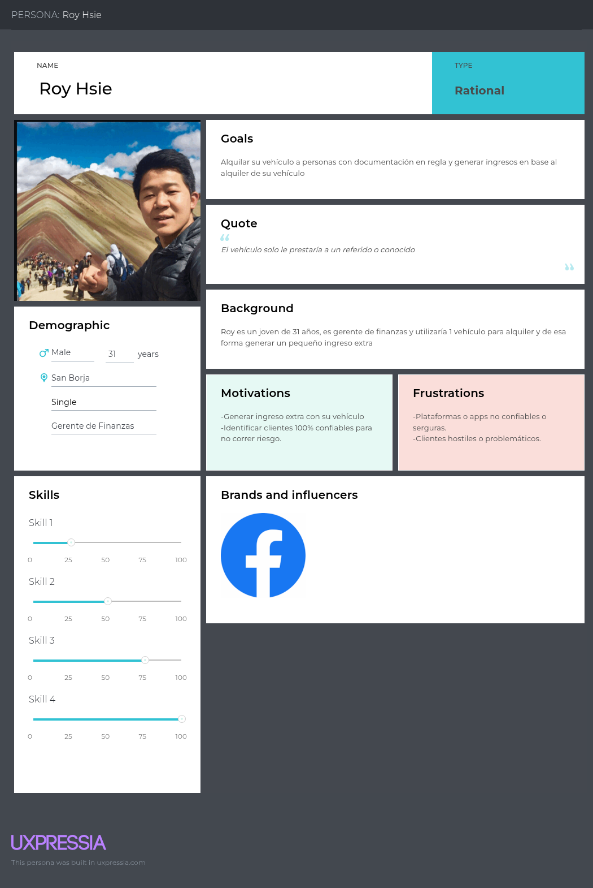
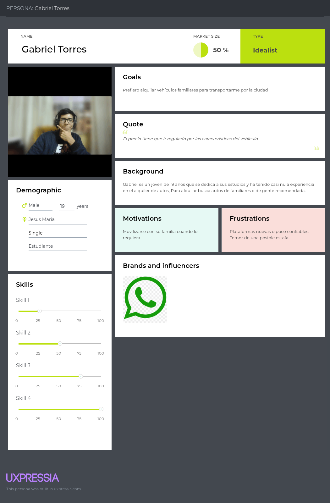
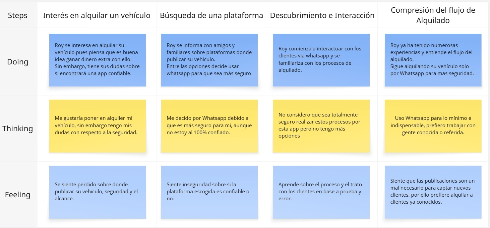
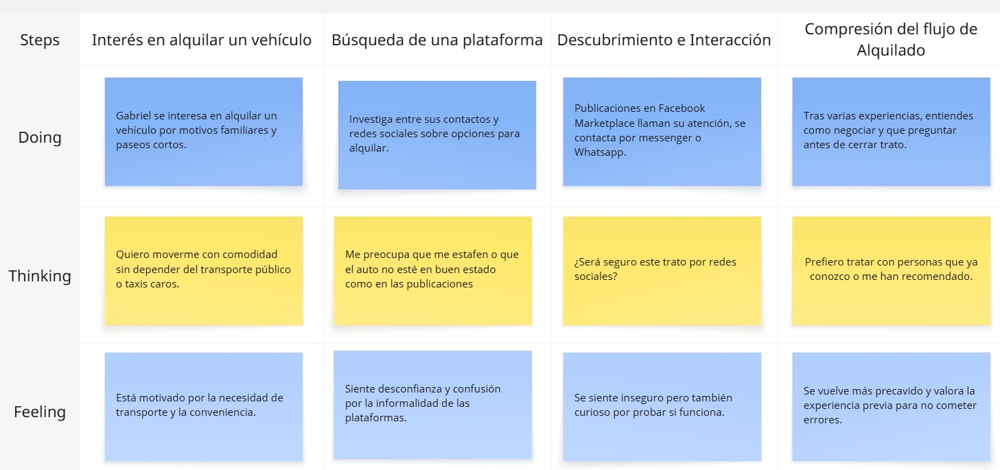
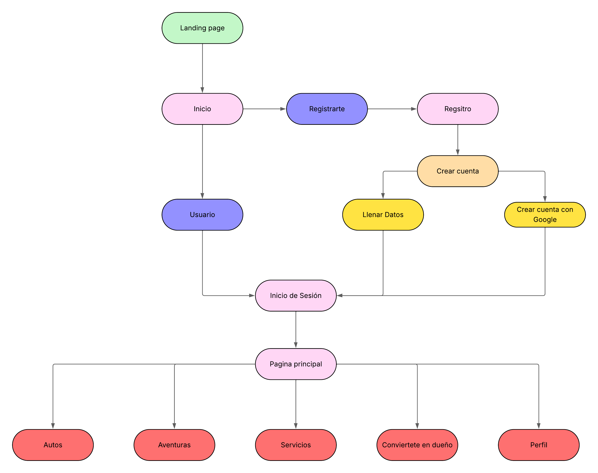

# <center>MOVEO PROJECT</center>

<p align="center">
    <strong>Universidad Peruana de Ciencias Aplicadas</strong><br>
    </img><br>
    <strong>Ingeniería de Software</strong><br>
    <strong>Aplicaciones Web - </strong><br>
    <strong>Profesor:  </strong><br>
    <strong>INFORME TB1  </strong><br>
</p>

<center>

#### Startup: **-----**
#### Product: **Moveo**
### Team  Members:

</center>

<div align="center">

| Member                               | Code        |
|:--------------------------------------:|:-------------:|
|Carlos Alejandro De la cruz Villareal | U20211c036  |
|Franco Gabriel Huang Liu              | U202310345  |
|Gianfranco Luna Morales               | U201824343  |
|Andreow Jomark Santiago Peña          | U202317362  |
|Sebastian Gabriel Zuñiga Calle        | u20221b479  |

</div>

<center>
<br> SEPTIEMBRE 2025
</center> 

# Registro de Versiones del Informe

|version|Fecha|Autor|Descripcion de Modificacion|
|---|---|---|---|
|0.1| 29/08/2025 | Andreow Santiago | Creacion y primera version del informe |
|0.2| 08/09/2025 | Franco Huang | Avance de Syle Guidelines  |
|0.3| 10/09/2025 | Franco Huang | Avance de Information Architecture y entrevistas  |


# Project Report Collaboration Insights

En esta sección, el equipo presenta un análisis detallado de la colaboración realizada durante el desarrollo del informe del proyecto. A continuación, se describe el progreso alcanzado a lo largo de las distintas entregas, destacando tanto el trabajo individual como el esfuerzo colectivo, los commits realizados y las evidencias gráficas del flujo colaborativo en GitHub.

A continuacion, se detalla el trabajo realizado durante cada entrega, acompañado de evidencias visuales de participación en el repositorio del report en GitHub y un resumen de los principales commits realizados por los miembros del equipo.

Link del reporte del equipo: 

https://github.com/UPC-PRE-202502-1ASI0730-7432-MOVEO/MOVEO-Report

#### TB1

La entrega del TB1 finalizó con éxito y está documentada en el repositorio de Github perteneciente a la organización del equipo:

Link al repositorio de la organización: https://github.com/UPC-PRE-202502-1ASI0730-7432-MOVEO

Durante el desarrollo del informe, se siguieron los siguientes lineamientos:

Los contenidos asignados a cada miembro fueron redactados y estructurados utilizando el formato Markdown , asegurando una presentación clara y estandarizada.
Cada cambio realizado fue respaldado mediante commits en el repositorio, garantizando trazabilidad y control de versiones del avance del proyecto.
Se crearon los artefactos necesarios utilizando las herramientas recomendadas. Las imágenes utilizadas fueron obtenidas a través de la carpeta assets o publicadas desde Imgur , para su correcta integración en el informe.
Se realizaron reuniones periódicas para coordinar el avance de los elementos del informe y reportar los progresos del Sprint 1, centrado en la definición inicial del alcance del proyecto y el diseño preliminar del sistema.
Coherencia con el Registro de Versiones del Informe
Los cambios realizados durante esta etapa están alineados con la evolución del documento, reflejando el trabajo colaborativo y constante refinamiento del contenido por parte del equipo.

Este historial de actualizaciones coincide con el trabajo desarrollado durante el TB1, mostrando cómo el equipo fue avanzando en la elaboración del informe de forma continua y colaborativa.

Actividad en GitHub - TB1 (Septiembre 2025)
Se muestra el gráfico de actividad en GitHub durante la preparación del TB1:


Commits para TB1
Estos commits reflejan el progreso constante y la colaboración entre los miembros del equipo.


Commit


Network graph para TB1


# Contenido

[Registro de Versiones del Informe](#registro-de-versiones-del-informe)

[Project Report Collaboration Insights](#project-report-collaboration-insights)

[Student Outcome](#student-outcome)

[Capítulo I: Introducción](#capítulo-i-introducción)

[1.1 Startup Profile](#11-startup-profile)  
[1.1.1. Descripción de la Startup](#111-descripción-de-la-startup)  
[1.1.2. Perfiles de integrantes del equipo](#112-perfiles-de-integrantes-del-equipo)  

[1.2. Solution Profile](#12-solution-profile)  
[1.2.1 Antecedentes y problemática](#121-antecedentes-y-problemática)  
[1.2.2 Lean UX Process.](#122-lean-ux-process)  
[1.2.2.1. Lean UX Problem Statements.](#1221-lean-ux-problem-statements)  
[1.2.2.2. Lean UX Assumptions.](#1222-lean-ux-assumptions)  
[1.2.2.3. Lean UX Hypothesis Statements.](#1223-lean-ux-hypothesis-statements)  
[1.2.2.4. Lean UX Canvas.](#1224-lean-ux-canvas)  

[1.3. Segmentos objetivo.](#13-segmentos-objetivo)  

[Capítulo II: Requirements Elicitation & Analysi](#capítulo-ii-requirements-elicitation--analysis)  

[2.1. Competidores](#21-competidores)  
[2.1.1. Análisis competitivo](#211-análisis-competitivo)  
[2.1.2. Estrategias y tácticas frente a competidores](#211-análisis-competitivo)  

[2.2. Entrevistas](#22-entrevistas)  
[2.2.1. Diseño de entrevistas](#221-diseño-de-entrevistas)  
[2.2.2. Registro de entrevistas](#222-registro-de-entrevistas)  
[2.2.3. Análisis de entrevistas](#223-análisis-de-entrevistas)  

[2.3. Needfinding](#23-needfinding)  
[2.3.1. User Personas](#231-user-personas)  
[2.3.2. User Task Matrix](#232-user-task-matrix)  
[2.3.3. User Journey Mapping](#233-user-journey-mapping)  
[2.3.4. Empathy Mapping](#234-empathy-mapping)  
[2.3.5. As-is Scenario Mapping](#235-as-is-scenario-mapping) 

[2.4. Ubiquitous Language](#24-ubiquitous-language)  

[Capítulo III: Requirements Specificatio](#capítulo-iii-requirements-specification)  

[3.1. To-Be Scenario Mapping](#31-to-be-scenario-mapping)    
[3.2. User Stories](#32-user-stories)  
[3.3. Impact Mapping](#33-impact-mapping)  
[3.4. Product Backlog](#34-product-backlog)  

[Capítulo IV: Product Desig](#capítulo-iv-product-design)  

[4.1. Style Guidelines](#41-style-guidelines)  
[4.1.1. General Style Guidelines](#411-general-style-guidelines)  
[4.1.2. Web Style Guidelines](#412-web-style-guidelines)  

[4.2. Information Architecture](#42-information-architecture)  
[4.2.1. Organization Systems](#421-organization-systems)  
[4.2.2. Labeling Systems](#422-labeling-systems)  
[4.2.3. SEO Tags and Meta Tag](#423-seo-tags-and-meta-tags)  
[4.2.4. Searching Systems](#424-searching-systems)   
[4.2.5. Navigation Systems](#425-navigation-systems)  

[4.3. Landing Page UI Design](#43-landing-page-ui-design)   
[4.3.1. Landing Page Wireframe](#431-landing-page-wireframe)  
[4.3.2. Landing Page Mock-up](#432-landing-page-mock-up) 

[4.4. Web Applications UX/UI Design](#44-web-applications-uxui-design)  
[4.4.1. Web Applications Wireframes](#441-web-applications-wireframes)  
[4.4.2. Web Applications Wireflow Diagrams](#442-web-applications-wireflow-diagrams)  
[4.4.3. Web Applications Mock-ups](#443-web-applications-mock-ups)   
[4.4.4. Web Applications User Flow Diagrams](#444-web-applications-user-flow-diagrams)  

[4.5. Web Applications Prototyping](#45-web-applications-prototyping)  

[4.6. Domain-Driven Software Architecture](#46-domain-driven-software-architecture)  
[4.6.1. Software Architecture Context Diagram](#461-software-architecture-context-diagram)  
[4.6.2. Software Architecture Container Diagrams](#462-software-architecture-container-diagrams)  
[4.6.3. Software Architecture Components Diagrams](#463-software-architecture-components-diagrams)  

[4.7. Software Object-Oriented Design](#47-software-object-oriented-design)  
[4.7.1. Class Diagrams](#471-class-diagrams)  
[4.7.2. Class Dictionary](#472-class-dictionary)  

[4.8. Database Design](#48-database-design)  
[4.8.1. Database Diagram](#481-database-diagram)  

[Capítulo V: Product Implementation, Validation & Deploymen](#capítulo-v-product-implementation-validation--deployment)  

[5.1. Software Configuration Management](#51-software-configuration-management)  
[5.1.1. Software Development Environment Configuration](#511-software-development-environment-configuration)  
[5.1.2. Source Code Management](#512-source-code-management)  
[5.1.3. Source Code Style Guide & Conventions](#513-source-code-style-guide--conventions)  
[5.1.4. Software Deployment Configuration](#514-software-deployment-configuration)  

[5.2. Landing Page, Services & Applications Implementation](#52-landing-page-services--applications-implementation)  
[5.2.1. Sprint 1](#521-sprint-1)  
[5.2.2. Sprint 2 ](#522-sprint-2)  
[5.2.2. Sprint 3 ](#522-sprint-3)  
[5.2.2. Sprint 4 ](#522-sprint-4)  
  
[Bibliografía](#bibliografía)  
[Anexos](#anexos)  

# Student Outcome

<table> <tr> <td><b>Criterio específico</b></td> <td><b>Acciones realizadas</b></td> <td><b>Conclusiones</b></td> </tr> <tr> <td> <p>Trabaja en equipo para proporcionar liderazgo en forma conjunta</p> </td> <td> 
  <p><strong>TB1</strong></p> 
 <p><strong>Luna Morales, Gianfranco:</strong>Facilité todas las reuniones de planning del Sprint 1 donde coordiné la distribución de HU entre desarrolladores, propuse la metodología de seguimiento en Trello que adoptamos como equipo y medié los conflictos que surgieron sobre la priorización de features, logrando que todos llegáramos a consensos constructivos.</p> 
  <p><strong>De la cruz Villareal,Carlos Alejandro:</strong>Propuse la estructura de archivos que seguimos para mantener el código organizado y compartí tutoriales básicos de Git con los compañeros que tenían menos experiencia.</p> 
  <p><strong>Huang Liu, Franco Gabriel :</strong>Lideré el análisis exhaustivo de nuestros competidores Peru Rent A Car, Kayak y Budget Car Rental, coordiné todas las sesiones de user research y testing de usabilidad, facilité workshops de ideación para UX/UI donde todos aportamos ideas creativas, y representé constantemente la voz del usuario en las decisiones técnicas para mantener el foco en la experiencia.</p> 
  <p><strong>Santiago Peña, Andreow Jomark :</strong>Organicé las reuniones iniciales del equipo para definir roles y responsabilidades, coordiné la creación del repositorio GitHub y la estructura de carpetas del proyecto, facilité las sesiones de brainstorming para definir el alcance del landing page y medié en la toma de decisiones sobre qué secciones incluir en la primera versión de MOVEO</p>
  <p><strong>Zuñiga Calle, Sebastian Gabriel :</strong>Lideré la validación manual de todas las secciones del landing page para asegurar que funcionaran correctamente, coordiné las pruebas de responsividad en diferentes dispositivos con ayuda de mis compañeros, propuse mejoras de usabilidad basadas en mi navegación por el sitio, y guié las correcciones finales antes de la entrega para garantizar que todo estuviera pulido.</p>
  
  


</td>
<td>
  <p><strong>TB1</strong></p>
  <p>En conclusión: La comunicación efectiva y constante entre los miembros favoreció la coordinación y el avance armónico del proyecto.</p>

</td>
</tr> <tr> <td> <p><b>Crea un entorno colaborativo e inclusivo, establece metas, planifica tareas y cumple objetivos.</b></p> </td> <td> <p><strong>TB1</strong></p> 
<p><strong>Luna Morales, Gianfranco:</strong>Creé el workspace de Trello completo y definí el flujo de trabajo que seguimos actualmente, establecí junto al equipo la Definition of Ready y Done que nos guía en cada tarea, organicé daily standups virtuales diarios e implementé retrospectivas semanales donde todos participamos para mejorar continuamente nuestros procesos.</p>
 <p><strong>De la cruz Villareal,Carlos Alejandro:</strong>Configuré el repositorio de GitHub con las ramas principales para que todos pudieran trabajar sin conflictos, establecí como meta crear un landing page responsive y funcional, dividí el desarrollo en componentes básicos (header, hero section, features, footer) asignando uno a cada miembro, y ayudé a resolver los problemas técnicos básicos que surgieron durante el desarrollo.</p> 
  <p><strong>Huang Liu, Franco Gabriel :</strong>Diseñé wireframes de forma colaborativa involucrando a todo el equipo en las decisiones de diseño, establecí métricas UX específicas como tiempo de carga menor a 3 segundos y usabilidad superior al 85%, organicé sesiones de testing con usuarios reales para validar nuestras hipótesis y creé un design system unificado que mantiene la coherencia visual en todo el proyecto.</p> 
  <p><strong>Santiago Peña, Andreow Jomark :</strong>Creé el canal de comunicación principal del equipo en WhatsApp y Discord, establecí las metas iniciales de completar el landing page y la documentación básica para la primera entrega, planifiqué la distribución de tareas entre compañeros según sus fortalezas e implementé reuniones de seguimiento diarias para mantener a todos alineados con los objetivos.</p>
  <p><strong>Zuñiga Calle, Sebastian Gabriel :</strong>Creé una lista de verificación básica que usamos como equipo para revisar cada sección del landing page, establecí como meta que el sitio se viera bien en móvil y desktop sin errores visuales, organicé sesiones de testing grupal donde todos navegamos el sitio y reportamos observaciones, e implementé un proceso de revisión final donde cada uno verificó el trabajo de otro compañero antes de dar por terminado.</p>


</td>
<td>
  <p><strong>TB1</strong></p>
  <p>En conclusión: La comunicación interdisciplinaria permitió un mejor desarrollo y entendimiento del proyecto en todas sus fases.</p>
  
 

</td>
</tr> </table>


# Capítulo I: Introducción
## 1.1. Startup Profile
### 1.1.1. Descripción de la Startup

Nuestro proyecto consiste en un servicio digital diseñado para conectar a personas que poseen un vehículo con quienes necesitan uno por un tiempo determinado. A diferencia de una compañía de alquiler tradicional, nuestra propuesta no requiere contar con un parque automotor propio, lo que reduce significativamente los costos iniciales. En lugar de ello, los autos registrados por los mismos usuarios son los que conforman la oferta disponible en la plataforma, generando así una red colaborativa similar a una flota virtual.
El modelo se centra en la intermediación: los dueños obtienen ingresos únicamente cuando su vehículo es efectivamente arrendado, mientras que los arrendatarios acceden a precios más accesibles que en el mercado convencional. De esta manera, se construye un sistema rentable, flexible y equitativo para ambas partes.

Misión: Ofrecer una solución moderna y segura que simplifique el acceso a un vehículo de alquiler, generando confianza y beneficios tanto para el propietario como para el arrendatario. Buscamos que nuestra plataforma sea percibida como una alternativa práctica, clara y orientada a las necesidades reales de los usuarios.

Visión: Aspiramos a consolidarnos como la plataforma más reconocida en el Perú para la renta de automóviles entre particulares. Queremos ser identificados por la innovación de nuestro modelo, la seguridad de nuestras operaciones y la facilidad de uso del sistema. Nuestra meta es que, al pensar en alquiler de autos sin trámites complicados, las personas recurran primero a nosotros.

#### 1.1.2. Perfiles de integrantes del equipo

| Integrantes                                                                                                   | Descripción | Conocimientos |
|:--------------------------------------------------------------------------------------------------------------| :--- | :--- |
|  <br>Carlos Alejandro De la cruz Villareal u20211c036 | soy un estudiante de Ingeniería de Software, tengo 22 años y vivo en Lima. Mis pasatiempos son hacer deporte, jugar videojuegos y escuchar música. Me gusta trabajar en equipo porque de esta manera todos los integrantes podemos dar nuestro punto de vista e ideas para poder lograr el objetivo del curso |  Tengo conocimientos básicos en C#, Java y Python, y estoy en constante búsqueda de mejorar mis habilidades técnicas.|
|  <br>Franco Gabriel Huang Liu u202310345             |  Soy estudiante de la carrera de Ingeniería de Software. Mi principal meta es poder desarrollar software de manera freelance. Me interesa mucho desarrollar software para maquinas industriales | Tengo conocimientos básicos en C++, HTML, Python y Typescript |
|  <br>Gianfranco Luna Morales  u201824343              | Me gusta observar el comportamiento de las personas para así crear un ambiente cómodo y activo; soy práctico y racional para los percances que puedan surgir.  | Si bien poseo conocimientos básicos en la programación en el lenguaje C + +, aportaré en lo que pueda para realizar con éxito la idea planteada. |
|  <br>Andreow Jomark Santiago Peña u202317362          | Soy estudiante de la carrera de Ingeniería de Software en la Universidad Peruana de Ciencias Aplicadas (UPC). Mi principal meta es especializarme en la creación de agentes inteligentes y soluciones basadas en Inteligencia Artificial, con enfoque en aprendizaje automático, procesamiento del lenguaje natural y sistemas autónomos.| Tengo experiencia en múltiples lenguajes de programación como Python, C#, Java, JavaScript y SQL, y estoy familiarizado con frameworks comoVue.js, ASP.NET Core y TensorFlow/Keras. Me apasiona aprender tecnologías emergentes y aplicarlas en proyectos reales que generen impacto. |
|  <br>Sebastian Gabriel Zuñiga Calle u20221b479        | Soy estudiante de la carrera de Ingeniería de Software. Mi principal interes se basa en aprender nuevas tecnologías constantemente,  el desarrollo en web y desarrollo de aplicaciones son mis principales areas a las que me inclino. | Cuento con conocimientos en los lenguajes de programación: C++, C#, Python y JavaScript. Siempre listo para utilizarlos en el desarrollo y solución de problemas. |


# 1.2. Solución Profile

## 1.2.1. Antecedentes y Problemática

Para explicar los fundamentos de nuestra startup utilizaremos una adaptación de la técnica de análisis 5W + 2H, que permite organizar la información respondiendo a las preguntas clave de cualquier iniciativa.

**Antecedentes**

- En los últimos años la necesidad de soluciones de movilidad temporal ha crecido considerablemente, especialmente en zonas urbanas donde adquirir un vehículo propio no siempre es viable. Ante ello surge la oportunidad de una plataforma digital que facilite el contacto directo entre propietarios de automóviles y personas interesadas en alquilarlos, optimizando el proceso a través de un aplicativo accesible.

**Problemática**

- La ausencia de servicios que ofrezcan un alquiler directo entre dueños y arrendatarios dificulta satisfacer la demanda de transporte temporal. Esto genera dos consecuencias principales: los usuarios que requieren un vehículo de manera inmediata encuentran limitaciones, y los propietarios pierden la posibilidad de generar ingresos adicionales con sus autos.

Aplicación del método 5W + 2H

**¿Qué?**

El proyecto busca responder a la falta de un sistema eficiente que conecte a quienes desean rentabilizar sus vehículos con quienes necesitan arrendarlos. La iniciativa está directamente relacionada con dos tipos de clientes: propietarios con autos disponibles y arrendatarios que requieren alternativas accesibles y confiables.

**¿Cuándo?**

La problemática se presenta en el momento en que un propietario desea alquilar su vehículo, pero no cuenta con un canal formal ni seguro para hacerlo. A su vez, los arrendatarios se ven afectados cuando requieren un vehículo por un tiempo limitado —sea por un viaje, una urgencia o una necesidad puntual— y no encuentran opciones adecuadas.
El uso de la plataforma se da justamente en esos escenarios: el dueño publica su vehículo y el arrendatario selecciona la opción que mejor se adapta a su situación.

**¿Dónde?**

El servicio puede utilizarse en cualquier lugar con acceso a internet, ya sea desde casa, el trabajo o en desplazamiento.
La propuesta está dirigida principalmente a contextos urbanos donde la demanda de movilidad es más alta y, paradójicamente, la oferta de plataformas colaborativas de alquiler es todavía reducida.

**¿Quiénes?**

Participan dos grupos principales: los propietarios que desean ofrecer su auto en alquiler y los arrendatarios que buscan una solución práctica sin trámites extensos.
El problema afecta sobre todo a los dueños que no logran monetizar sus vehículos y a las personas que necesitan movilidad temporal pero no encuentran opciones seguras y confiables.
En consecuencia, el público objetivo que hará uso del servicio corresponde a ambos segmentos, integrados en una misma plataforma.

**¿Por qué?**

La raíz del problema se encuentra en la falta de un canal especializado y confiable que asegure la interacción entre dueños y arrendatarios. Esta ausencia limita la rentabilidad de los primeros y restringe la variedad de opciones para los segundos.

**¿Cómo?**

El servicio se utiliza cuando los dueños desean generar ingresos con su vehículo o cuando un arrendatario necesita resolver rápidamente una necesidad de transporte.
Los usuarios llegan a la plataforma a través de campañas digitales, publicidad segmentada en redes sociales y recomendaciones de otros clientes.
En general, el detonante es la búsqueda de una alternativa segura, flexible y accesible frente a los servicios tradicionales de alquiler.

**¿Cuánto cuesta?**

Para los propietarios no existen costos de inscripción ni inversión inicial; únicamente se descuenta una comisión en caso de concretarse el alquiler.
Los arrendatarios, en cambio, acceden a tarifas variables y flexibles, con opciones que resultan más económicas en comparación con las agencias de renta tradicionales.

## 1.2.2. Lean UX Process

### 1.2.2.1. Lean UX Problem Statement

La propuesta de MOVEO nace como respuesta a la falta de opciones innovadoras en el mercado de alquiler de vehículos. Actualmente, gran parte de las compañías del rubro trabajan con un esquema rígido, caracterizado por una oferta limitada y costos elevados para los usuarios. Otro aspecto que no ha sido bien explotado por los competidores es el hecho de que la mayoría depende de contar con una flota propia de autos, lo que exige una fuerte inversión inicial y reduce la flexibilidad del negocio. En contraste, nuestro modelo se fundamenta en no adquirir vehículos, sino en integrar aquellos que pertenecen a los propietarios registrados, generando así un sistema más ligero y escalable.
El valor diferencial de MOVEO se basa y encuentra en esta estructura de “entrada y salida”: los dueños incorporan sus autos a la plataforma, mientras que los arrendatarios acceden a ellos bajo un esquema seguro y eficiente. De esta manera, tanto propietarios como usuarios obtienen beneficios económicos, consolidando un círculo de confianza y rentabilidad.

Consideramos que habremos alcanzado un avance significativo cuando logremos que el número de propietarios inscritos crezca de forma constante y que la oferta de vehículos disponibles se adapte a la demanda real del mercado.

### 1.2.2.2. Lean UX Assumptions

**Segmento de Usuarios:**

**¿Quién es el usuario?**

Nuestros principales usuarios son dos: los dueños de vehículos que desean generar ingresos pasivos sin tener que involucrarse en la gestión diaria de sus autos, y las personas que buscan alternativas de alquiler de vehiculos seguras, cómodas y accesibles.

**¿Dónde se integra el servicio en su vida?**

Para los propietarios, el servicio se convierte en un medio para obtener ingresos extra sin esfuerzo operativo. Para los inquilinos, representa la posibilidad de acceder a un vehículo en el momento en que lo necesitan, sin asumir compromisos de propiedad ni altos costos.

**¿Cuándo y cómo se utiliza el servicio?**

Los dueños lo usan al registrar su vehículo y seguir sus ganancias, mientras que los inquilinos lo emplean cuando requieren transporte para viajes, mudanzas, diligencias o necesidades puntuales de movilidad.

**¿Qué problemas enfrenta el servicio?**

El mayor reto es garantizar la seguridad y confianza de los propietarios respecto al uso de sus vehículos, al mismo tiempo que se asegura que los inquilinos disfruten de una experiencia rápida, sencilla y sin complicaciones.

**Resultados de Negocio (Business Outcomes):**

- Anticipamos que los propietarios valorarán una plataforma que les permita alquilar sin preocuparse de la gestión operativa.
- Creemos que los arrendatarios encontrarán en nuestro servicio una alternativa más económica y variada que las opciones tradicionales.
- Reconocemos que existen competidores en el sector, pero nuestro modelo —sin flota propia— nos permitirá mantener precios atractivos y una mejor experiencia de usuario.
- Sabemos que para mantener la confianza, debemos reforzar la calidad del servicio con pruebas constantes, mejoras continuas y canales abiertos de comunicación con nuestros clientes.

### 1.2.2.3. Lean UX Hypothesis Statements

1. Consideramos que los propietarios interesados en generar ingresos pasivos, sin invertir grandes sumas ni dedicar mucho tiempo, verán en nuestra plataforma una fuente confiable para monetizar sus vehículos.

2. Creemos que los arrendatarios que buscan alternativas de alquiler flexibles y asequibles optarán por MOVEO, debido a su sencillez de uso, precios competitivos y garantías de seguridad.

3. Suponemos que, al operar bajo un modelo sin grupo de automoviles listos para la reserva y alquiler correspondiente propio, podremos redirigir recursos hacia innovación y mejoras en la experiencia de usuario. Esto nos permitirá mantener tarifas estables y atractivas, atrayendo tanto a quienes alquilan como a quienes ofrecen sus autos.

#### 1.2.2.4. Lean UX Canvas.
En el apartado de Lean UX Canvas se desarrolló una estructuración completa y académica de las principales hipótesis estratégicas que sustentan la propuesta de valor y la arquitectura de la plataforma Moveo

Cada hipótesis fue traducida en un Lean UX Canvas formal, siguiendo un enfoque científico-experimental que articula: el problema de negocio detectado (Business Problem ), las soluciones propuestas a nivel funcional y técnico (Solutions ), los resultados esperados a nivel organizacional (Business Outcomes ), la caracterización de los usuarios objetivos (Users ), los beneficios esperados para estos usuarios (User Outcomes & Benefits ), la formulación de hipótesis de aprendizaje (Hypotheses ), y el diseño de experimentos estratégicos para validar o refutar dichas hipótesis (What's the most important thing we need to learn first? y What's the least amount of work we need to do to learn the next most important thing? ).

Este trabajo metodológico permitió no solo establecer un marco claro de experimentación y validación temprana de las decisiones de diseño y tecnología, sino también alinear todos los esfuerzos de desarrollo a métricas de éxito específicas y medibles. Así, el apartado de Lean UX Canvas representa una pieza fundamental dentro del enfoque de construcción iterativa, ágil y centrada en el usuario de Moveo, asegurando que cada funcionalidad propuesta responde a necesidades reales, riesgos priorizados y oportunidades de negocio tangibles.


## 1.3. Segmentos objetivo

**Segmento 1: Propietarios de vehículos**

Datos demográficos:
- Género: hombres y mujeres.
- Rango etario: de 18 a 70 años.
- Condición socioeconómica: sectores A, B y C (clase media o clase alta).

Datos geográficos:
- Nacionalidad: peruana.
- Área de residencia: zonas urbanas.
- Ubicación principal: Lima Metropolitana.

Datos psicográficos:
- Individuos (naturales o jurídicos) que poseen un vehículo que permanece sin uso la mayor parte del tiempo.
- Personas interesadas en generar ingresos adicionales a través de un recurso que ya poseen, sin necesidad de destinar grandes cantidades de tiempo a la gestión.
- Propietarios que aún no cuentan con un mecanismo práctico, seguro y rápido para ofrecer sus autos en alquiler.

**Segmento 2: Inquilinos o usuarios finales**

Datos demográficos:
- Género: tanto masculino como femenino.
- Edad: entre 18 y 50 años.
- Nivel socioeconómico: clases A, B y C (clase media, media alta y alta).

Datos geográficos:
- Nacionalidad: peruana.
- Lugar de residencia: zonas urbanas.
- Departamento: Lima Metropolitana.

Datos psicográficos:
- Personas que pasan una cantidad considerable de horas en transporte público o en el tráfico y buscan alternativas más cómodas y flexibles.
- Usuarios que no cuentan con los recursos para adquirir un auto propio (nuevo o de segunda mano), pero que requieren movilidad en situaciones específicas.
- Personas que necesitan disponer de un vehículo particular por un período corto, ya sea para actividades puntuales, compromisos laborales o viajes.

# Capítulo II: Requirements Elicitation & Analysis
## 2.1. Competidores
Previo al desarrollo de la aplicación, hicimos una búsqueda de las opciones que ya existen en el mercado, para ver que es lo que ofrecen y como podemos diferenciarnos de ellos.
- **Peru Rent A Car:**
  Esta plataforma se especializa en el alquiler de coches en Perú. Ofrece una amplia gama de vehículos y opciones de alquiler, así como información sobre destinos turísticos en Perú. 
  La plataforma también permite a los usuarios comparar precios y reservar coches en línea.
  <div style="text-align: center;">
 
  </div>
  
- **Kayak:**
  Kayak es una de las plataformas de búsqueda de viajes más grandes del mundo. Permite a los usuarios buscar y comparar precios de vuelos, hoteles y alquiler de coches en una sola plataforma. 
  Kayak también ofrece herramientas para planificar viajes, como alertas de precios y recomendaciones personalizadas.
  <div style="text-align: center;">

  </div>

- **Budget Car Rental Peru:**
  A diferencia de Peru Rent A Car, Budget Car Rental es una empresa internacional que ofrece servicios de alquiler de coches en Perú. 
  La plataforma permite a los usuarios buscar y comparar precios de coches de alquiler en diferentes ubicaciones y reservar en línea. Budget Car Rental también ofrece opciones de alquiler a largo plazo y programas de fidelización.
  <div style="text-align: center;">

  </div>

### 2.1.1. Análisis competitivo.

<table border="1" style="text-align: center;">
	<tbody>
		<tr><td colspan="6">Análisis de competidores</td></tr>
		<tr><td colspan="2"></td><td>Moveo</td><td>Kayak</td><td>Peru Rent A Car</td><td>Budget Car Rental Peru</td></tr>
		<tr><td rowspan="2">Perfil</td><td>Resumen</td>
			<td>Una aplicación que busca ofrecer una plataforma rápida y ágil para el alquiler de autos, con un fuerte enfoque en la seguridad de ambas partes.</td>
			<td>Kayak es una plataforma líder de búsqueda tanto de vuelos, como cuartos de hotel, alquiler de vehículos, etc.</td>
			<td>Esta plataforma web presenta parte de un catálogo establecido de vehículos para alquilar, con una atención mediante WhatsApp y dirigido solo a clientes.</td>
			<td>Plataforma de similar funcionamiento que Rent A Car Peru, orientado a clientes con un énfasis en cuidar el presupuesto de los mismos.</td></tr>
		<tr><td>Ventaja competitiva</td>
			<td>Ofrecer una plataforma tanto para dueños de vehículos como a clientes interesados en alquilar.</td>
			<td>Es la aplicación líder en la búsqueda de servicios por su variedad y robusta plataforma web.</td>
			<td>Líder local del servicio de alquiler de autos, con una amplia flota y rápida atención al usuario</td>
			<td>Ofrece una alternativa de alquiler económica velando por el bolsillo de sus clientes. </td></tr>
		<tr><td rowspan="2">Perfil de Marketing</td><td>Mercado objetivo</td>
			<td>Jóvenes y adultos desde los 20 a los 50 años.</td>
			<td>Turistas o viajeros que necesiten cualquier tipo de servicio de comodidad.</td>
			<td>Adultos peruanos que busquen alquilar un vehiculo.</td>
			<td>Adultos peruanos que busquen alquilar un vehiculo económico.</td></tr>
		<tr><td>Estrategias de marketing</td>
			<td>Marketing digital en redes sociales y colaboraciones con influencers.</td>
			<td>Alianza con Google Ads, tanto en Youtube como Chrome.</td>
			<td>Patrocinio mediante búsquedas de Chrome.</td>
			<td>Patrocinio mediante búsquedas de Chrome.</td></tr>
		<tr><td rowspan="3">Perfil de Producto</td>
			<td>Productos y Servicios</td>
			<td>Aplicación destinada a la oferta de vehículos en alquiler, como la demanda de los mismos.</td>
			<td>Aplicación móvil y web que cuenta con una enorme variedad de servicios esenciales para viajeros y turistas</td>
			<td>Aplicación web rápida e intuitiva que permite consultar parte del catálogo de vehículos disponibles para alquiler.</td>
			<td>Aplicación web ágil y amigable que permite consultar una limitada oferta de vehículos económicos en alquiler</td></tr>
		<tr><td>Precios y Costos</td>
			<td>Costos por publicación de vehículos mediante una suscripción.</td>
			<td>Modelo gratuito, con cobro de comisión a las empresas referidas.</td>
			<td>Ingreso directo mediante el alquiler.</td>
			<td>Ingreso directo mediante el alquiler.</td></tr>
		<tr><td>Canales de distribución</td>
			<td>Disponible en línea a través de la aplicación web.</td>
			<td>Descargable en Google Play y App Store y la plataforma web.</td>
			<td>Disponible en línea a través de la aplicación web.</td>
			<td>Disponible en línea a través de la aplicación web.</td></tr>
		<tr><td rowspan="4">Análisis SWOT</td><td>Fortalezas</td><td><ul>
                    <li>Orientado a jóvenes y adultos peruanos</li><li>Facilidades para alquilar, como ofrecer alquiler</li><li>Énfasis en la seguridad y garantía</li></ul></td>
			<td><ul>
                    <li>Gran cantidad de usuarios</li><li>Referente del sector</li><li>Plataformas ágiles e intuitivas</li></ul></td>
			<td><ul><li>Plataforma local</li><li>Excelente atención al cliente</li></ul></td>
			<td><ul><li>Plataforma web amigable</li><li>Todo el catálogo está disponible para cualquier usuario</li></ul></td></tr>
		<tr><td>Debilidades</td>
            <td><ul><li>Nuevo competidor</li><li>Sector con competidores fuertes ya establecidos</li></ul></td>
			<td><ul><li>Pobre atención al cliente</li></ul></td>
			<td><ul><li>Solo se puede consultar parte del catálogo de vehículos</li></ul></td>
			<td><ul><li>Opta por un nicho muy concreto</li><li>No cuenta con tanta relevancia como su competencia</li></ul></td></tr>
		<tr><td>Oportunidades</td>
            <td><ul><li>Sin competidores a nivel nacional</li><li>Ofrece servicio para ambas partes involucradas en el alquiler</li></ul></td>
			<td><ul><li>Fuerte presencia internacional</li><li>Referente del sector</li></ul></td>
			<td><ul><li>Flota amplia y en crecimiento</li><li>Atención personalizada</li></ul></td>
			<td><ul><li>Excelente interfaz</li></ul></td></tr>
		<tr><td>Amenazas</td>
            <td><ul><li>Competencia ya establecida</li><li>Sector muy competitivo</li></ul></td>
			<td><ul><li>Oferta demasiado ámplia</li><li>Sin control de calidad</li></ul></td>
			<td><ul><li>Oferta fija y poco variada</li><li>Sin opciones para dueños interesados en alquilar</li></ul></td>
<td><ul><li>Se ve opacado por la competencia</li><li>Oferta aún más limitada que la competencia</li></ul></td>
</tr></tbody></table>

### 2.1.2. Estrategias y tácticas frente a competidores.
Moveo se diferenciará mediante un enfoque local y seguro, integrando tanto a dueños de vehículos como a arrendatarios. 
Para contrarrestar la falta de reconocimiento como nuevo competidor, se aplicarán tácticas de marketing digital y alianzas con influencers, generando confianza y visibilidad rápida. 
Aprovechando la ausencia de un líder nacional en movilidad tipo Airbnb, la estrategia será posicionarse como la primera opción peruana especializada en alquiler de autos. 
Frente a amenazas de grandes plataformas, Moveo enfocará sus esfuerzos en segmentos desatendidos y en brindar soporte inmediato y flexibilidad en precios, destacando su cercanía y adaptabilidad frente a la oferta internacional y tradicional.

## 2.2. Entrevistas


### 2.2.1. Diseño de entrevistas.

**Segmento 1: Propietarios**

¿Cuál es tu nombre completo?

¿Qué edad tienes actualmente?

¿En qué distrito resides?

¿A qué te dedicas (trabajo, estudios, negocio propio)?

¿Qué requisitos solicitas a una persona antes de entregarle tu vehículo?

¿Qué tipo de unidades sueles alquilar (auto, SUV, camioneta, moto, otro)?

¿Cuál es el tiempo mínimo y máximo que normalmente estás dispuesto a prestar tu vehículo?

¿Cómo gestionas el control de tus autos disponibles y en uso (anotaciones, Excel, aplicación, otro)?

¿Dónde publicas actualmente tus vehículos para alquilarlos (apps, redes sociales, conocidos)?

¿Prefieres usar computadora, celular o ambos para manejar estas publicaciones?

¿Qué tan confiable consideras que son las plataformas actuales para validar a los clientes?

¿Qué tan útil sería para ti ver comentarios de otros dueños sobre un cliente antes de alquilar?

¿Te interesaría contar con un panel digital donde registres todos tus autos y su estado?

¿Qué tan importante consideras poder calificar a los clientes después de cada alquiler?


**Segmento 2: Inquilinos**

¿Cuál es tu nombre completo?

¿Qué edad tienes actualmente?

¿En qué distrito vives?

¿Cuál es tu ocupación principal?

¿Qué documentos te han solicitado en tus experiencias previas al alquilar un auto?

¿Qué tipo de vehículo prefieres alquilar según tu necesidad (trabajo, viaje, ocasión especial)?

¿Qué requisitos o condiciones suelen ponerte antes de alquilar (edad mínima, tarjeta de crédito, otros)?

¿Qué factores te desaniman al momento de querer alquilar un auto (precio, desconfianza, restricciones, otro)?

¿Dónde sueles buscar opciones de autos en alquiler (apps, redes, páginas web, conocidos)?

¿Desde qué dispositivo sueles hacerlo más (celular, laptop, ambos)?

¿Qué tanto confías en que las aplicaciones muestran información real de los dueños y autos?

¿Qué tan valioso sería para ti revisar reseñas de otros usuarios sobre el dueño antes de alquilar?

¿Te resultaría útil poder reservar un vehículo con anticipación directamente desde la app?

¿Qué tan importante es para ti dejar una opinión sobre tu experiencia con el dueño o el vehículo?


### 2.2.2. Registro de entrevistas

#### **Segmento 1:**

##### **Roy Hsieh:** 

<p align="center">

</p>

Link: <https://youtu.be/kJXcfmofi8g>

#### **Segmento 2:**

##### **Gabriel Torres**

<p align="center">

</p>

Link: <https://youtu.be/pLZNIzb0hL0>

### 2.2.3. Análisis de Entrevistas

#### **Segmento 1:**

##### **Roy Hsieh:** 

#### **Segmento 2:**

##### **Gabriel Torres:** 

Gabriel Eduardo Torres Campos, un joven de 19 años, compartió su visión sobre el alquiler de autos a partir de la experiencia de su padre, aunque él nunca ha alquilado uno directamente. Mencionó que los documentos más comunes son el DNI, la licencia de conducir y, posiblemente, un contrato. También señaló que los requisitos suelen incluir ser mayor de edad, tener licencia con al menos 1 o 2 años de vigencia y contar con una tarjeta como garantía. Para él, los factores que más pesan al momento de alquilar son el precio y el estado del vehículo, ya que espera que el costo se justifique con la calidad y seguridad del auto.

Gabriel destacó que confía más en recomendaciones de familiares o conocidos que en plataformas abiertas, pues teme fraudes o autos en mal estado. Prefiere comunicarse por WhatsApp o llamadas si trata con dueños particulares, mientras que con empresas prefiere usar la computadora para navegar mejor por sus páginas. Además, valoró mucho la posibilidad de reservar con anticipación mediante una app para ahorrar tiempo y evitar trámites al llegar a un destino. Finalmente, comentó que casi nunca deja reseñas, salvo cuando la experiencia es muy buena.

## 2.3. Needfinding

### 2.3.1. User Persona
Segmento Objetivo 1: **Propietarios de Vehículos**



Segmento Objetivo 1: **Inquilinos**



### 2.3.2. User Task Matrix

<table><tr><th rowspan="2" valign="top"><b><i>User Task Matrix</i></b></th>
    <th colspan="2" valign="top"><b><i>Roy Hsieh</i></b></th>
    <th colspan="2" valign="top"><b><i>Gabriel Torres</i></b></th></tr>
  <tr><td valign="top"><b><i>Frecuencia</i></b></td>
    <td valign="top"><b><i>Importancia</i></b></td>
    <td valign="top"><b><i>Frecuencia</i></b></td>
    <td valign="top"><b><i>Importancia</i></b></td></tr>
  <tr><td>Comunicación directa con el dueño o cliente</td>
    <td><b><i>Siempre</i></b></td>
    <td><b><i>Alta</i></b></td>
    <td><b><i>A menudo</i></b></td>
    <td><b><i>Alta</i></b></td></tr>
  <tr><td>Valoración del dueño o cliente</td>
    <td><b><i>Baja</i></b></td>
    <td><b><i>Alta</i></b></td>
    <td><b><i>Baja</i></b></td>
    <td><b><i>Alta</i></b></td></tr>
  <tr><td>Historial de alquileres realizados</td>
    <td><b><i>Nunca</i></b></td>
    <td><b><i>Alta</i></b></td>
    <td><b><i>Nunca</i></b></td>
    <td><b><i>Media</i></b></td></tr>
  <tr><td>Acceso a los documentos de garantía del cliente o dueño</td>
    <td><b><i>Siempre</i></b></td>
    <td><b><i>Alta</i></b></td>
    <td><b><i>Siempre</i></b></td>
    <td><b><i>Alta</i></b></td></tr>
  <tr><td>Panel de navegación de vehículos</td>
    <td><b><i>Nunca</i></b></td>
    <td><b><i>Baja</i></b></td>
    <td><b><i>Siempre</i></b></td>
    <td><b><i>Alta</i></b></td></tr>
  <tr><td>Panel de publicación de vehículos</td>
    <td><b><i>Siempre</i></b></td>
    <td><b><i>Alta</i></b></td>
    <td><b><i>Nunca</i></b></td>
    <td><b><i>Baja</i></b></td></tr></table>

**Tareas con mayor frecuencia e importancia** <br>

-Para Roy Hsieh, destacan la comunicación directa con el dueño o cliente, el acceso a documentos de garantía y el panel de publicación de vehículos, todas con alta importancia y ejecutadas con mucha frecuencia. 
Esto refleja su rol enfocado en la interacción directa y en la gestión de la oferta.

-Para Gabriel Torres, las más relevantes son la comunicación directa con el dueño o cliente, el acceso a documentos de garantía y el panel de navegación de vehículos, lo que evidencia que su rol está más orientado al control y monitoreo de los vehículos disponibles.

**Diferencias principales** <br>

-Roy nunca accede al historial de alquileres ni al panel de navegación, mientras que Gabriel sí utiliza con frecuencia el panel de navegación, aunque no se involucra en la publicación de vehículos.
Esto marca un contraste claro: Roy está centrado en publicar y relacionarse con el cliente, mientras Gabriel se dedica más a la gestión operativa y seguimiento.

**Coincidencias** <br>

Ambos coinciden en dar alta importancia a la comunicación con el cliente y al acceso a documentos de garantía, aunque la frecuencia varía ligeramente.

También consideran la valoración del dueño o cliente como poco frecuente pero siempre muy importante para la confianza en el servicio.

### 2.3.3. User Journey Mapping

Segmento Objetivo 1: **Propietario de vehículos** 


Se puede evidenciar el flujo de trabajo y captación de Roy para encontrar nuevos clientes, no es ideal y se encuentra frustrado con la poca seguridad que le ofrecen las plataformas gratuitas, por eso no las usa.

Segmento Objetivo 2: **Inquilinos**


Por su lado Gabriel se siente frustrado por la falta de opciones y la poca seguridad que le ofrecen las plataformas gratuitas, por ello una vez identifica dueños confiables, deja de utilizar dicha plataforma a menos que sea estrictamente necesario.

### 2.3.4. Empathy Mapping

Segmento 1: **Propietarios**


Segmento 2: **Inquilinos**


### 2.3.5. As-is Scenario Mapping

Segmento 1: **Propietarios**



Segmento 2: **Inquilinos**



## 2.4. Ubiquitous Language

Arrendador:	Usuario que publica su vehículo para alquiler.

Arrendatario:	Usuario que alquila un vehículo disponible en la app.

Vehículo:	Entidad principal registrada por un arrendador.

Reserva:	Proceso mediante el cual un arrendatario aparta un vehículo en una fecha.

Publicación:	Objeto que contiene los datos visibles de un vehículo (precio, fotos, reglas).

Reseña:	Valoración escrita o numérica sobre el arrendador o vehículo.

Framework:	Conjunto de herramientas y librerías que usamos para construir la aplicación .

Entidad:	Objeto del dominio que tiene identidad propia .

Repositorio: Componente de software que gestiona la persistencia de entidades en la base de datos.

# Capítulo III: Requirements Specification
## 3.1. To-Be Scenario Mapping

## 3.2. User Stories

## 3.3. Impact Mapping

## 3.4. Product Backlog.

## 3.5. Entity Diagram.


# Capítulo IV: Product Design
## 4.1. Style Guidelines.
En esta sección se define un repositorio centralizado y debidamente organizado para el uso de todo el equipo, el cual incluye recursos como assets, tipografías y demás elementos necesarios. Su finalidad es asegurar una presentación coherente, estandarizada y alineada en todo el proyecto.

### 4.1.1. General Style Guidelines.
Buscamos transmitir confianza, accesibilidad y modernidad. Para reflejar la idea de compartir vehículos de manera segura y práctica, integramos un logo en el que un automóvil  se ubica frente a una casa , ambos unidos por un pin que simboliza ubicación y conexión. El branding se construye sobre la base de:
* **Misión:** Facilitar el acceso a la movilidad mediante una plataforma confiable donde las personas puedan compartir y alquilar autos con seguridad.
* **Visión:** Crear entornos dignos y seguros para adultos mayores usando tecnología.

#### Logo

Queremos transmitir una imagen de confianza, seguridad y tranquilidad al usuario a través de este diseño, utilizando un logotipo principalmente verde y crema para reforzar el concepto.

<p align="center">

</p>

#### Typography

La tipografía debe transmitir claridad, calidez y profesionalismo. Por esa razón decidimos usar **Poppins** e **Inter**, ya que tienen un diseño limpio y sencillo, lo que facilita la lectura en pantallas.
En este caso se usará **Poppins** para titulos y/o subtitulos e **Inter** para texto y/o subtexto.

<p align="center">

</p>

#### Colors

Elegimos los siguientes colores buscando plasmar una paleta que influya seguridad y profesionalismo:

<p align="center">

</p>

#### Spacing

En este proyecto el espaciado cumple un papel clave para mantener la legibilidad y la accesibilidad. Por ello:

* Párrafos: Se añade un espacio equivalente a una línea completa entre cada uno, lo que facilita distinguir las ideas.

* Elementos interactivos: Se deja entre 8 y 12 píxeles de separación en botones, enlaces u otros componentes, reduciendo posibles errores en dispositivos táctiles.

* Márgenes y padding: Se aplican márgenes de 16 a 24 píxeles alrededor del contenido, evitando que la interfaz se vea saturada.
  
#### Communication Tone

| Dimensión              | Nivel Adoptado    |
|------------------------|-------------------|
| Divertido/Serio        | Medio-Serio       |
| Formal/Casual          | Semi-Formal       |
| Respetuoso/Irreverente | Muy Respetuoso    |
| Entusiasta/Sereno      | Sereno y Empático |

Decidimos mantener una comunicación clara, cálida y profesional, porque este enfoque nos permite conectar de manera efectiva con el público, especialmente en un contexto tan sensible como la seguridad del usuario. 

### 4.1.2. Web Style Guidelines.

Para garantizar que la página se adapte a diferentes tamaños de pantalla y mantenga una presentación clara y atractiva, se empleará CSS con el apoyo de media queries. De esta manera, será posible definir estilos específicos según la resolución del dispositivo. Elementos clave como la barra de navegación y el pie de página se ajustarán automáticamente, ofreciendo una experiencia consistente en cualquier dispositivo. Los puntos de quiebre definidos son los siguientes:

| Dispositivo     | Ancho mínimo | Ejemplo de uso            |
|-----------------|--------------|----------------------------|
| Mobile          | ≥ 320px      | Teléfonos                  |
| Tablet          | ≥ 768px      | iPad / tablets genéricas   |
| Laptop  | ≥ 1024px     | Monitores y laptops        |
| Wide Screen     | ≥ 1440px     | Pantallas grandes o TV     |

## 4.2. Information Architecture.

### 4.2.1. Organization Systems.

Nuestro propósito es garantizar una experiencia de usuario coherente y sin fricciones en la plataforma web, tanto en la versión de sobremesa como la versión móvil. La estructura visual que presentamos ha sido diseñada estratégicamente para responder a las necesidades de nuestros dos segmentos principales.

Si bien ambos acceden a las mismas secciones, la diferencia radica en los niveles de permiso. Los dueños pueden prestar el transporte, ofrecer rutas de aventuras y prestar servicios adicionales, mientras que los inquilinos cuentan únicamente con acceso a la visualización de autos, aventuras y servicios disponibles, además de la posibilidad de filtrar por locación, fecha y/o cantidad de personas.

<p align="center">

</p>

Como se ve en el diagrama, se sigue un proceso estructurado para facilitar la gestión de la salud de los pacientes, permitiendo la interacción entre médicos y familiares. Aquí explicamos cada etapa del proceso y las funciones disponibles:

1. **Landing Page**: Es la página de inicio donde los usuarios pueden explorar la aplicación y conocer sus beneficios.

2. **Inicio**: Los usuarios pueden iniciar sesión si ya tienen una cuenta o registrarse como nuevos usuarios.

3. **Registro**:
   - **Crear Cuenta**: Los nuevos usuarios ingresan sus datos manualmente.
   - **Registrarse con Google**: Opción para facilitar el acceso mediante una cuenta de Google.
   - **Llenar Datos**: Se completa un formulario con información personal.

4. **Inicio de Sesión**: Los usuarios existentes ingresan sus credenciales para acceder a la plataforma.

5. **Página Principal**: Una vez dentro, los usuarios pueden acceder a diversas funcionalidades.

6. **Autos**: Los usuarios pueden ver autos disponibles.

7. **Aventuras**: Rutas por auto creadas por personas hacia diversos destinos con alguna temática.

8. **Servicios**: Servicios brinda.

9. **Conviertete en dueño**: Complementa la experiencia de alquiler, ofreciendo beneficios adicionales que mejoran la seguridad, comodidad y confianza del usuario.

10. **Perfil**: Configuración de la cuenta, donde los usuarios pueden actualizar su información personal.

Este flujo de trabajo permite que los médicos tomen decisiones informadas sobre la salud del paciente y que los familiares estén al tanto de su evolución.

### 4.2.2. Labeling Systems.

Los sistemas de etiquetado seguirán la misma estructura presentada en Organization Systems. El usuario podrá seleccionar el encabezado de su interés y, al hacer clic, será dirigido automáticamente a la sección correspondiente dentro de la plataforma.

| **Sección**  | **Contenido** |
|-------------|--------------|
| **Página Principal** | Es el primer punto de contacto con Moveo. Aquí se introduce la aplicación, explicando su propósito, misión y visión, además de resaltar esta manera de alquilar automóviles. |
| **About** | Proporciona una descripción detallada de las herramientas y funcionalidades que ofrece Moveo. Se explican los módulos principales, cómo interactúa el dueño de automóvil y el arrendador, y los beneficios del uso de la aplicación. |
| **Contacto** | Espacio donde los usuarios pueden encontrar los canales de comunicación con el equipo de soporte. Se incluyen redes sociales, un correo de asistencia técnica y un correo para consultas de negocios o colaboraciones. |

##### Secciones y contenido de Moveo

| **Sección**  | **Contenido** |
|-------------|--------------|
| **Autos** | Esta es la página principal en la que tambipen contiene la selección de autos disponibles para alquilar. |
| **Aventuras** | Sección donde los usuarios pueden publicar rutas personalizadas con actividades planeadas y destinos diferentes. |
| **Servicios** | Espacio dedicado a multiples servicios automovilisticos seleccionables . |
| **Conviertete en dueño** | Permite al usuario poner su auto en alquiler, publicar una aventura o publicar un servicio. |
| **Perfil** | Sección para la administración del perfil del usuario, permitiendo la actualización de datos personales, preferencias y configuración de accesibilidad. |

### 4.2.3. SEO Tags and Meta Tags

La **Landing Page** está diseñada para atraer nuevos usuarios, informar sobre la propuesta de valor y generar confianza en la marca.  Las etiquetas meta se centran en captar tráfico orgánico de personas interesadas en alquilar un auto, ir de viaje manejando o buscando un servicio automovilístico.


**Título de la página (Title)**

El título resume de forma directa el propósito del sitio, incluyendo las palabras clave **"autos"**, **"alquilar"** y **"seguro"**, que son términos con alta relevancia SEO para nuestro público objetivo.

```html
<title>Moveo – Alquilar autos de manera segura</title>
```

**Meta descripción (Meta Description)**

La meta descripción ofrece una vista clara del valor que ofrece la plataforma, motivando al clic desde los resultados de búsqueda.

```html
<meta name="description" content="Moveo es una plataforma digital que mejora la seguridad al alquilar autos, brindadndo viajes y servicios automovilísticos.">
```

**Palabras clave (Meta Keywords)**

Los términos elegidos cubren conceptos clave relacionados con el contexto de uso de Moveo, permitiendo un mayor alcance en búsquedas asociadas.

```html
<meta name="keywords" content="autos, alquiler, viajes, actividades, plataforma digital, aventuras, servicios automovilísticos">
```


**Autor del sitio (Meta Author)**

La etiqueta autor identifica al equipo creador, útil para fines de propiedad y referencia en motores de búsqueda.

```html
<meta name="author" content="Moveo Team">
```


### 4.2.4. Searching Systems.

La plataforma Moveo incorpora un sistema de búsqueda global que permite a los usuarios encontrar rápidamente lo que necesitan sin importar en qué sección se encuentren.

#### **Busqueda Global**

* Disponible en la barra superior de navegación en todas las páginas.
* El usuario puede escribir palabras clave como “SUV Lima”, “aventura playa” o “servicio mantenimiento”.
* El motor de búsqueda devuelve resultados clasificados por secciones:
  * Autos disponibles
  * Aventuras creadas por otros usuarios
  * Servicios automovilísticos
  * Usuarios/Dueños (en caso de búsqueda por nombre o alias)

#### **Filtrado de información**

* En cada sección principal (Autos, Aventuras, Servicios), los usuarios disponen de filtros específicos:
  * **Autos**: por ubicación, tipo de vehículo (sedán, SUV, deportivo), precio por día, transmisión (manual/automática), y valoraciones de otros usuarios.
  * **Aventuras**: por destino, temática (playa, montaña, ciudad), duración y popularidad.
  * **Servicios**: por tipo (lavado, mantenimiento, chofer privado, asistencia en carretera) y disponibilidad.
* Los filtros se combinan con la búsqueda global para entregar resultados personalizados y relevantes.

### 4.2.5. Navigation Systems.

Organizamos las secciones, permitiendo a los usuarios desplazarse sin dificultad entre distintas funcionalidades. La navegación está basada en una barra de menú principal, accesos rápidos y una estructura jerárquica clara que guía al usuario en su recorrido.

#### **Estructura de Navegación en la Landing Page**
 La landing page consta de las siguientes secciones principales:

 | **Sección**  | **Contenido** |
|-------------|--------------|
| **Página Principal** | Introduce Moveo, su propósito, misión y visión. Desde aquí, los usuarios pueden acceder rápidamente a las funciones clave. |
| **About** | Explica las herramientas principales de Moveo, cómo funcionan y cómo beneficia a los usuarios. |
| **Contacto** | Incluye enlaces a redes sociales, un correo de asistencia técnica y otro para consultas de negocio. |

#### **Estructura de Navegación en Moveo**
 La aplicación consta de las siguientes secciones principales:

 | **Sección**  | **Contenido** |
|-------------|--------------|
| **Autos** | Muestra de manera simple los carros disponibles y a la vez divididos por categorías. |
| **Aventuras** | Proporciona rutas personalizadas con actividades planeadas y destinos diferentes. |
| **Servicios** | Sección enfocada en brindar una variedad de opciones de servicios automotrices disponibles para selección. |
| **Conviertete en dueño** | Espacio donde el usuario puede publicar su automóvil para alquiler, proponer rutas personalizadas o agregar servicios complementarios. |
| **Perfil** | Área dedicada al control del perfil del usuario, con herramientas para mantener actualizados los datos, preferencias y accesos personalizados. |

## 4.3. Landing Page UI Design.

### 4.3.1. Landing Page Wireframe.

### 4.3.2. Landing Page Mock-up.


## 4.4. Web Applications UX/UI Design.
### 4.4.1. Web Applications Wireframes.

### 4.4.2. Web Applications Wireflow Diagrams.

### 4.4.3. Web Applications Mock-ups.

### 4.4.4. Web Applications User Flow Diagrams.

## 4.5. Web Applications Prototyping.

## 4.6. Domain-Driven Software Architecture.
### 4.6.1. Software Architecture Context Diagram.

### 4.6.2. Software Architecture Container Diagrams.

### 4.6.3. Software Architecture Components Diagrams.

## 4.7. Software Object-Oriented Design.
### 4.7.1. Class Diagrams.

### 4.7.2. Class Dictionary.

## 4.8. Database Design.
### 4.8.1. Database Diagram.

# Capítulo V: Product Implementation, Validation & Deployment
## 5.1. Software Configuration Management.

### 5.1.1. Software Development Environment Configuration.

### 5.1.2. Source Code Management.

### 5.1.3. Source Code Style Guide & Conventions.

### 5.1.4. Software Deployment Configuration.

## 5.2. Landing Page, Services & Applications Implementation.

## 5.2.1. Sprint 1
### 5.2.1.1. Sprint Planning 1.
### 5.2.1.2. Aspect Leaders and Collaborators.
### 5.2.1.3. Sprint Backlog 1.
### 5.2.1.4. Development Evidence for Sprint Review.
### 5.2.1.5. Execution Evidence for Sprint Review.
### 5.2.1.6. Services Documentation Evidence for Sprint Review.
### 5.2.1.7. Software Deployment Evidence for Sprint Review.
### 5.2.1.8. Team Collaboration Insights during Sprint.
