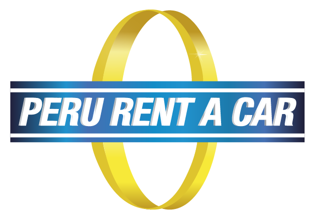

# <center>MOVEO PROJECT</center>

<p align="center">
    <strong>Universidad Peruana de Ciencias Aplicadas</strong><br>
    </img><br>
    <strong>Ingeniería de Software</strong><br>
    <strong>Aplicaciones Web - </strong><br>
    <strong>Profesor:  </strong><br>
    <strong>INFORME TB1  </strong><br>
</p>

<center>

#### Startup: **-----**
#### Product: **Moveo**
### Team  Members:

</center>

<div align="center">

| Member                               | Code        |
|:--------------------------------------:|:-------------:|
|Carlos Alejandro De la cruz Villareal | U20211c036  |
|Franco Gabriel Huang Liu              | U202310345  |
|Gianfranco Luna Morales               | U201824343  |
|Andreow Jomark Santiago Peña          | U202317362  |
|Sebastian Gabriel Zuñiga Calle        | u20221b479  |

</div>

<center>
<br> SEPTIEMBRE 2025
</center> 

# Registro de Versiones del Informe

|version|Fecha|Autor|Descripcion de Modificacion|
|---|---|---|---|
|0.1| 29/08/2025 | Andreow Santiago | Creacion y primera version del informe |
|0.2| 08/09/2025 | Franco Huang | Avance de Syle Guidelines  |
|0.3| 10/09/2025 | Franco Huang | Avance de Information Architecture y entrevistas  |


# Project Report Collaboration Insights

En esta sección, el equipo presenta un análisis detallado de la colaboración realizada durante el desarrollo del informe del proyecto. A continuación, se describe el progreso alcanzado a lo largo de las distintas entregas, destacando tanto el trabajo individual como el esfuerzo colectivo, los commits realizados y las evidencias gráficas del flujo colaborativo en GitHub.

A continuacion, se detalla el trabajo realizado durante cada entrega, acompañado de evidencias visuales de participación en el repositorio del report en GitHub y un resumen de los principales commits realizados por los miembros del equipo.

Link del reporte del equipo: 

https://github.com/UPC-PRE-202502-1ASI0730-7432-MOVEO/MOVEO-Report

#### TB1

aun no acabamos


# Contenido

[Registro de Versiones del Informe](#registro-de-versiones-del-informe)

[Project Report Collaboration Insights](#project-report-collaboration-insights)

[Student Outcome](#student-outcome)

[Capítulo I: Introducción](#capítulo-i-introducción)

[1.1 Startup Profile](#11-startup-profile)  
[1.1.1. Descripción de la Startup](#111-descripción-de-la-startup)  
[1.1.2. Perfiles de integrantes del equipo](#112-perfiles-de-integrantes-del-equipo)  

[1.2. Solution Profile](#12-solution-profile)  
[1.2.1 Antecedentes y problemática](#121-antecedentes-y-problemática)  
[1.2.2 Lean UX Process.](#122-lean-ux-process)  
[1.2.2.1. Lean UX Problem Statements.](#1221-lean-ux-problem-statements)  
[1.2.2.2. Lean UX Assumptions.](#1222-lean-ux-assumptions)  
[1.2.2.3. Lean UX Hypothesis Statements.](#1223-lean-ux-hypothesis-statements)  
[1.2.2.4. Lean UX Canvas.](#1224-lean-ux-canvas)  

[1.3. Segmentos objetivo.](#13-segmentos-objetivo)  

[Capítulo II: Requirements Elicitation & Analysi](#capítulo-ii-requirements-elicitation--analysis)  

[2.1. Competidores](#21-competidores)  
[2.1.1. Análisis competitivo](#211-análisis-competitivo)  
[2.1.2. Estrategias y tácticas frente a competidores](#211-análisis-competitivo)  

[2.2. Entrevistas](#22-entrevistas)  
[2.2.1. Diseño de entrevistas](#221-diseño-de-entrevistas)  
[2.2.2. Registro de entrevistas](#222-registro-de-entrevistas)  
[2.2.3. Análisis de entrevistas](#223-análisis-de-entrevistas)  

[2.3. Needfinding](#23-needfinding)  
[2.3.1. User Personas](#231-user-personas)  
[2.3.2. User Task Matrix](#232-user-task-matrix)  
[2.3.3. User Journey Mapping](#233-user-journey-mapping)  
[2.3.4. Empathy Mapping](#234-empathy-mapping)  
[2.3.5. As-is Scenario Mapping](#235-as-is-scenario-mapping) 

[2.4. Ubiquitous Language](#24-ubiquitous-language)  

[Capítulo III: Requirements Specificatio](#capítulo-iii-requirements-specification)  

[3.1. To-Be Scenario Mapping](#31-to-be-scenario-mapping)    
[3.2. User Stories](#32-user-stories)  
[3.3. Impact Mapping](#33-impact-mapping)  
[3.4. Product Backlog](#34-product-backlog)  

[Capítulo IV: Product Desig](#capítulo-iv-product-design)  

[4.1. Style Guidelines](#41-style-guidelines)  
[4.1.1. General Style Guidelines](#411-general-style-guidelines)  
[4.1.2. Web Style Guidelines](#412-web-style-guidelines)  

[4.2. Information Architecture](#42-information-architecture)  
[4.2.1. Organization Systems](#421-organization-systems)  
[4.2.2. Labeling Systems](#422-labeling-systems)  
[4.2.3. SEO Tags and Meta Tag](#423-seo-tags-and-meta-tags)  
[4.2.4. Searching Systems](#424-searching-systems)   
[4.2.5. Navigation Systems](#425-navigation-systems)  

[4.3. Landing Page UI Design](#43-landing-page-ui-design)   
[4.3.1. Landing Page Wireframe](#431-landing-page-wireframe)  
[4.3.2. Landing Page Mock-up](#432-landing-page-mock-up) 

[4.4. Web Applications UX/UI Design](#44-web-applications-uxui-design)  
[4.4.1. Web Applications Wireframes](#441-web-applications-wireframes)  
[4.4.2. Web Applications Wireflow Diagrams](#442-web-applications-wireflow-diagrams)  
[4.4.3. Web Applications Mock-ups](#443-web-applications-mock-ups)   
[4.4.4. Web Applications User Flow Diagrams](#444-web-applications-user-flow-diagrams)  

[4.5. Web Applications Prototyping](#45-web-applications-prototyping)  

[4.6. Domain-Driven Software Architecture](#46-domain-driven-software-architecture)  
[4.6.1. Software Architecture Context Diagram](#461-software-architecture-context-diagram)  
[4.6.2. Software Architecture Container Diagrams](#462-software-architecture-container-diagrams)  
[4.6.3. Software Architecture Components Diagrams](#463-software-architecture-components-diagrams)  

[4.7. Software Object-Oriented Design](#47-software-object-oriented-design)  
[4.7.1. Class Diagrams](#471-class-diagrams)  
[4.7.2. Class Dictionary](#472-class-dictionary)  

[4.8. Database Design](#48-database-design)  
[4.8.1. Database Diagram](#481-database-diagram)  

[Capítulo V: Product Implementation, Validation & Deploymen](#capítulo-v-product-implementation-validation--deployment)  

[5.1. Software Configuration Management](#51-software-configuration-management)  
[5.1.1. Software Development Environment Configuration](#511-software-development-environment-configuration)  
[5.1.2. Source Code Management](#512-source-code-management)  
[5.1.3. Source Code Style Guide & Conventions](#513-source-code-style-guide--conventions)  
[5.1.4. Software Deployment Configuration](#514-software-deployment-configuration)  

[5.2. Landing Page, Services & Applications Implementation](#52-landing-page-services--applications-implementation)  
[5.2.1. Sprint 1](#521-sprint-1)  
[5.2.2. Sprint 2 ](#522-sprint-2)  
[5.2.2. Sprint 3 ](#522-sprint-3)  
[5.2.2. Sprint 4 ](#522-sprint-4)  
  
[Bibliografía](#bibliografía)  
[Anexos](#anexos)  

# Student Outcome

| Criterio Específico | Acciones Realizadas |
|---|---|
     


# Capítulo I: Introducción
## 1.1. Startup Profile
### 1.1.1. Descripción de la Startup
#### 1.1.2. Perfiles de integrantes del equipo

# 1.2. Solución Profile

## 1.2.1. Antecedentes y Problemática


## 1.2.2. Lean UX Process

### 1.2.2.1. Lean UX Problem Statement

### 1.2.2.2. Lean UX Assumptions

### 1.2.2.3. Lean UX Hypothesis Statements

#### 1.2.2.4. Lean UX Canvas.

## 1.3. Segmentos objetivo

# Capítulo II: Requirements Elicitation & Analysis
## 2.1. Competidores
Previo al desarrollo de la aplicación, hicimos una búsqueda de las opciones que ya existen en el mercado, para ver que es lo que ofrecen y como podemos diferenciarnos de ellos.
- **Peru Rent A Car:**
  Esta plataforma se especializa en el alquiler de coches en Perú. Ofrece una amplia gama de vehículos y opciones de alquiler, así como información sobre destinos turísticos en Perú. 
  La plataforma también permite a los usuarios comparar precios y reservar coches en línea.
  <div style="text-align: center;">

  </div>
  
- **Kayak:**
  Kayak es una de las plataformas de búsqueda de viajes más grandes del mundo. Permite a los usuarios buscar y comparar precios de vuelos, hoteles y alquiler de coches en una sola plataforma. 
  Kayak también ofrece herramientas para planificar viajes, como alertas de precios y recomendaciones personalizadas.
  <div style="text-align: center;">

  </div>

- **Budget Car Rental Peru:**
  A diferencia de Peru Rent A Car, Budget Car Rental es una empresa internacional que ofrece servicios de alquiler de coches en Perú. 
  La plataforma permite a los usuarios buscar y comparar precios de coches de alquiler en diferentes ubicaciones y reservar en línea. Budget Car Rental también ofrece opciones de alquiler a largo plazo y programas de fidelización.
  <div style="text-align: center;">

  </div>

### 2.1.1. Análisis competitivo.

<table border="1" style="text-align: center;">
	<tbody>
		<tr><td colspan="6">Análisis de competidores</td></tr>
		<tr><td colspan="2"></td><td>Moveo</td><td>Kayak</td><td>Peru Rent A Car</td><td>Budget Car Rental Peru</td></tr>
		<tr><td rowspan="2">Perfil</td><td>Resumen</td>
			<td>Una aplicación que busca ofrecer una plataforma rápida y ágil para el alquiler de autos, con un fuerte enfoque en la seguridad de ambas partes.</td>
			<td>Kayak es una plataforma líder de búsqueda tanto de vuelos, como cuartos de hotel, alquiler de vehículos, etc.</td>
			<td>Esta plataforma web presenta parte de un catálogo establecido de vehículos para alquilar, con una atención mediante WhatsApp y dirigido solo a clientes.</td>
			<td>Plataforma de similar funcionamiento que Rent A Car Peru, orientado a clientes con un énfasis en cuidar el presupuesto de los mismos.</td></tr>
		<tr><td>Ventaja competitiva</td>
			<td>Ofrecer una plataforma tanto para dueños de vehículos como a clientes interesados en alquilar.</td>
			<td>Es la aplicación líder en la búsqueda de servicios por su variedad y robusta plataforma web.</td>
			<td>Líder local del servicio de alquiler de autos, con una amplia flota y rápida atención al usuario</td>
			<td>Ofrece una alternativa de alquiler económica velando por el bolsillo de sus clientes. </td></tr>
		<tr><td rowspan="2">Perfil de Marketing</td><td>Mercado objetivo</td>
			<td>Jóvenes y adultos desde los 20 a los 50 años.</td>
			<td>Turistas o viajeros que necesiten cualquier tipo de servicio de comodidad.</td>
			<td>Adultos peruanos que busquen alquilar un vehiculo.</td>
			<td>Adultos peruanos que busquen alquilar un vehiculo económico.</td></tr>
		<tr><td>Estrategias de marketing</td>
			<td>Marketing digital en redes sociales y colaboraciones con influencers.</td>
			<td>Alianza con Google Ads, tanto en Youtube como Chrome.</td>
			<td>Patrocinio mediante búsquedas de Chrome.</td>
			<td>Patrocinio mediante búsquedas de Chrome.</td></tr>
		<tr><td rowspan="3">Perfil de Producto</td>
			<td>Productos y Servicios</td>
			<td>Aplicación destinada a la oferta de vehículos en alquiler, como la demanda de los mismos.</td>
			<td>Aplicación móvil y web que cuenta con una enorme variedad de servicios esenciales para viajeros y turistas</td>
			<td>Aplicación web rápida e intuitiva que permite consultar parte del catálogo de vehículos disponibles para alquiler.</td>
			<td>Aplicación web ágil y amigable que permite consultar una limitada oferta de vehículos económicos en alquiler</td></tr>
		<tr><td>Precios y Costos</td>
			<td>Costos por publicación de vehículos mediante una suscripción.</td>
			<td>Modelo gratuito, con cobro de comisión a las empresas referidas.</td>
			<td>Ingreso directo mediante el alquiler.</td>
			<td>Ingreso directo mediante el alquiler.</td></tr>
		<tr><td>Canales de distribución</td>
			<td>Disponible en línea a través de la aplicación web.</td>
			<td>Descargable en Google Play y App Store y la plataforma web.</td>
			<td>Disponible en línea a través de la aplicación web.</td>
			<td>Disponible en línea a través de la aplicación web.</td></tr>
		<tr><td rowspan="4">Análisis SWOT</td><td>Fortalezas</td><td><ul>
                    <li>Orientado a jóvenes y adultos peruanos</li><li>Facilidades para alquilar, como ofrecer alquiler</li><li>Énfasis en la seguridad y garantía</li></ul></td>
			<td><ul>
                    <li>Gran cantidad de usuarios</li><li>Referente del sector</li><li>Plataformas ágiles e intuitivas</li></ul></td>
			<td><ul><li>Plataforma local</li><li>Excelente atención al cliente</li></ul></td>
			<td><ul><li>Plataforma web amigable</li><li>Todo el catálogo está disponible para cualquier usuario</li></ul></td></tr>
		<tr><td>Debilidades</td>
            <td><ul><li>Nuevo competidor</li><li>Sector con competidores fuertes ya establecidos</li></ul></td>
			<td><ul><li>Pobre atención al cliente</li></ul></td>
			<td><ul><li>Solo se puede consultar parte del catálogo de vehículos</li></ul></td>
			<td><ul><li>Opta por un nicho muy concreto</li><li>No cuenta con tanta relevancia como su competencia</li></ul></td></tr>
		<tr><td>Oportunidades</td>
            <td><ul><li>Sin competidores a nivel nacional</li><li>Ofrece servicio para ambas partes involucradas en el alquiler</li></ul></td>
			<td><ul><li>Fuerte presencia internacional</li><li>Referente del sector</li></ul></td>
			<td><ul><li>Flota amplia y en crecimiento</li><li>Atención personalizada</li></ul></td>
			<td><ul><li>Excelente interfaz</li></ul></td></tr>
		<tr><td>Amenazas</td>
            <td><ul><li>Competencia ya establecida</li><li>Sector muy competitivo</li></ul></td>
			<td><ul><li>Oferta demasiado ámplia</li><li>Sin control de calidad</li></ul></td>
			<td><ul><li>Oferta fija y poco variada</li><li>Sin opciones para dueños interesados en alquilar</li></ul></td>
<td><ul><li>Se ve opacado por la competencia</li><li>Oferta aún más limitada que la competencia</li></ul></td>
</tr></tbody></table>

### 2.1.2. Estrategias y tácticas frente a competidores.
Moveo se diferenciará mediante un enfoque local y seguro, integrando tanto a dueños de vehículos como a arrendatarios. 
Para contrarrestar la falta de reconocimiento como nuevo competidor, se aplicarán tácticas de marketing digital y alianzas con influencers, generando confianza y visibilidad rápida. 
Aprovechando la ausencia de un líder nacional en movilidad tipo Airbnb, la estrategia será posicionarse como la primera opción peruana especializada en alquiler de autos. 
Frente a amenazas de grandes plataformas, Moveo enfocará sus esfuerzos en segmentos desatendidos y en brindar soporte inmediato y flexibilidad en precios, destacando su cercanía y adaptabilidad frente a la oferta internacional y tradicional.

## 2.2. Entrevistas


### 2.2.1. Diseño de entrevistas.

**Segmento 1: Propietarios**

¿Cuál es tu nombre completo?

¿Qué edad tienes actualmente?

¿En qué distrito resides?

¿A qué te dedicas (trabajo, estudios, negocio propio)?

¿Qué requisitos solicitas a una persona antes de entregarle tu vehículo?

¿Qué tipo de unidades sueles alquilar (auto, SUV, camioneta, moto, otro)?

¿Cuál es el tiempo mínimo y máximo que normalmente estás dispuesto a prestar tu vehículo?

¿Cómo gestionas el control de tus autos disponibles y en uso (anotaciones, Excel, aplicación, otro)?

¿Dónde publicas actualmente tus vehículos para alquilarlos (apps, redes sociales, conocidos)?

¿Prefieres usar computadora, celular o ambos para manejar estas publicaciones?

¿Qué tan confiable consideras que son las plataformas actuales para validar a los clientes?

¿Qué tan útil sería para ti ver comentarios de otros dueños sobre un cliente antes de alquilar?

¿Te interesaría contar con un panel digital donde registres todos tus autos y su estado?

¿Qué tan importante consideras poder calificar a los clientes después de cada alquiler?


**Segmento 2: Inquilinos**

¿Cuál es tu nombre completo?

¿Qué edad tienes actualmente?

¿En qué distrito vives?

¿Cuál es tu ocupación principal?

¿Qué documentos te han solicitado en tus experiencias previas al alquilar un auto?

¿Qué tipo de vehículo prefieres alquilar según tu necesidad (trabajo, viaje, ocasión especial)?

¿Qué requisitos o condiciones suelen ponerte antes de alquilar (edad mínima, tarjeta de crédito, otros)?

¿Qué factores te desaniman al momento de querer alquilar un auto (precio, desconfianza, restricciones, otro)?

¿Dónde sueles buscar opciones de autos en alquiler (apps, redes, páginas web, conocidos)?

¿Desde qué dispositivo sueles hacerlo más (celular, laptop, ambos)?

¿Qué tanto confías en que las aplicaciones muestran información real de los dueños y autos?

¿Qué tan valioso sería para ti revisar reseñas de otros usuarios sobre el dueño antes de alquilar?

¿Te resultaría útil poder reservar un vehículo con anticipación directamente desde la app?

¿Qué tan importante es para ti dejar una opinión sobre tu experiencia con el dueño o el vehículo?


### 2.2.2. Registro de entrevistas

#### **Segmento 1:**

##### **Roy Hsieh:** 

<p align="center">

</p>

Link: <https://youtu.be/kJXcfmofi8g>

#### **Segmento 2:**

##### **Gabriel Torres**

<p align="center">

</p>

Link: <https://youtu.be/pLZNIzb0hL0>

### 2.2.3. Análisis de Entrevistas

#### **Segmento 1:**

##### **Roy Hsieh:** 

#### **Segmento 2:**

##### **Gabriel Torres:** 

Gabriel Eduardo Torres Campos, un joven de 19 años, compartió su visión sobre el alquiler de autos a partir de la experiencia de su padre, aunque él nunca ha alquilado uno directamente. Mencionó que los documentos más comunes son el DNI, la licencia de conducir y, posiblemente, un contrato. También señaló que los requisitos suelen incluir ser mayor de edad, tener licencia con al menos 1 o 2 años de vigencia y contar con una tarjeta como garantía. Para él, los factores que más pesan al momento de alquilar son el precio y el estado del vehículo, ya que espera que el costo se justifique con la calidad y seguridad del auto.

Gabriel destacó que confía más en recomendaciones de familiares o conocidos que en plataformas abiertas, pues teme fraudes o autos en mal estado. Prefiere comunicarse por WhatsApp o llamadas si trata con dueños particulares, mientras que con empresas prefiere usar la computadora para navegar mejor por sus páginas. Además, valoró mucho la posibilidad de reservar con anticipación mediante una app para ahorrar tiempo y evitar trámites al llegar a un destino. Finalmente, comentó que casi nunca deja reseñas, salvo cuando la experiencia es muy buena.

## 2.3. Needfinding

### 2.3.1. User Persona
Segmento Objetivo 1: **Propietarios de Vehículos**


Segmento Objetivo 1: **Inquilinos**


### 2.3.2. User Task Matrix

<table><tr><th rowspan="2" valign="top"><b><i>User Task Matrix</i></b></th>
    <th colspan="2" valign="top"><b><i>Roy Hsieh</i></b></th>
    <th colspan="2" valign="top"><b><i>Gabriel Torres</i></b></th></tr>
  <tr><td valign="top"><b><i>Frecuencia</i></b></td>
    <td valign="top"><b><i>Importancia</i></b></td>
    <td valign="top"><b><i>Frecuencia</i></b></td>
    <td valign="top"><b><i>Importancia</i></b></td></tr>
  <tr><td>Comunicación directa con el dueño o cliente</td>
    <td><b><i>Siempre</i></b></td>
    <td><b><i>Alta</i></b></td>
    <td><b><i>A menudo</i></b></td>
    <td><b><i>Alta</i></b></td></tr>
  <tr><td>Valoración del dueño o cliente</td>
    <td><b><i>Baja</i></b></td>
    <td><b><i>Alta</i></b></td>
    <td><b><i>Baja</i></b></td>
    <td><b><i>Alta</i></b></td></tr>
  <tr><td>Historial de alquileres realizados</td>
    <td><b><i>Nunca</i></b></td>
    <td><b><i>Alta</i></b></td>
    <td><b><i>Nunca</i></b></td>
    <td><b><i>Media</i></b></td></tr>
  <tr><td>Acceso a los documentos de garantía del cliente o dueño</td>
    <td><b><i>Siempre</i></b></td>
    <td><b><i>Alta</i></b></td>
    <td><b><i>Siempre</i></b></td>
    <td><b><i>Alta</i></b></td></tr>
  <tr><td>Panel de navegación de vehículos</td>
    <td><b><i>Nunca</i></b></td>
    <td><b><i>Baja</i></b></td>
    <td><b><i>Siempre</i></b></td>
    <td><b><i>Alta</i></b></td></tr>
  <tr><td>Panel de publicación de vehículos</td>
    <td><b><i>Siempre</i></b></td>
    <td><b><i>Alta</i></b></td>
    <td><b><i>Nunca</i></b></td>
    <td><b><i>Baja</i></b></td></tr></table>

**Tareas con mayor frecuencia e importancia** <br>

-Para Roy Hsieh, destacan la comunicación directa con el dueño o cliente, el acceso a documentos de garantía y el panel de publicación de vehículos, todas con alta importancia y ejecutadas con mucha frecuencia. 
Esto refleja su rol enfocado en la interacción directa y en la gestión de la oferta.

-Para Gabriel Torres, las más relevantes son la comunicación directa con el dueño o cliente, el acceso a documentos de garantía y el panel de navegación de vehículos, lo que evidencia que su rol está más orientado al control y monitoreo de los vehículos disponibles.

**Diferencias principales** <br>

-Roy nunca accede al historial de alquileres ni al panel de navegación, mientras que Gabriel sí utiliza con frecuencia el panel de navegación, aunque no se involucra en la publicación de vehículos.
Esto marca un contraste claro: Roy está centrado en publicar y relacionarse con el cliente, mientras Gabriel se dedica más a la gestión operativa y seguimiento.

**Coincidencias** <br>

Ambos coinciden en dar alta importancia a la comunicación con el cliente y al acceso a documentos de garantía, aunque la frecuencia varía ligeramente.

También consideran la valoración del dueño o cliente como poco frecuente pero siempre muy importante para la confianza en el servicio.

### 2.3.3. User Journey Mapping

Segmento Objetivo 1: **Propietario de vehículos** 


Se puede evidenciar el flujo de trabajo y captación de Roy para encontrar nuevos clientes, no es ideal y se encuentra frustrado con la poca seguridad que le ofrecen las plataformas gratuitas, por eso no las usa.

Segmento Objetivo 2: **Inquilinos**


Por su lado Gabriel se siente frustrado por la falta de opciones y la poca seguridad que le ofrecen las plataformas gratuitas, por ello una vez identifica dueños confiables, deja de utilizar dicha plataforma a menos que sea estrictamente necesario.

### 2.3.4. Empathy Mapping

Segmento 1: **Propietarios**


Segmento 2: **Inquilinos**


### 2.3.5. As-is Scenario Mapping

Segmento 1: **Propietarios**


Segmento 2: **Inquilinos**


## 2.4. Ubiquitous Language

Arrendador:	Usuario que publica su vehículo para alquiler.

Arrendatario:	Usuario que alquila un vehículo disponible en la app.

Vehículo:	Entidad principal registrada por un arrendador.

Reserva:	Proceso mediante el cual un arrendatario aparta un vehículo en una fecha.

Publicación:	Objeto que contiene los datos visibles de un vehículo (precio, fotos, reglas).

Reseña:	Valoración escrita o numérica sobre el arrendador o vehículo.

Framework:	Conjunto de herramientas y librerías que usamos para construir la aplicación .

Entidad:	Objeto del dominio que tiene identidad propia .

Repositorio: Componente de software que gestiona la persistencia de entidades en la base de datos.

# Capítulo III: Requirements Specification

En este capítulo se definen los requisitos del producto digital, basados en los hallazgos de investigación y los escenarios ideales de usuario. 

## 3.1. To-Be Scenario Mapping

Este mapa describe la experiencia ideal de dos usuarios clave en la plataforma:

 **Segmento 1: Propietario (Roy)**  
Busca una forma segura y sencilla de ganar dinero extra alquilando su auto. Valora la verificación de identidad, la publicación guiada, el chat seguro dentro de la app, los contratos automáticos y los pagos sin contacto. Su motivación principal: confianza, simplicidad y profesionalismo.


 **Segmento 2: Inquilino (Gabriel)**  
Necesita un auto rápido, confiable y sin riesgos. Confía en fotos verificadas, reseñas reales, historial del vehículo y procesos claros. Valora la reserva con un clic, el pago digital, las llaves virtuales y el soporte integrado. Su motivación: seguridad, ahorro de tiempo y tranquilidad.


Miro con el To-Be: https://miro.com/app/board/uXjVJHk66ZY=/?share_link_id=390494907497

## 3.2. User Stories

Las User Stories traducen las necesidades de propietarios, inquilinos, visitantes y desarrolladores en requisitos verificables. Cada historia sigue el formato “Como <rol>, quiero <acción> para <beneficio>” y tiene criterios de aceptación en Gherkin (Given-When-Then), en tercera persona, sin UI y comprobables. Incluyen historias para la Landing Page (rol: visitante) y la API (rol: Developer), alineadas con los mapas “As-Is” y “To-Be”. El cuadro a continuación presenta todas las historias del proyecto.

| ID | Título | Descripción | Criterios de Aceptación | Relacionado con (Epic ID) |
|----|----|----|----|----|
| EP01 | Información del producto en Landing Page | Como visitante, quiero entender qué ofrece MOVEO para decidir si me registro y alquilo o rento un auto. | Given el visitante accede al sitio web<br>When explora el contenido principal<br>Then comprende que puede alquilar o rentar autos de particulares de forma segura y económica<br><br>Given el visitante compara con servicios tradicionales<br>When evalúa los beneficios de MOVEO<br>Then identifica que no requiere flota propia y tiene menores costos | - |
| HU01 | Ver beneficios del alquiler entre particulares | Como visitante, quiero conocer las ventajas de usar MOVEO frente a servicios tradicionales.   | Given el visitante está en la sección de beneficios<br>When lee los puntos destacados (seguro incluido, verificación de usuarios, precios más bajos)<br>Then entiende por qué es mejor que alquilar en agencias convencionales<br><br>Given el visitante tiene dudas sobre seguridad<br>When lee cómo funciona la verificación<br>Then siente confianza en el modelo de negocio | EP01                      |
| HU02 | Leer testimonios de usuarios reales         | Como visitante, quiero leer experiencias de otros usuarios para confiar en la plataforma.     | Given el visitante está en la sección de testimonios<br>When lee reseñas de propietarios e inquilinos<br>Then siente mayor confianza en el servicio<br><br>Given el visitante identifica patrones en las reseñas<br>When evalúa la consistencia de las experiencias positivas<br>Then considera que la plataforma es confiable y transparente | EP01                      |
| HU03 | Ver planes de precios y comisiones          | Como visitante, quiero conocer cuánto cuesta usar la plataforma y qué comisiones se aplican para tomar una decisión informada y comparar con otras opciones del mercado antes de comprometerme.  | Given el visitante está en la sección de precios<br>When revisa los costos para inquilinos y comisiones para propietarios<br>Then entiende que no hay costos de registro y solo se cobra al concretar el alquiler<br><br>Given el visitante compara precios con agencias tradicionales<br>When calcula el ahorro potencial<br>Then decide que le conviene usar MOVEO | EP01                      |
| HU04 | Contactar al soporte desde la web           | Como visitante, quiero resolver mis dudas fácilmente antes de registrarme para sentirme seguro y confiado en que la plataforma cumple con mis expectativas sin necesidad de invertir tiempo en soporte.                   | Given el visitante necesita ayuda<br>When envía un mensaje a través del formulario de contacto<br>Then recibe confirmación inmediata de recepción<br><br>Given el mensaje fue enviado<br>When el equipo de soporte responde<br>Then el visitante recibe respuesta en menos de 24 horas con información clara y útil | EP01                      |
| EP02 | Crear cuenta como usuario                   | Como propietario o inquilino, quiero crear una cuenta para comenzar a utilizar las funcionalidades ofrecidas por la plataforma. | Given el usuario accede al proceso de registro<br>When ingresa su correo, DNI y datos básicos<br>Then recibe un correo de verificación para activar su cuenta<br><br>Given el usuario confirma su correo<br>When inicia sesión por primera vez<br>Then accede a funcionalidades personalizadas según su rol (propietario o inquilino) | -                         |
| HU05 | Registrarse como propietario                | Como propietario, quiero registrarme para publicar mi auto y generar ingresos pasivos.        | Given el usuario selecciona "Soy propietario"<br>When completa su perfil y sube documentos del vehículo<br>Then su cuenta queda en estado "Pendiente de verificación"<br><br>Given la verificación es aprobada<br>When el sistema notifica al usuario<br>Then puede publicar su auto y comenzar a recibir solicitudes de alquiler | EP02                      |
| HU06 | Registrarse como inquilino                  | Como inquilino, quiero registrarme para buscar y alquilar autos según mis necesidades.        | Given el usuario selecciona "Soy inquilino"<br>When completa su perfil y verifica su identidad<br>Then puede buscar y reservar autos inmediatamente<br><br>Given el usuario finaliza el registro<br>When inicia sesión<br>Then recibe recomendaciones personalizadas basadas en su ubicación y preferencias | EP02                      |
| EP03 | Publicar y gestionar autos (propietario)    | Como propietario, quiero publicar y gestionar mis autos en alquiler para maximizar mis ingresos. | Given el propietario tiene cuenta verificada<br>When publica un auto con disponibilidad, precio y condiciones<br>Then el auto aparece en los resultados de búsqueda de inquilinos<br><br>Given el auto está publicado<br>When el propietario actualiza su disponibilidad<br>Then los cambios se reflejan en tiempo real para los inquilinos | -                         |
| HU07 | Publicar un vehículo                        | Como propietario, quiero publicar mi auto para que los inquilinos puedan alquilarlo.          | Given el propietario accede a la sección de gestión de autos<br>When ingresa detalles del vehículo (modelo, año, fotos, precio, ubicación)<br>Then el auto se publica con estado "Activo" y aparece en búsquedas<br><br>Given el auto se publicó<br>When un inquilino lo selecciona<br>Then el propietario recibe notificación de interés | EP03                      |
| HU08 | Editar información del auto                 | Como propietario, quiero actualizar los datos de mi auto publicado para mantener la información precisa. | Given el propietario accede a sus autos publicados<br>When selecciona un vehículo y modifica su precio o disponibilidad<br>Then los cambios se guardan automáticamente y se actualizan en la plataforma<br><br>Given los cambios se guardaron<br>When un inquilino visualiza el auto<br>Then ve la información actualizada sin errores | EP03                      |
| HU09 | Recibir notificaciones de reservas          | Como propietario, quiero ser notificado cuando alguien solicita alquilar mi auto para responder oportunamente. | Given un inquilino envía una solicitud de reserva<br>When el sistema procesa la petición<br>Then el propietario recibe una notificación con los detalles de la reserva<br><br>Given la notificación fue enviada<br>When el propietario no responde en 24h<br>Then el sistema cancela automáticamente la solicitud para liberar el vehículo | EP03                      |
| EP04 | Buscar y reservar autos (inquilino)         | Como inquilino, quiero encontrar y reservar un auto que se ajuste a mis necesidades y presupuesto para solucionar mi requerimiento de movilidad de forma rápida, flexible y sin exceder mi capacidad de gasto. | Given el inquilino está logueado<br>When filtra por ubicación, fechas y rango de precio<br>Then ve autos disponibles con descripciones, fotos y calificaciones<br><br>Given el inquilino selecciona un auto<br>When confirma la reserva<br>Then recibe un resumen de la transacción y contrato digital | -                         |
| HU10 | Filtrar autos por ubicación y fecha         | Como inquilino, quiero buscar autos disponibles en mi zona y en las fechas que necesito para planificar mi viaje o actividad con anticipación y asegurarme de que habrá un vehículo listo cuando lo requiera.      | Given el inquilino ingresa su distrito y rango de fechas<br>When aplica los filtros<br>Then ve solo los autos disponibles en ese periodo y ubicación<br><br>Given aplica filtros adicionales<br>When ordena por precio o calificación<br>Then la lista se reordena según su preferencia sin perder los resultados | EP04                      |
| HU11 | Reservar un auto con pago seguro            | Como inquilino, quiero reservar un auto y realizar el pago de forma segura para garantizar la transacción. | Given el inquilino selecciona un auto disponible<br>When confirma la reserva y elige método de pago<br>Then el sistema bloquea el vehículo y genera un contrato digital<br><br>Given el pago es procesado exitosamente<br>When el propietario acepta la reserva<br>Then el inquilino recibe confirmación final con detalles de entrega | EP04                      |
| HU12 | Calificar al propietario después del alquiler | Como inquilino, quiero dejar una reseña sobre mi experiencia para ayudar a otros usuarios y mejorar la calidad del servicio. | Given el alquiler ha finalizado<br>When el inquilino accede a su historial de reservas<br>And califica de 1 a 5 estrellas y deja un comentario<br>Then la calificación se publica en el perfil del propietario<br><br>Given la calificación fue enviada<br>When el sistema la procesa<br>Then se notifica al propietario y se actualiza su promedio de calificaciones | EP04                      |
| EP05 | Gestión de pagos y contratos                | Como plataforma, debo gestionar pagos, contratos y seguros automáticamente para garantizar transacciones seguras y transparentes. | Given se confirma una reserva<br>When el inquilino realiza el pago<br>Then se genera un contrato digital firmado electrónicamente<br><br>Given el auto es devuelto sin incidentes<br>When el sistema verifica la devolución<br>Then se libera el pago al propietario (menos la comisión de la plataforma) | -                         |
| HU13 | Generar contrato digital automático         | Como sistema, debo generar un contrato digital al confirmar la reserva para formalizar el acuerdo entre las partes. | Given la reserva es aceptada por el propietario<br>When el pago es confirmado<br>Then se genera un documento con condiciones, fechas, datos de ambas partes y cláusulas de responsabilidad<br><br>Given el contrato se generó<br>When se envía por correo a ambos usuarios<br>Then ambos reciben el PDF adjunto en menos de 5 minutos con firma digital válida | EP05                      |
| HU14 | Liberar pago al propietario tras devolución | Como sistema, debo liberar el pago al propietario solo tras confirmar la devolución del auto en buen estado para garantizar la equidad en la transacción y proteger los intereses tanto del propietario como del inquilino. | Given el auto es devuelto<br>When el inquilino confirma la devolución en la app<br>And no hay reporte de daños<br>Then se transfiere el 90% del pago al propietario (10% es comisión)<br><br>Given hay un reporte de daños<br>When el equipo de soporte investiga y valida el reclamo<br>Then el pago se retiene hasta resolver el incidente y se notifica a ambas partes | EP05                      |
| EP06 | Seguridad y verificación de usuarios        | Como plataforma, debo verificar la identidad de propietarios e inquilinos para garantizar la confianza y seguridad en las transacciones para construir un entorno confiable donde los usuarios se sientan seguros al compartir sus vehículos o alquilarlos. | Given un usuario se registra<br>When sube DNI y selfies para verificación<br>Then su perfil queda como "Verificado" tras aprobación automática o manual<br><br>Given el usuario completó la verificación<br>When otro usuario interactúa con su perfil<br>Then observa un distintivo que indica confiabilidad y puede transar con mayor seguridad | -                         |
| HU15 | Verificar identidad con DNI y selfie        | Como sistema, debo verificar la identidad del usuario con DNI y selfie para prevenir fraudes y garantizar autenticidad. | Given el usuario sube foto de su DNI y una selfie<br>When el sistema compara rostros y datos<br>Then aprueba o rechaza la verificación automáticamente<br><br>Given la verificación falla<br>When el usuario reenvía documentos<br>Then el sistema vuelve a intentar la validación o deriva a verificación manual | EP06                      |
| HU16 | Mostrar indicador de "Usuario Verificado"   | Como sistema, debo mostrar un distintivo de verificación en perfiles verificados para aumentar la confianza entre usuarios. | Given el usuario completó la verificación<br>When otro usuario ve su perfil<br>Then aparece un distintivo claro de "Verificado"<br><br>Given el perfil no está verificado<br>When otro usuario lo visualiza<br>Then no aparece el distintivo y se muestra mensaje de "Verificación pendiente" para incentivar su completitud | EP06                      |
| EP07 | API RESTful para operaciones del sistema    | Como Developer, necesito APIs para gestionar usuarios, autos, reservas y pagos de forma segura y escalable. | Given el frontend necesita autenticar un usuario<br>When envía credenciales válidas al endpoint /auth/login<br>Then recibe un token JWT y status 200<br><br>Given las credenciales son inválidas<br>When se envía la petición<br>Then recibe status 401 y mensaje de error genérico | -                         |
| TS01 | API de Autenticación (Login/Register)       | Como Developer, necesito una API para login y registro de usuarios que garantice la seguridad de las credenciales. | Given el frontend envía datos de registro válidos<br>When llama al endpoint POST /users<br>Then recibe status 201 y objeto del usuario creado con rol asignado<br><br>Given el email ya existe<br>When intenta registrarlo nuevamente<br>Then recibe status 409 y mensaje de conflicto | EP07                      |
| TS02 | API de Gestión de Autos | Como Developer, quiero endpoints para crear, leer, actualizar y eliminar autos que permitan a los propietarios gestionar su inventario para ofrecer una experiencia fluida y en tiempo real que soporte la autonomía del propietario en la administración de sus activos. | Given el frontend envía datos válidos de un auto<br>When llama al endpoint POST /cars<br>Then recibe status 201 y el auto con ID generado<br><br>Given el auto existe<br>When llama a GET /cars/{id}<br>Then recibe status 200 y los datos completos del auto incluyendo disponibilidad y precio | EP07                      |
| TS03 | API de Reservas y Contratos                 | Como Developer, necesito gestionar reservas y contratos vía API para automatizar el flujo de alquiler entre usuarios. | Given se crea una reserva válida<br>When el frontend llama a POST /bookings<br>Then recibe status 201, ID de reserva y URL de contrato<br><br>Given las fechas están ocupadas<br>When intenta crear reserva<br>Then recibe status 400 y mensaje indicando conflicto de disponibilidad | EP07                      |
| EP08 | Soporte y gestión de incidencias            | Como usuario, quiero reportar problemas y recibir soporte rápido para resolver cualquier inconveniente durante el alquiler. | Given el usuario tiene un problema con una reserva o auto<br>When envía un reporte desde la app<br>Then el equipo de soporte lo atiende en menos de 12h<br><br>Given el problema requiere reembolso<br>When el soporte lo aprueba<br>Then el usuario recibe el dinero en su cuenta en menos de 48h con notificación clara | - |
| HU20 | Reportar un problema con un auto            | Como inquilino, quiero reportar un problema con el auto alquilado para que se investigue y se tome acción correctiva. | Given el inquilino finaliza el uso del auto<br>When accede a "Mi reserva" y selecciona "Reportar problema"<br>And describe el daño o incidencia<br>Then el soporte recibe el reporte con fotos adjuntas y lo asigna a un ticket<br><br>Given el reporte fue enviado<br>When el sistema lo procesa<br>Then el inquilino recibe número de seguimiento y estimación de tiempo de respuesta | EP08 |
| HU21 | Recibir reembolso parcial por incidencia    | Como inquilino, quiero recibir reembolso si el auto no cumple con lo prometido o presenta daños no reportados para sentirme protegido frente a imprevistos y mantener la confianza en la plataforma como un servicio justo y transparente. | Given se confirma una incidencia válida por el equipo de soporte<br>When se aprueba el reembolso<br>Then se devuelve un porcentaje del pago al inquilino según gravedad del incidente<br><br>Given el reembolso fue procesado<br>When el inquilino revisa su historial de transacciones<br>Then ve el monto acreditado y motivo del reembolso con detalle | EP08 |
| EP09 | Landing Page - Estructura y Contenido       | Como visitante, quiero navegar por un sitio claro y atractivo que me permita entender el valor de MOVEO sin confusiones. | Given el visitante ingresa al sitio<br>When explora las secciones principales<br>Then encuentra la información que busca en máximo 2 clics<br><br>Given el visitante tiene dudas específicas<br>When busca en el sitio<br>Then encuentra respuestas claras sin necesidad de contactar soporte | -                         |
| HU22 | Ver propuesta de valor clara en la página principal | Como visitante, quiero entender inmediatamente cómo MOVEO resuelve mi problema de movilidad temporal para evaluar rápidamente si esta solución se adapta a mi situación y decidir si vale la pena explorarla más a fondo. | Given el visitante está en la página de inicio<br>When lee el mensaje principal y los ejemplos de uso<br>Then entiende que puede alquilar autos de particulares de forma segura y económica<br><br>Given el visitante interactúa con los enlaces principales<br>When hace clic en uno<br>Then es redirigido a la sección correspondiente sin errores ni demoras | EP09 |
| HU23 | Conocer quiénes están detrás de MOVEO       | Como visitante, quiero saber quiénes fundaron la plataforma para generar confianza en su propuesta de valor. | Given el visitante accede a la sección "Sobre Nosotros"<br>When lee la misión, visión y conoce al equipo fundador<br>Then siente que es una empresa seria, transparente y centrada en el usuario<br><br>Given el visitante termina de leer la sección<br>When vuelve a la página principal<br>Then recuerda claramente el propósito de MOVEO y su diferenciación frente a competidores | EP09 |
| HU24 | Entender el proceso de alquiler paso a paso | Como visitante, quiero comprender cómo funciona el alquiler en MOVEO en pasos simples para sentirme seguro al usar el servicio para reducir la incertidumbre, eliminar barreras de entrada y sentir que el proceso es claro, predecible y diseñado para mí. | Given el visitante accede a la sección "Cómo funciona"<br>When ve los pasos ilustrados para propietarios e inquilinos<br>Then comprende el flujo completo sin confusiones<br><br>Given el visitante termina de ver los pasos<br>When cierra la sección<br>Then puede explicar el proceso a otra persona con claridad y confianza | EP09 |
| HU25 | Resolver dudas comunes sin contactar soporte | Como visitante, quiero encontrar respuestas a preguntas frecuentes para tomar decisiones informadas sin demoras. | Given el visitante accede a la sección "Preguntas Frecuentes"<br>When lee las preguntas organizadas por temas (registro, pagos, seguros, devoluciones)<br>Then encuentra respuesta a sus dudas principales<br><br>Given no encuentra su pregunta específica<br>When usa el buscador interno<br>Then obtiene resultados relevantes o es redirigido al formulario de contacto con contexto prellenado | EP09 |
| HU26 | Comprender cómo se manejan mis datos | Como visitante, quiero saber cómo se protege mi información personal para sentirme seguro al registrarme. | Given el visitante accede a "Términos y Condiciones" y "Política de Privacidad"<br>When lee los documentos<br>Then entiende cómo se recopilan, usan y protegen sus datos<br><br>Given el visitante termina de leer<br>When decide registrarse<br>Then acepta los términos con pleno conocimiento de sus derechos y obligaciones | EP09                      |
| HU27 | Navegar entre secciones sin perderme | Como visitante, quiero moverme entre secciones del sitio con facilidad para explorar toda la información sin frustración. | Given el visitante está en cualquier sección<br>When usa la navegación principal o los enlaces del pie de página<br>Then llega rápidamente a la sección deseada sin errores<br><br>Given el visitante hace clic en un enlace<br>When la página carga<br>Then la navegación refleja claramente en qué sección se encuentra para orientar su recorrido | EP09 |

## 3.3. Impact Mapping:

Este Impact Map visualiza estratégicamente cómo las funcionalidades de la plataforma contribuyen a alcanzar objetivos de negocio concretos, alineando las acciones de nuestros dos segmentos clave: Roy, el propietario de vehículo, y Gabriel, el inquilino.

El mapa parte de Business Goals SMART (como alcanzar 500 usuarios en 6 meses) y desciende en niveles:

Actores (Personas): Roy y Gabriel, cuyos comportamientos impulsan el éxito del negocio.

Impacts: Los cambios deseados en su comportamiento (ej: Roy publica su auto con confianza; Gabriel reserva rápido y seguro).

Deliverables: Las soluciones que la plataforma ofrece para provocar esos cambios (ej: verificación de identidad, motor de búsqueda, sistema de reseñas).

User Stories: Las historias de usuario concretas que implementan cada deliverable, asegurando trazabilidad desde la estrategia hasta la funcionalidad


## 3.4. Product Backlog.


## 3.5. Entity Diagram.


# Capítulo IV: Product Design
## 4.1. Style Guidelines.
En esta sección se define un repositorio centralizado y debidamente organizado para el uso de todo el equipo, el cual incluye recursos como assets, tipografías y demás elementos necesarios. Su finalidad es asegurar una presentación coherente, estandarizada y alineada en todo el proyecto.

### 4.1.1. General Style Guidelines.
Buscamos transmitir confianza, accesibilidad y modernidad. Para reflejar la idea de compartir vehículos de manera segura y práctica, integramos un logo en el que un automóvil  se ubica frente a una casa , ambos unidos por un pin que simboliza ubicación y conexión. El branding se construye sobre la base de:
* **Misión:** Facilitar el acceso a la movilidad mediante una plataforma confiable donde las personas puedan compartir y alquilar autos con seguridad.
* **Visión:** Crear entornos dignos y seguros para adultos mayores usando tecnología.

#### Logo

Queremos transmitir una imagen de confianza, seguridad y tranquilidad al usuario a través de este diseño, utilizando un logotipo principalmente verde y crema para reforzar el concepto.

<p align="center">

</p>

#### Typography

La tipografía debe transmitir claridad, calidez y profesionalismo. Por esa razón decidimos usar **Poppins** e **Inter**, ya que tienen un diseño limpio y sencillo, lo que facilita la lectura en pantallas.
En este caso se usará **Poppins** para titulos y/o subtitulos e **Inter** para texto y/o subtexto.

<p align="center">

</p>

#### Colors

Elegimos los siguientes colores buscando plasmar una paleta que influya seguridad y profesionalismo:

<p align="center">

</p>

#### Spacing

En este proyecto el espaciado cumple un papel clave para mantener la legibilidad y la accesibilidad. Por ello:

* Párrafos: Se añade un espacio equivalente a una línea completa entre cada uno, lo que facilita distinguir las ideas.

* Elementos interactivos: Se deja entre 8 y 12 píxeles de separación en botones, enlaces u otros componentes, reduciendo posibles errores en dispositivos táctiles.

* Márgenes y padding: Se aplican márgenes de 16 a 24 píxeles alrededor del contenido, evitando que la interfaz se vea saturada.
  
#### Communication Tone

| Dimensión              | Nivel Adoptado    |
|------------------------|-------------------|
| Divertido/Serio        | Medio-Serio       |
| Formal/Casual          | Semi-Formal       |
| Respetuoso/Irreverente | Muy Respetuoso    |
| Entusiasta/Sereno      | Sereno y Empático |

Decidimos mantener una comunicación clara, cálida y profesional, porque este enfoque nos permite conectar de manera efectiva con el público, especialmente en un contexto tan sensible como la seguridad del usuario. 

### 4.1.2. Web Style Guidelines.

Para garantizar que la página se adapte a diferentes tamaños de pantalla y mantenga una presentación clara y atractiva, se empleará CSS con el apoyo de media queries. De esta manera, será posible definir estilos específicos según la resolución del dispositivo. Elementos clave como la barra de navegación y el pie de página se ajustarán automáticamente, ofreciendo una experiencia consistente en cualquier dispositivo. Los puntos de quiebre definidos son los siguientes:

| Dispositivo     | Ancho mínimo | Ejemplo de uso            |
|-----------------|--------------|----------------------------|
| Mobile          | ≥ 320px      | Teléfonos                  |
| Tablet          | ≥ 768px      | iPad / tablets genéricas   |
| Laptop  | ≥ 1024px     | Monitores y laptops        |
| Wide Screen     | ≥ 1440px     | Pantallas grandes o TV     |

## 4.2. Information Architecture.

### 4.2.1. Organization Systems.

Nuestro propósito es garantizar una experiencia de usuario coherente y sin fricciones en la plataforma web, tanto en la versión de sobremesa como la versión móvil. La estructura visual que presentamos ha sido diseñada estratégicamente para responder a las necesidades de nuestros dos segmentos principales.

Si bien ambos acceden a las mismas secciones, la diferencia radica en los niveles de permiso. Los dueños pueden prestar el transporte, ofrecer rutas de aventuras y prestar servicios adicionales, mientras que los inquilinos cuentan únicamente con acceso a la visualización de autos, aventuras y servicios disponibles, además de la posibilidad de filtrar por locación, fecha y/o cantidad de personas.

<p align="center">

</p>

Como se ve en el diagrama, se sigue un proceso estructurado para facilitar la gestión de la salud de los pacientes, permitiendo la interacción entre médicos y familiares. Aquí explicamos cada etapa del proceso y las funciones disponibles:

1. **Landing Page**: Es la página de inicio donde los usuarios pueden explorar la aplicación y conocer sus beneficios.

2. **Inicio**: Los usuarios pueden iniciar sesión si ya tienen una cuenta o registrarse como nuevos usuarios.

3. **Registro**:
   - **Crear Cuenta**: Los nuevos usuarios ingresan sus datos manualmente.
   - **Registrarse con Google**: Opción para facilitar el acceso mediante una cuenta de Google.
   - **Llenar Datos**: Se completa un formulario con información personal.

4. **Inicio de Sesión**: Los usuarios existentes ingresan sus credenciales para acceder a la plataforma.

5. **Página Principal**: Una vez dentro, los usuarios pueden acceder a diversas funcionalidades.

6. **Autos**: Los usuarios pueden ver autos disponibles.

7. **Aventuras**: Rutas por auto creadas por personas hacia diversos destinos con alguna temática.

8. **Servicios**: Servicios brinda.

9. **Conviertete en dueño**: Complementa la experiencia de alquiler, ofreciendo beneficios adicionales que mejoran la seguridad, comodidad y confianza del usuario.

10. **Perfil**: Configuración de la cuenta, donde los usuarios pueden actualizar su información personal.

Este flujo de trabajo permite que los médicos tomen decisiones informadas sobre la salud del paciente y que los familiares estén al tanto de su evolución.

### 4.2.2. Labeling Systems.

Los sistemas de etiquetado seguirán la misma estructura presentada en Organization Systems. El usuario podrá seleccionar el encabezado de su interés y, al hacer clic, será dirigido automáticamente a la sección correspondiente dentro de la plataforma.

| **Sección**  | **Contenido** |
|-------------|--------------|
| **Página Principal** | Es el primer punto de contacto con Moveo. Aquí se introduce la aplicación, explicando su propósito, misión y visión, además de resaltar esta manera de alquilar automóviles. |
| **About** | Proporciona una descripción detallada de las herramientas y funcionalidades que ofrece Moveo. Se explican los módulos principales, cómo interactúa el dueño de automóvil y el arrendador, y los beneficios del uso de la aplicación. |
| **Contacto** | Espacio donde los usuarios pueden encontrar los canales de comunicación con el equipo de soporte. Se incluyen redes sociales, un correo de asistencia técnica y un correo para consultas de negocios o colaboraciones. |

##### Secciones y contenido de Moveo

| **Sección**  | **Contenido** |
|-------------|--------------|
| **Autos** | Esta es la página principal en la que tambipen contiene la selección de autos disponibles para alquilar. |
| **Aventuras** | Sección donde los usuarios pueden publicar rutas personalizadas con actividades planeadas y destinos diferentes. |
| **Servicios** | Espacio dedicado a multiples servicios automovilisticos seleccionables . |
| **Conviertete en dueño** | Permite al usuario poner su auto en alquiler, publicar una aventura o publicar un servicio. |
| **Perfil** | Sección para la administración del perfil del usuario, permitiendo la actualización de datos personales, preferencias y configuración de accesibilidad. |

### 4.2.3. SEO Tags and Meta Tags

La **Landing Page** está diseñada para atraer nuevos usuarios, informar sobre la propuesta de valor y generar confianza en la marca.  Las etiquetas meta se centran en captar tráfico orgánico de personas interesadas en alquilar un auto, ir de viaje manejando o buscando un servicio automovilístico.


**Título de la página (Title)**

El título resume de forma directa el propósito del sitio, incluyendo las palabras clave **"autos"**, **"alquilar"** y **"seguro"**, que son términos con alta relevancia SEO para nuestro público objetivo.

```html
<title>Moveo – Alquilar autos de manera segura</title>
```

**Meta descripción (Meta Description)**

La meta descripción ofrece una vista clara del valor que ofrece la plataforma, motivando al clic desde los resultados de búsqueda.

```html
<meta name="description" content="Moveo es una plataforma digital que mejora la seguridad al alquilar autos, brindadndo viajes y servicios automovilísticos.">
```

**Palabras clave (Meta Keywords)**

Los términos elegidos cubren conceptos clave relacionados con el contexto de uso de Moveo, permitiendo un mayor alcance en búsquedas asociadas.

```html
<meta name="keywords" content="autos, alquiler, viajes, actividades, plataforma digital, aventuras, servicios automovilísticos">
```


**Autor del sitio (Meta Author)**

La etiqueta autor identifica al equipo creador, útil para fines de propiedad y referencia en motores de búsqueda.

```html
<meta name="author" content="Moveo Team">
```


### 4.2.4. Searching Systems.

La plataforma Moveo incorpora un sistema de búsqueda global que permite a los usuarios encontrar rápidamente lo que necesitan sin importar en qué sección se encuentren.

#### **Busqueda Global**

* Disponible en la barra superior de navegación en todas las páginas.
* El usuario puede escribir palabras clave como “SUV Lima”, “aventura playa” o “servicio mantenimiento”.
* El motor de búsqueda devuelve resultados clasificados por secciones:
  * Autos disponibles
  * Aventuras creadas por otros usuarios
  * Servicios automovilísticos
  * Usuarios/Dueños (en caso de búsqueda por nombre o alias)

#### **Filtrado de información**

* En cada sección principal (Autos, Aventuras, Servicios), los usuarios disponen de filtros específicos:
  * **Autos**: por ubicación, tipo de vehículo (sedán, SUV, deportivo), precio por día, transmisión (manual/automática), y valoraciones de otros usuarios.
  * **Aventuras**: por destino, temática (playa, montaña, ciudad), duración y popularidad.
  * **Servicios**: por tipo (lavado, mantenimiento, chofer privado, asistencia en carretera) y disponibilidad.
* Los filtros se combinan con la búsqueda global para entregar resultados personalizados y relevantes.

### 4.2.5. Navigation Systems.

Organizamos las secciones, permitiendo a los usuarios desplazarse sin dificultad entre distintas funcionalidades. La navegación está basada en una barra de menú principal, accesos rápidos y una estructura jerárquica clara que guía al usuario en su recorrido.

#### **Estructura de Navegación en la Landing Page**
 La landing page consta de las siguientes secciones principales:

 | **Sección**  | **Contenido** |
|-------------|--------------|
| **Página Principal** | Introduce Moveo, su propósito, misión y visión. Desde aquí, los usuarios pueden acceder rápidamente a las funciones clave. |
| **About** | Explica las herramientas principales de Moveo, cómo funcionan y cómo beneficia a los usuarios. |
| **Contacto** | Incluye enlaces a redes sociales, un correo de asistencia técnica y otro para consultas de negocio. |

#### **Estructura de Navegación en Moveo**
 La aplicación consta de las siguientes secciones principales:

 | **Sección**  | **Contenido** |
|-------------|--------------|
| **Autos** | Muestra de manera simple los carros disponibles y a la vez divididos por categorías. |
| **Aventuras** | Proporciona rutas personalizadas con actividades planeadas y destinos diferentes. |
| **Servicios** | Sección enfocada en brindar una variedad de opciones de servicios automotrices disponibles para selección. |
| **Conviertete en dueño** | Espacio donde el usuario puede publicar su automóvil para alquiler, proponer rutas personalizadas o agregar servicios complementarios. |
| **Perfil** | Área dedicada al control del perfil del usuario, con herramientas para mantener actualizados los datos, preferencias y accesos personalizados. |

## 4.3. Landing Page UI Design.

### 4.3.1. Landing Page Wireframe.

### 4.3.2. Landing Page Mock-up.


## 4.4. Web Applications UX/UI Design.
### 4.4.1. Web Applications Wireframes.

### 4.4.2. Web Applications Wireflow Diagrams.

### 4.4.3. Web Applications Mock-ups.

### 4.4.4. Web Applications User Flow Diagrams.

## 4.5. Web Applications Prototyping.

## 4.6. Domain-Driven Software Architecture.
### 4.6.1. Software Architecture Context Diagram.

### 4.6.2. Software Architecture Container Diagrams.

### 4.6.3. Software Architecture Components Diagrams.

## 4.7. Software Object-Oriented Design.
### 4.7.1. Class Diagrams.

### 4.7.2. Class Dictionary.

## 4.8. Database Design.
### 4.8.1. Database Diagram.

# Capítulo V: Product Implementation, Validation & Deployment
## 5.1. Software Configuration Management.

### 5.1.1. Software Development Environment Configuration.

### 5.1.2. Source Code Management.

### 5.1.3. Source Code Style Guide & Conventions.

### 5.1.4. Software Deployment Configuration.

## 5.2. Landing Page, Services & Applications Implementation.

## 5.2.1. Sprint 1
### 5.2.1.1. Sprint Planning 1.
### 5.2.1.2. Aspect Leaders and Collaborators.
### 5.2.1.3. Sprint Backlog 1.
### 5.2.1.4. Development Evidence for Sprint Review.
### 5.2.1.5. Execution Evidence for Sprint Review.
### 5.2.1.6. Services Documentation Evidence for Sprint Review.
### 5.2.1.7. Software Deployment Evidence for Sprint Review.
### 5.2.1.8. Team Collaboration Insights during Sprint.
